   
 
# Einführung in die Verwendung der Arduino Portable Version mit der Bionic Flower

Dieses Dokument erklärt die Installation der Portable Version der Arduino Software (IDE). Diese portable Version beinhaltet alle nötigen Dateien und Verzeichnisse, um mit der Bionic Flower arbeiten zu können. Damit wird ein direkter Start mit dem Programmieren der Bionic Flower ermöglicht, ohne,  dass hierfür zusätzliche Downloads oder Installationen aus der Bibliothek notwendig sind.
## Download 
Gehen Sie auf die [Bionics4Education](https://www.bionics4education.com/startseite/support) Website und laden Sie die komprimierte (.zip) Datei herunter.
 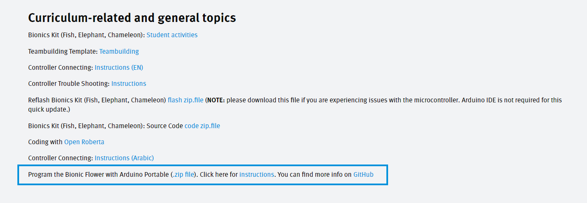

## Öffnen
Sobald der Download abgeschlossen ist, finden sie die Datei im zip-Format im Downloadordner ihres Computers.
 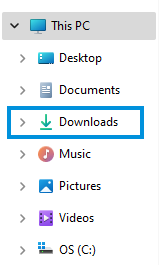
 Sie müssen die Datei öffnen, um auf sie zugreifen zu können. Öffnen lässt sich die Datei mit einem rechten Mausklick und anschließend *Extract all...* (Alle entnehmen) auswählen.
 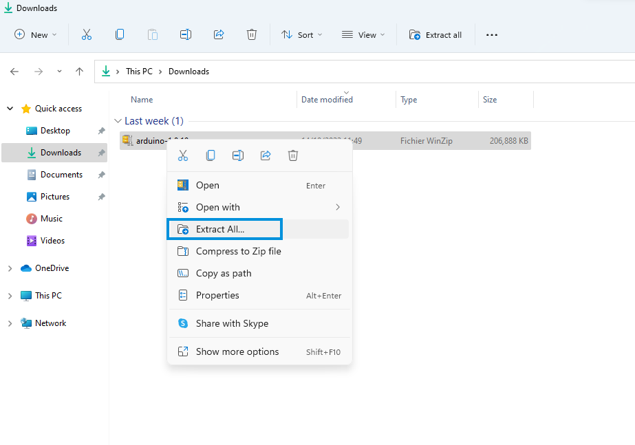  
 Es öffnet sich ein Fenster, in dem Sie den Ablageort des Dokuments in ihren Dokumenten auswählen und entnehmen können.
 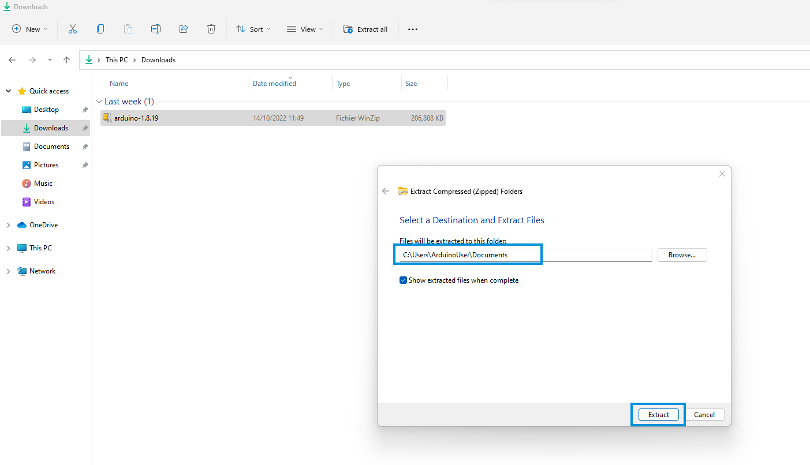

## Arduino IDE starten
Nachdem Alles installiert wurde, müssen sie die Arduinosoftware starten. Gehen Sie dafür auf den vorherigen Ordner und führen sie die arduino.exe Datei aus.
 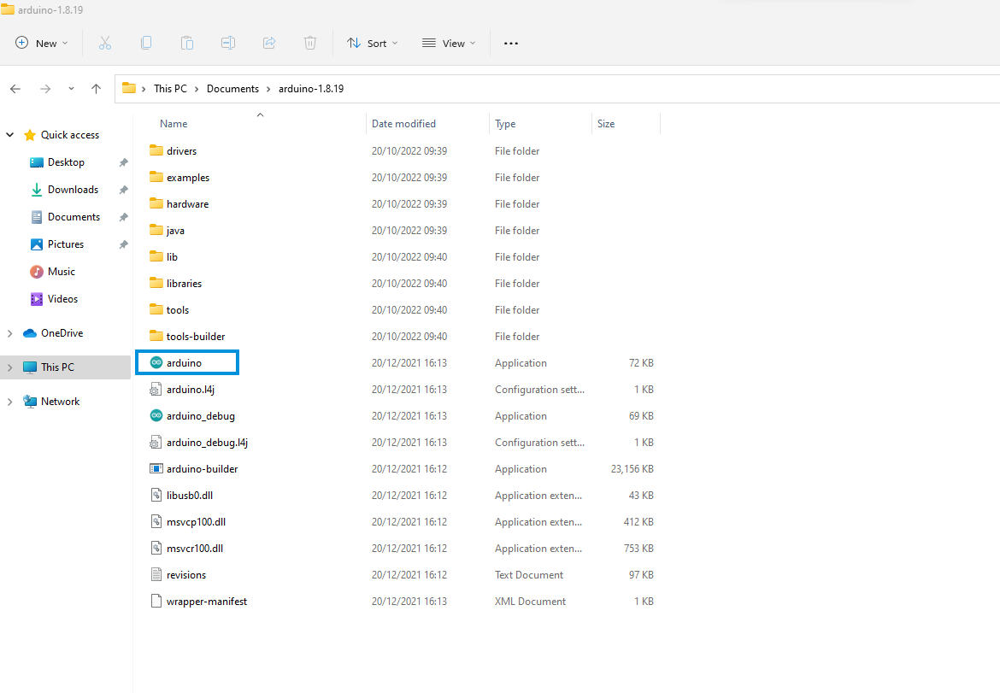
  Es öffnet sich die Benutzeroberfläche der Arduino IDE. 
 

## Einstellen der Arduine IDE Umgebung für die Bionic Flower.
Um Zugang zu allen Funktionen der mobilen Version mit der Bionic Flower zu erhalten, müssen Sie das ESP32 Board einrichten/aufbauen. Gehen sie dafür auf *Datei*-> *Voreinstellungen* .
 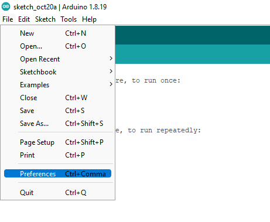
 Sobald sich das Voreinstellungsfenster geöffnet hat, müssen Sie überprüfen, ob die URL für das ESP32 Board vorhanden ist. Ist die URL nicht vorhanden, fügen sie bitte die zusätzlichen Board manager URL’s über folgenden Link hinzu:  https://dl.espressif.com/dl/package_esp32_index.json 
 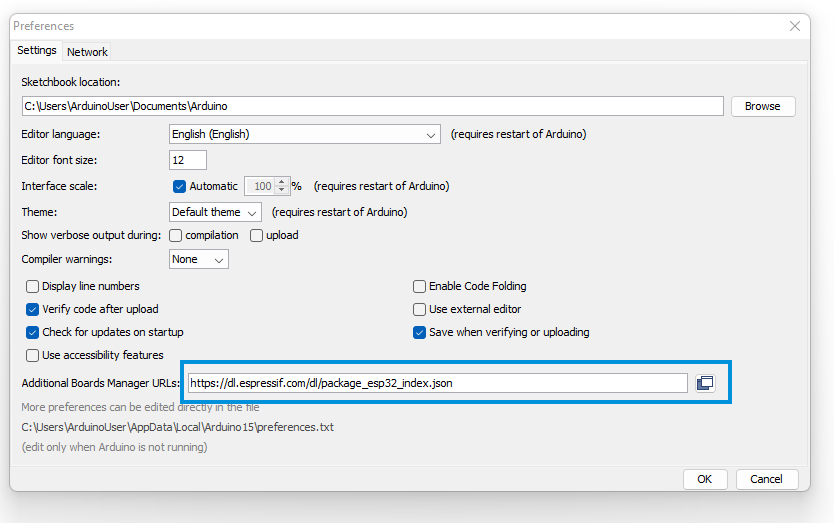
 Danach müssen Sie die Bibliothek für das ESP322 Board hinzufügen. Gehen sie hierfür zu *Werkzeuge (Tools)* -> *Board* -> *Board Manager*.
 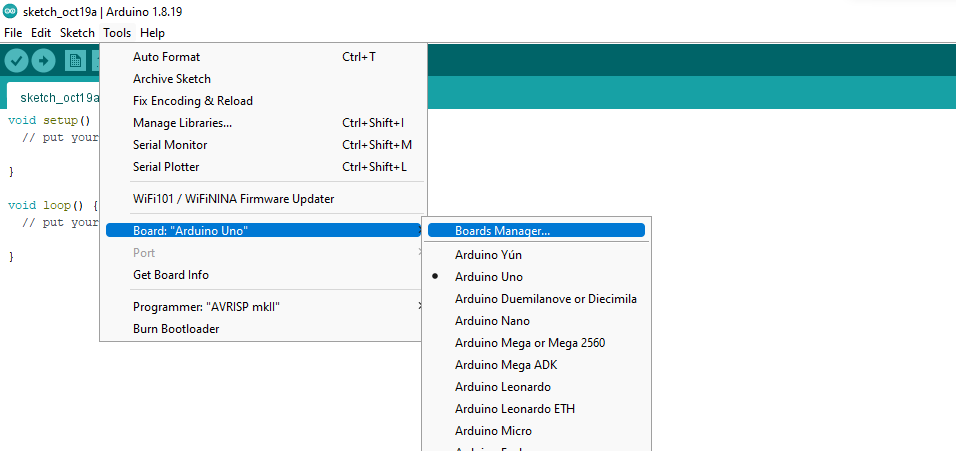
 Geben Sie oben in dem geöffneten Fenster *esp32* ein und klicken Sie auf *installieren*.  
 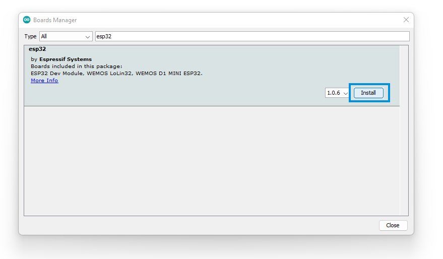
 Warten sie ein paar Minuten. Die Installation ist beendet, sobald die *installiert* Anzeige eingeblendet wird. Danach können sie das Fenster schließen. 
 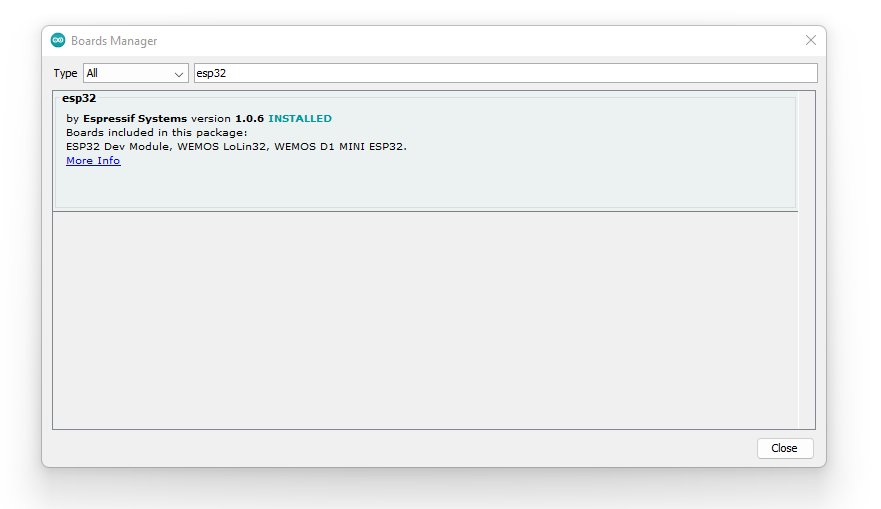

## ESP32 Modulverbindung
Das ESP32 Modul müssen Sie per USB Anschluss an Ihren Computer anschließen. Falls Ihr Computer das ESP32 Modul nicht erkennt, müssen Sie den Driver manuell installieren. Dafür gehen Sie auf  [SiliconLabs](https://www.silabs.com/developers/usb-to-uart-bridge-vcp-drivers),*Downloads* und laden den *CP210x Universal Windows Driver* herunter.
  Zu erst müssen Sie das richtige Board auswählen,  gehen Sie hierfür zu *Werkzeuge (Tools)* -> *Board* -> *ESP32 Arduino* -> ESP32 Dev Module*. 
 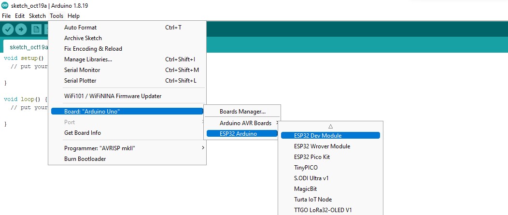
  Anschließend müssen Sie sicherstellen, dass das richtige Port/Anschluss ausgewählt ist. Dafür klicken sie auf *Werkzeuge (Tools)* -> *Port*
 
 Jetzt sind sie bereit die Bionic Flower zu Programmieren! 

## Erster Test mit der Bionic Flower
Ein paar Codes wurden speziell vorab für die Bionic Flower geschrieben, damit Sie zu Beginn etwas über die Bionic Flower lernen können. Diese finden Sie unter *Datei* -> *Notizbuch* -> *12.Bionic_Flower*.
 Starten Sie mit dem Code der für die Ansteuerung für die LED der Bionic Flower zuständig ist: *color_sequence.ino*.
 
 Ein neues Fenster öffnet sich mit dem Code für die LED. 
 
  Nachdem Sie den Code gelesen haben, können sie ihn ausführen, sofern der Code auf das ESP32 Modul geladen wurde.
Klicken Sie dafür auf den rechten Pfeil Knopf.
 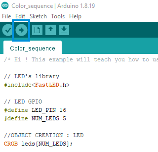
 Stellen Sie sicher, dass der Download mit der Nachricht abgeschlossen wurde.
 
  Wenn alles geklappt hat, sollte die Bionic Flower nun ihre Farbe ändern! 
 
  Sie können den gleichen Vorgang für andere Beispielcodes verwenden. 
* **LEDs**
     -> *Color_sequence.ino* :*: Dieses Beispiel zeigt Ihnen, wie man die Farbe der LEDs ändern und eine Farbreihenfolge erstellt. (Rot, Blau, Grün).
 * **Motor**
     -> *Motor_Open_Close.ino* : Dieses Beispiel zeigt Ihnen, wie Sie den Motor der Bionic Flower benutzen können. Der Motor ermöglicht das Öffnen und Schließen der Blume.
 * **Touch sensor**
     -> *Right_Left.ino* : Dieses Beispiel zeigt Ihnen, wie man den Touchsensor benutzt und eine Nachricht angezeigt wird, sobald eine Berührung registriert wird.
     -> *Open_close_flower.ino* : Dieses Beispiel zeigt Ihnen, wie man den Touchsensor benutzt, um die Blume zu öffnen oder schließen. Hierfür ist es notwendig, dass sie wissen, wie man den Touchsensor und Motor bedient.
     -> *Change_color.ino* : Dieses Beispiel zeigt Ihnen, wie man mit Hilfe des Touchsensors die Farbe des Lichts der Bionic Flower ändert. Dafür sollten sie wissen, wie man die LED und den Touchsensor bedient.  
 * **Light sensor**
     -> *Light_value.ino* : Dieses Beispiel zeigt Ihnen, wie man den Lichtsensor bedient und den Betrag der Lichtstärke auf dem Display angezeigt wird. 
     -> *Day_Night_Color.ino* : Dieses Beispiel zeigt Ihnen, wie man mit Hilfe des Lichtsensors die Farbe der Bionic Flower verändern kann. Tagsüber soll die Blume gelb leuchten, Nachts blau.
 * **All components** 
   -> *Light_Touch_LED_Motor.ino*: Dieses Beispiel zeigt Ihnen, wie man die beiden Sensoren mit der I2C zusammen benutzt.  Wird der rechte Touchsensor betätigt, öffnet sich die Blume. Wird der linke Touchsensor betätigt, schließt sich die Blume wieder. Zusätzlich soll die Blume ab einem bestimmten Lichtstärkewert gelb leuchten, ansonsten leuchtet sie blau.

