# Introduction Arduino Portable

This document explains how to install a portable version of the Arduino Software (IDE). This portable version contains all the files and directories necessary to work with the Bionic Flower. Thus, it allows you to start right away with programming the Bionic Flower without any extra library downloads/installations or delays.
## Download 
Go to the [Bionics4Education](https://www.bionics4education.com/startseite/support) website and download the compressed (.zip) file.
 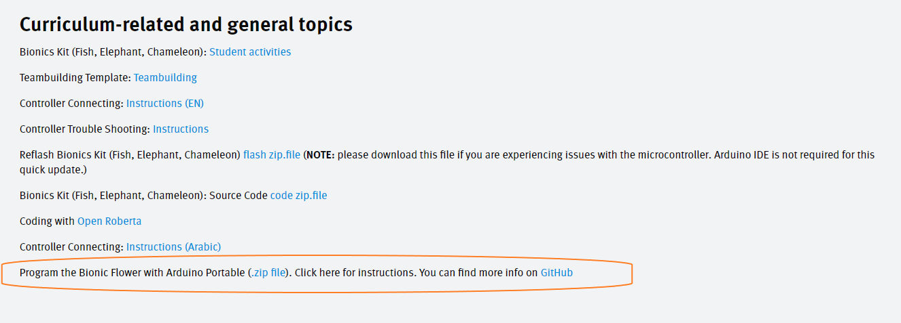

## Unzip 
Once the download is completed, you will find the file in zip format in the download folder of your computer.
 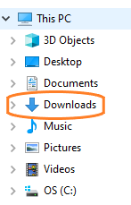
 You need to unzip it to access the file, for that right click on the mouse on the computer and select "*7-Zip*" -> "*Extract files...*".
 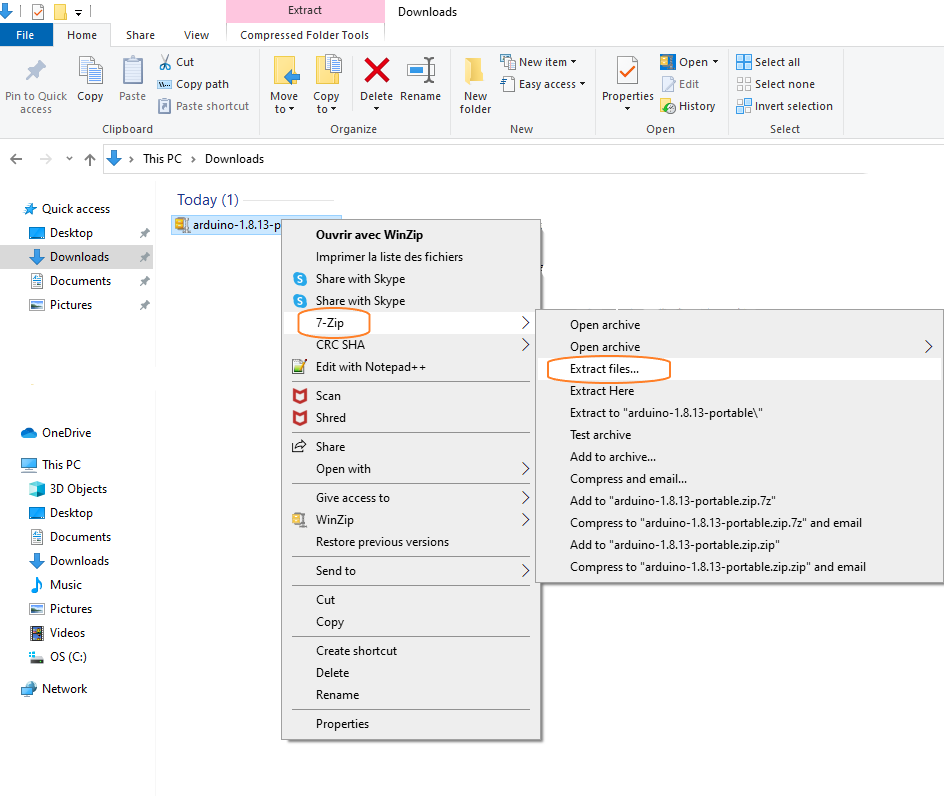  
 Now a window opens, you must now select the location of the file in your documents. For that you can create a folder named like this: *Name_Bionic_Flower_Project*
 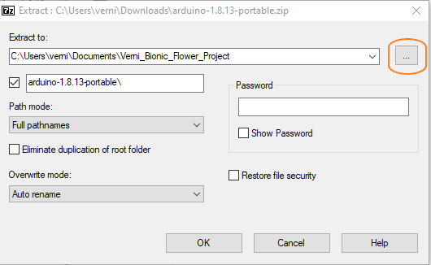

## Start with Arduino IDE 
Now that everything is installed, you need to run the Arduino software.
 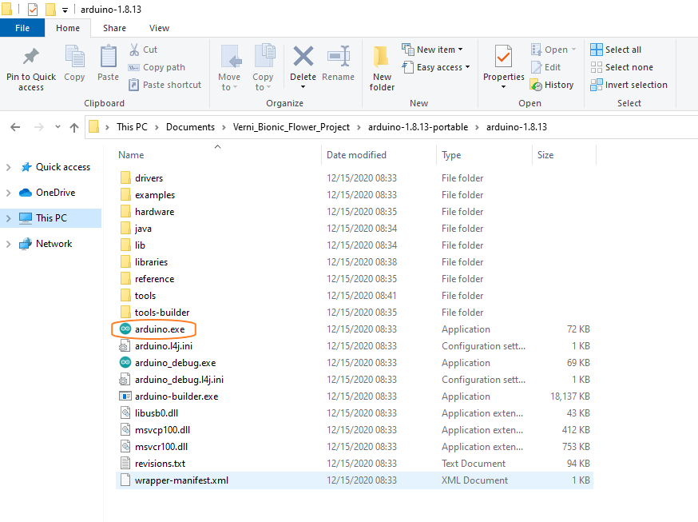
 A window opens, this is the user interface of the Arduino IDE. 
 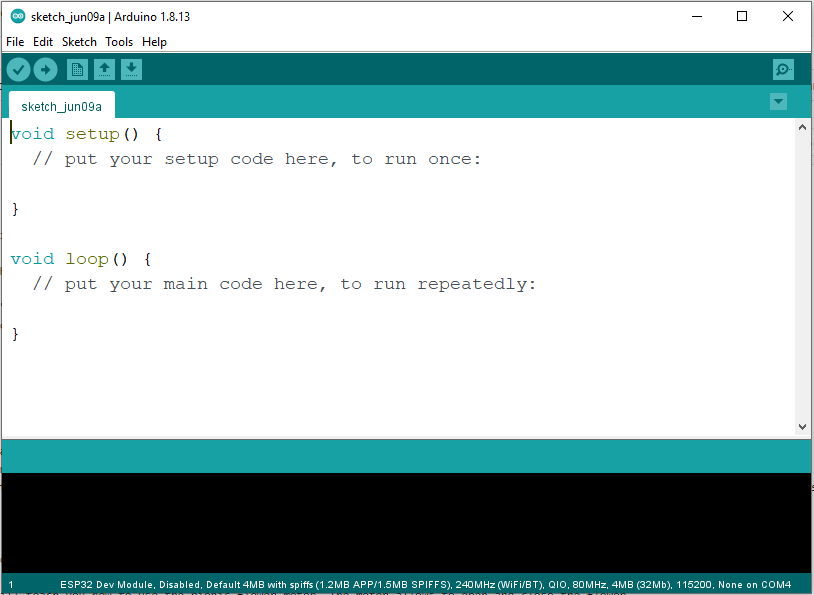
 To access all the functionality of the Arduino portable version you have to change the directory. For that, click on *File* -> *Preferences*.
 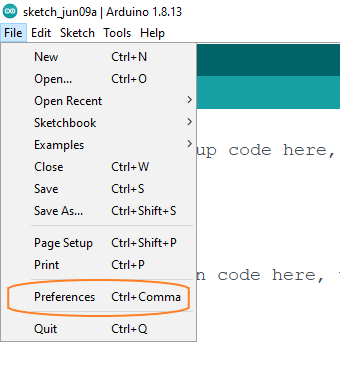
 Once opened the preferences window you have to select the directory of your file *Name_Bionic_Flower_Project*. 
 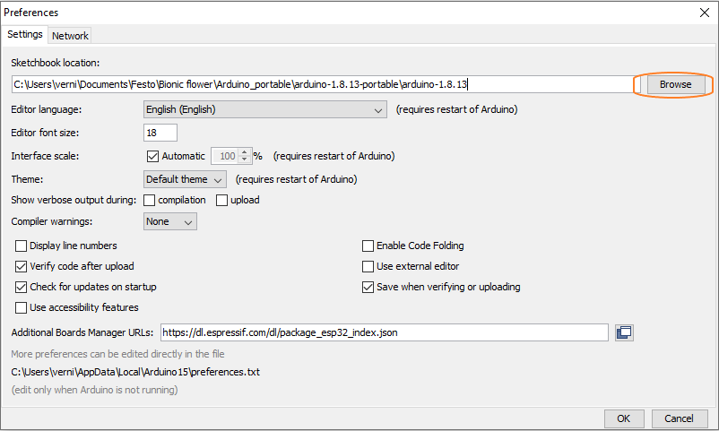

## ESP32 module connection 
You have to connect the ESP32 module to your computer via a USB port.  If your computer doesn't find the ESp32 module you have to install the driver manually. Therefore go to [SiliconLabs](https://www.silabs.com/developers/usb-to-uart-bridge-vcp-drivers), navigate to *Downloads* and download *CP210x Universal Windows Driver*. After that, you have to make sure that you selected the right port. For that selecte *Tools* -> *Port*.
 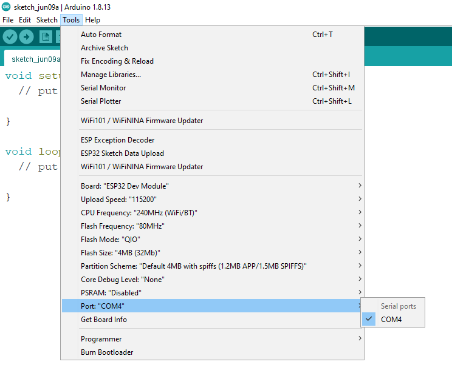
  Make sure that the type of micropocessor is the ES32 module. For this select *Tools*. 
 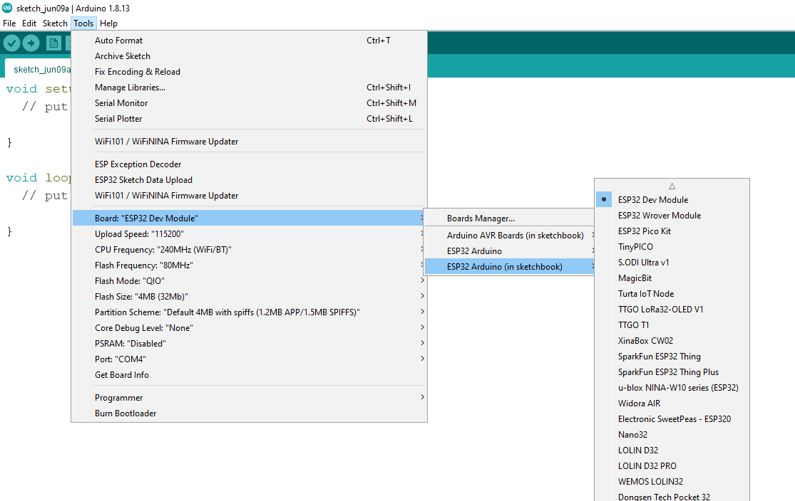
 Now, you are ready to start your first code with the Bionic Flower ! 

## First test with the Bionic Flower
Some code have been created specifically for you to learn about the Bionic Flower. You can find them by selecting *File* -> *Sketchbook* -> *12.Bionic_Flower*.
 Let's start with the code to work with led LED : *color_sequence.ino*. 
 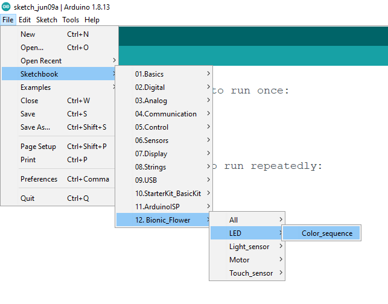
  A new window opens with the code for the LED. 
 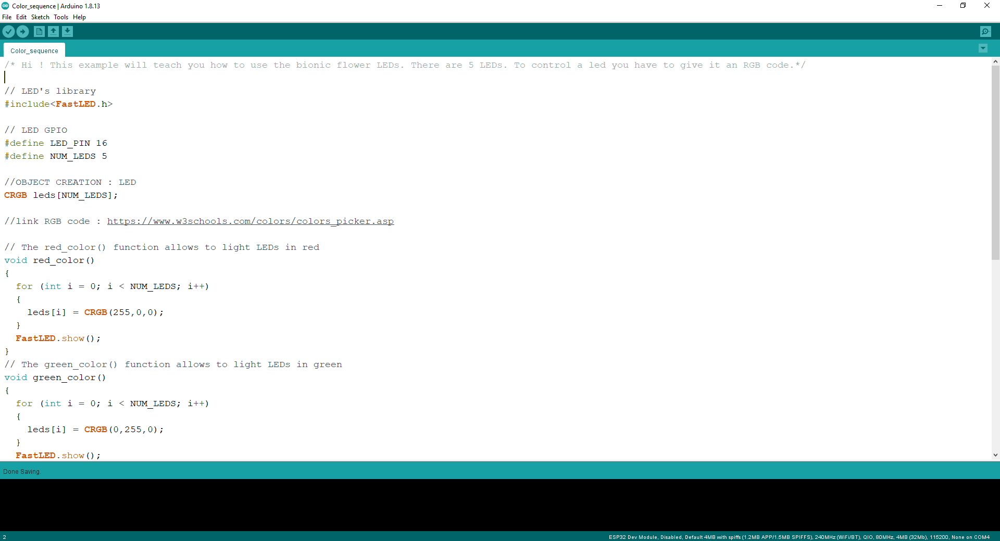
  After reading the code, you can implement the code, i.e. downloaded the code on the ESP32 module. For this you click on right arrow button. 
 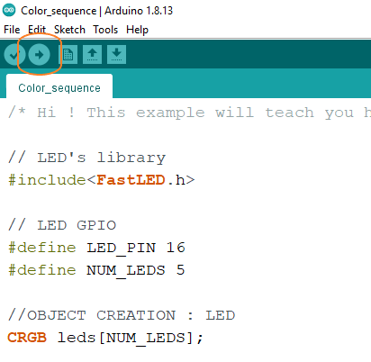
 Make sure the download is finished with this message. 
 
  If everything went well the Bionic Flower changes color ! 
 
  You can use the same procedure to work with the other sample code of the Bionic Flower. 
* **LEDs**
     -> *Color_sequence.ino* : This example teach you how to change the color of the LEDs and create a color sequence (red,blue,green).
 * **Motor**
     -> *Motor_Open_Close.ino* : This example will teach you how to use the Bionic Flower motor. The motor allows to open and close the flower. 
 * **Touch sensor**
     -> *Right_Left.ino* : This example will teach you how to use the touche sensor and display a message if a touch is detected.
     -> *Open_close_flower.ino* : This example will teach you how to use the touch sensor to open or close the flower. For this you need to know how use the motor and the touch sensor. 
     -> *Change_color.ino* : This example will teach you how to use the touch sennsor to change the color of the flower. For this you need to know how use the LEDs and the touch sensor.  
 * **Light sensor**
     -> *Light_value.ino* : This example will teach you how to use the light sensor and display the luminosity value on the serial monitor.
     -> *Day_Night_Color.ino* : This example will teach you how to use light sensor to change the flower's color. If it is the day, the flower lights yellow. If it is the night, the flower lights blue. 
 * **All components** 
   -> *Light_Touch_LED_Motor.ino*: This example will teach you how to use 2 sensors with the I2C communication. If a right touch is detected the flower is opening. If a left touch is detected the flower is closing. In addition, if the luminosity is enough the flower is yellow, otherwise the flower is yellow.

