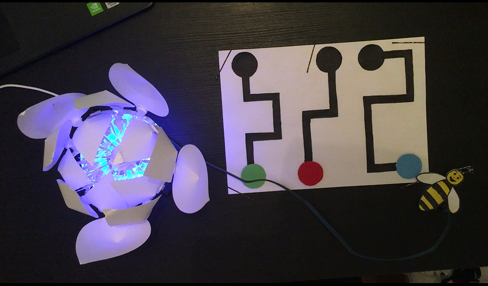
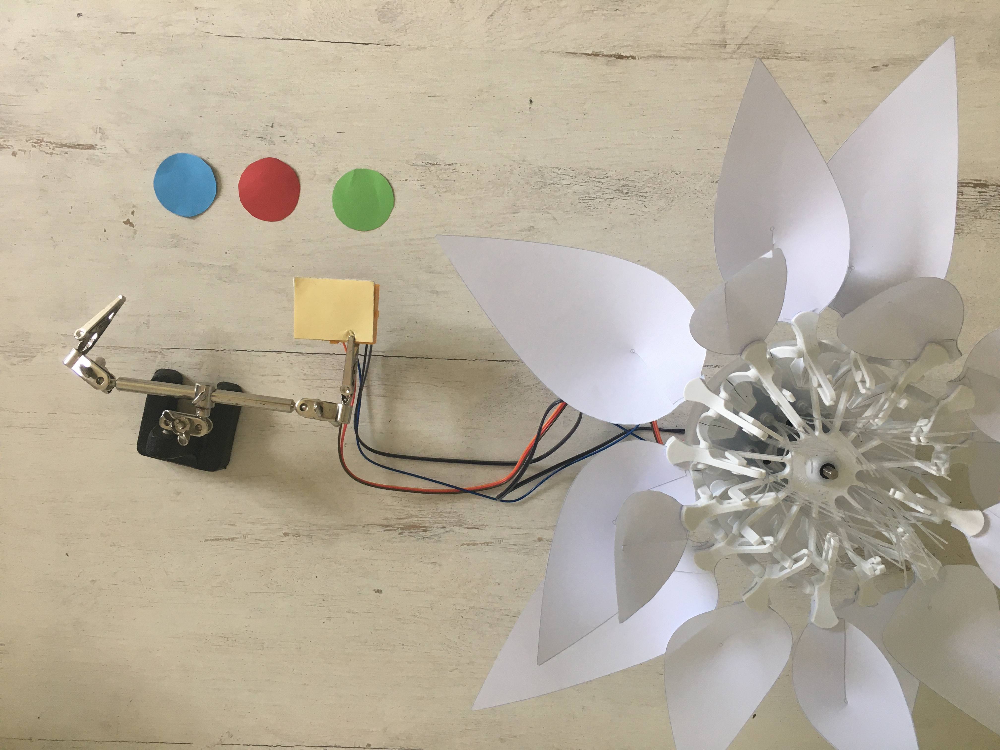
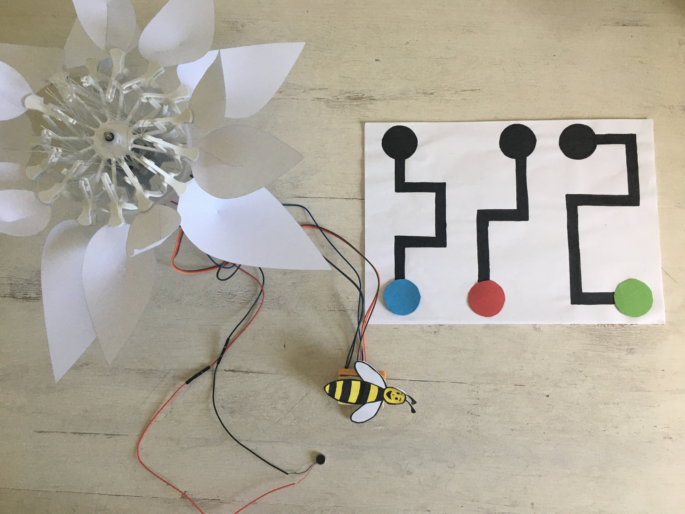

# Schritt für Schritt
# Die Reise der Biene
<br>

Bienen sind wichtig für das Leben der Blumen. In der Tat ist die Hauptrolle der Bienen die Bestäubung, die die Reproduktion von Pflanzen ermöglicht.
<br> In diesem Projekt werden wir die Situation nachstellen, dass einige Bienen von bestimmten Blumen angezogen werden. So folgen sie jedes Jahr den gleichen Weg, um diese Blumen zu bestäuben.

Du wirst ein kleines Programm schreiben, um mit der Blume zu interagieren. Jeder Weg ist mit einer Farbe (blau, rot oder grün) verbunden. Du wirst eine Biene zeichnen und den Farbsensor darunter anbringen. Die Bionic Flower wird in zufälligen Farben aufleuchten. Der Sensor erkennt, ob du dem Pfad gut gefolgt bist und ob du die richtige Farbe gewählt hast. Wenn das der Fall ist, wird sich die Blume öffnen. Andernfalls summt der Vibrationsmotor.

## Zielsetzung
* Du kannst eine LED schalten.
* Du kannst einen Farbsensor integrieren.
* Du kannst einen Vibrationsmotor ansteuern.
* Du kannst einen Schrittmotor ansteuern.
* Du verstehst Bedingungen.
* Du kannst mit globalen und lokalen Variablen umgehen.
* Du verstehst logische Operatoren.
* Du verstehst das Schreiben und Aufrufen von Funktionen.

## Material 
*	1 Bionic Flower
*	1 Farbsensor
*	1 Vibrationsmotor
*	Jumper Kabel
* *BEE_S_TRAVEL_Code_Challenge.ino* (download on github)

<br>

# Aufgabe 1: Steuer die LEDs an
**Einige Variablen oder Funktionen (z. B. RGB_Calibration ()) sind auskommentierte Codezeilen, diese werden für Aufgabe 2 hilfreich sein.**

Ändere die Farbe der LED's. Die Bionic Flower besteht aus 5 eingebauten LEDs. Die Farbe jeder LED ist durch einen RGB-Code gegeben. Die LEDs sind an GPIO 16 angeschlossen.
## Verdrahtungsplan:
LEDs	| ESP32 
------------ | -------------
LEDs | GPIO 16

## Code:
1. Öffne die Datei: *BEE_S_TRAVEL_Code_Challenge.ino*.
2. *Bibliothek*
<br> Füg die Bibliothek zur Steuerung der LEDs hinzu.
3. *Globale Variablen*
*	Definiere den GPIO der LEDs und gib ihm den Variablennamen "LED_PIN".
*	Erstelle das Objekt für die LEDs.
*	Erstellen Sie 3 Funktionen, um die LEDs in blau, rot und grün leuchten zu lassen. Denk daran, eine Funktion zum Ausschalten der LEDs (schwarze Farbe) hinzuzufügen.
<br>*Hier findest du Hilfe zu den Farben: RGB-Code Website-Link :* https://www.w3schools.com/colors/colors_picker.asp
4. *setup()*
* Initialisiere die LEDs.
* Schalte die LEDs aus.
5. *loop()* (Schleife)
<br>Lass die Blume in zufälligen Farben leuchten:
* Definiere Sie einen zufälligen Wert, verwende dazu die Funktion random(Wert).
```
 //The flower light in random color 
  int color = random(3);
 ```
 *	Schreibe eine if-Bedingung:
      *	Wenn Farbvariable gleich 0 ist, leuchtet die Blume in rot.
     * Wenn die Farbvariable gleich 1 ist, leuchtet die Blume in grün.
     * Wenn die Farbvariable gleich 2 ist, leuchtet die Blume blau.
*	Warte 500 ms.

# Aufgabe 2: Integriere den Farbsensor
<br> Jede Farbe ist durch ihren RGB-Code, eine Farbkomponente von 0 bis 255, definiert. (https://www.w3schools.com/colors/colors_picker.asp). Nach einer Kalibrierung misst der Farbsensor den Wert der roten, grünen und blauen Farbkomponenten.
<br> Der Farbsensor kommuniziert über das I2C-Protokoll, er nutzt also die Pins SCL und SDA. Die I2C-Adresse des Farbsensors ist 0x44.
<br> In dieser Aufgabe leuchtet die Blume in der Farbe, die der Farbsensor erkennt (rot, blau oder grün).
* Die Funktion *BW_Calibration()* erlaubt es, den maximalen RGB-Wert durch Messung eines weißen Objekts und den minimalen RGB-Wert mit einem schwarzen Objekt zu messen. Mit diesen Werten können dann die RGB-Werte aller Farben berechnet werden.
* Die Funktion *RGB_Calibration()* ermöglicht die Messung der RGB-Komponenten für die Farben Rot, Grün und Blau. Diese Werte werden dann in der Funktion *Read_RGB()* verwendet, um festzustellen, ob eine dieser Farben von dem Sensor erfasst wird.
* Die Funktion *Read_RGB()* ermöglicht das Auslesen der Werte der RGB-Komponenten. Sie ermittelt, ob sich die rote Farbe unter dem Sensor befindet (Red=true, wenn dies der Fall ist), ob sich die grüne Farbe unter dem Sensor befindet (GREEN=true, wenn dies der Fall ist) oder ob sich die blaue Farbe unter dem Sensor befindet (BLUE=true, wenn dies der Fall ist).
<br>
## Verdrahtungsplan:
 Farbsensor | ESP32
------------ | -------------
SCL | GPIO 5
SDA | GPIO 4 
(+)  | 5 V
(-)  | GND

## Code:
1. *Bibliothek*
<br> Füg die Bibliothek für die I2C-Kommunikation und für den Farbsensor hinzu.
```
// color sensor's library
#include "SparkFunISL29125.h"
```
2. *Globale Variablen*
*	Definiere die Pins der I2C-Kommunikation.
*	Entferne den Kommentarbereich der Codezeilen für den Farbsensor
*	Definiere die I2C-Adresse des Sensors
*	Erstelle das Objekt für den Farbsensor.
```
// Color sensor
SFE_ISL29125 RGB_sensor;
```
*	Entferne die Kommentarsymbole für die *BW_Calibration()* Funktion, der *RGB_Calibration()* Funktion und der *Read_RGB()* Funktion. Nimm dir Zeit die Funktionen zu lesen und zu verstehen. 
3. *setup()*
* Starte die I2c-kommunikation
* Initialisiere den Farbsensor.
```
//Color sensor initialisation
 RGB_sensor.init();
 ```
*	Kalibriere den Sensor zuerst mit den schwarz und weißen Referenzobjekten (wie Papierblätter) und dann mit den rot, grün und blauen.
* Warte 3s.
4. *loop()* (Schleife)
* Schreibe eine while-Schleife:
     * Solange keine Farbe erkannt wird (kein Rot, kein Blau, kein Grün), lies den Farbsensor weiter aus.
* Wenn du aus der while-Schleife heraus bist, ist eine Farbe erkannt worden, also kannst du die Blume in der detektierten Farbe beleuchten.
* Warte 5s.
* Schalte dann die LEDs aus.
* Setzt die boolesche Variable (ROT,BLAU und GRÜN) auf false.

# Aufgabe 3: Integriere den Schrittmotor
Benutze den Schrittmotor zum Öffnen und Schließen der Bionic Flower.
<br>Bei dieser Aufgabe leuchtet die Blume in einer zufälligen Farbe. Wenn die durch den Farbsensor erkannte Farbe gleich dieser Zufallsfarbe ist, öffnet sich die Blume. Nach 4s schließt sich die Blume wieder. 

## Code:
1. *Bibliothek*
<br> Füg die Bibliothek zur Steuerung des Motors der Bionic Flower hinzu.
2. *Globale Variablen*
*	Definier den GPIO und die Variable für den Motor.
*	Erstelle das Objekt für den Motor.
*	Füge die Funktion *motor_calibration()* hinzu.
3. *setup()*
* Initialisiere den Motor.
*	Kalibriere den Motor.
4. *loop()* (Schleife)
 * Lass die Bionic Flower in einer zufälligen Farbe aufleuchten.
 * Schreibe eine while-Schleife :
      *	Solange keine Farbe erkannt wird (kein Rot, kein Blau, kein Grün), lies den Farbsensor weiter aus.
 * Wenn du aus der while-Schleife heraus bist, ist eine Farbe erkannt wurden. Definiere und setze eine boolesche Variable *good_color* true, wenn die Zufallsfarbe und die erkannte Farbe gleich sind. 
 *	Schreibe eine if-Schleife: 
      * Wenn *good_color* true ist, öffne die Blume, warte und schließe die Blume.
      *	Andernfalls: Gib "Lose" auf dem seriellen Monitor in der Arduino DIE aus.
* Schalte die LEDs aus.
*	Setze die boolesche Variable (ROT,BLAU und GRÜN) auf false.
*	Warte 5s.

 
# Aufgabe 4: Steuere den Vibrationsmotor an
<br>Der Vibrationsmotor vibriert, wenn man ihn mit Strom speist. Der Motor ist ein digitales Objekt und wird an GPIO 22 angeschlossen.
<br>In dieser Aufgabe wirst du den Vibrationsmotor verwenden, um anzuzeigen, ob die richtige Farbe erkannt wird oder nicht.
<br>
## Verdrahtungsplan:
Vibrationsmotor| ESP32
------------ | -------------
(+)  | GPIO 22 
(-)  | GND

## Code:
1. *Globale Variablen*
* Definier den GPIO des Vibrationsmotors und gib ihm den Variablennamen "MOTOR_PIN". 
2. *setup()*
*	Setze den MOTOR_PIN als OUTPUT.
*	Schalte den Vibrationsmotor aus.
3. *loop()* (Schleife)
 * Lass die Bionic Flower in einer zufälligen Farbe aufleuchten.
 * Schreibe eine while-Schleife :
      *	Solange keine Farbe erkannt wird (kein Rot, kein Blau, kein Grün), lies den Farbsensor weiter aus.
 * Wenn du aus der while-Schleife heraus bist, ist eine Farbe erkannt wurden. Definiere und setze eine boolesche Variable *good_color* true, wenn die Zufallsfarbe und die erkannte Farbe gleich sind. 
 *	Schreibe eine if-Schleife: 
      * Wenn *good_color* true ist, öffne die Blume, warte und schließe die Blume.
      *	Andernfalls schalte den Vibrationsmotor ein, warte 2s und schalte den Vibrationsmotor wieder aus.
* Schalte die LEDs aus.
*	Setze die boolesche Variable (ROT,BLAU und GRÜN) auf false.
*	Warte 5s.

# Aufgabe 5: Bilde den Pfad
<br> In dieser Aufgabe leuchtet die Blume in der Farbe, die vom Farbsensor erkannt wurde (rot, blau oder grün).
* Die Funktion *BW_Calibration()* erlaubt es, den maximalen RGB-Wert durch Messung eines weißen Objekts und den minimalen RGB-Wert mit einem schwarzen Objekt zu messen. Mit diesen Werten können dann die RGB-Werte aller Farben berechnet werden.
* Die Funktion *RGB_Calibration()* ermöglicht die Messung der RGB-Komponenten für die Farben Rot, Grün und Blau. Diese Werte werden dann in der Funktion *Read_RGB()* verwendet, um festzustellen, ob eine dieser Farben von dem Sensor erfasst wird.
* Die Funktion *Read_RGB()* ermöglicht das Auslesen der Werte der RGB-Komponenten. Sie ermittelt, ob sich die rote Farbe unter dem Sensor befindet (Red=true, wenn dies der Fall ist), ob sich die grüne Farbe unter dem Sensor befindet (GREEN=true, wenn dies der Fall ist) oder ob sich die blaue Farbe unter dem Sensor befindet (BLUE=true, wenn dies der Fall ist).

## Code:
1. *Globale Variablen*
*	Definieren zwei boolesche Variablen, um den Pfad und das Ende des Pfades zu erkennen.
* Entferne in der Funktion *RGB_Calibration()* die Kommentarsymbole zu dem Teil des Codes, der sich auf den Pfad und das Ende des Pfades bezieht.
* Vervollständige die Funktion *Read_RGB()*, um den Pfad und das Ende des Pfades zu prüfen. Inspirieren Sie Strukturen für die Farben Rot, Blau und Grün.
2. *loop()* (Schleife)
*	Definiere eine boolesche Variable RUN. Dieser Wert wird true, wenn eine Farbe bis zum Ende des Pfades richtig erkannt wird.
* Lass die Bionic Flower in einer zufälligen Farbe aufleuchten.
* Schreibe eine while-Schleife :
      *	Solange keine Farbe erkannt wird (kein Rot, kein Blau, kein Grün), lies den Farbsensor weiter aus.
* Wenn du aus der while-Schleife heraus bist, ist eine Farbe erkannt wurden. Definiere und setze eine boolesche Variable *good_color* true, wenn die Zufallsfarbe und die erkannte Farbe gleich sind. 
*	Schreibe eine if-Schleife: 
      * Wenn *good_color* true ist, öffne die Blume, warte und schließe die Blume.
      *	Andernfalls schalte den Vibrationsmotor ein, warte 2s und schalte den Vibrationsmotor wieder aus.
*	Schreibe eine while-Schleife :
     *	Wenn der Pfad erkannt wird, gib "-----" auf dem seriellen Monitor aus.
 	   * Wenn das Ende des Pfades erkannt wird, gib "######" auf dem seriellen Monitor aus und setze die RUN-Variable auf false.
     * Andernfalls schalte den Vibrationsmotor ein, warte 500 ms und schalte den Vibrationsmotor wieder aus.
* Schalte die LEDs aus.
*	Setze die boolesche Variable (ROT,BLAU und GRÜN) auf false.
*	Warte 5s.


# Aufgabe6: Das ganze Szenario
Erstelle nun den endgültigen Code, um das Szenario nachzubilden :
  *	Lass die Bionic Flower in einer zufälligen Farbe aufleuchten.
  * Beleuchten Sie die bionische Blume in zufälligen Farben.
  * Ermittle eine Farbe mit dem Sensor und folge dem Pfad bis zum Ende. Wenn du den Pfad nicht korrekt bis zum Ende folgst, summt der Vibrationsmotor.
  * Berechne eine Punktzahl, um festzustellen, ob du den Pfad gut gefolgt bist.
  * Wenn du die richtige Farbe ausgewählt hast und eine gute Punktzahl hast (höher als eine Siegschwelle), öffnet sich die Blume. Nach 4s schließt sich die Blume wieder.
 
 

