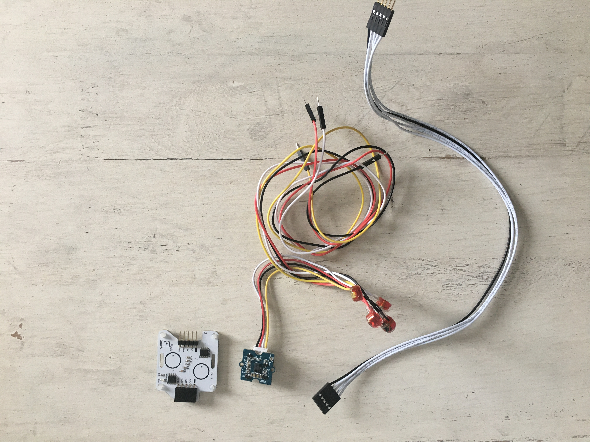
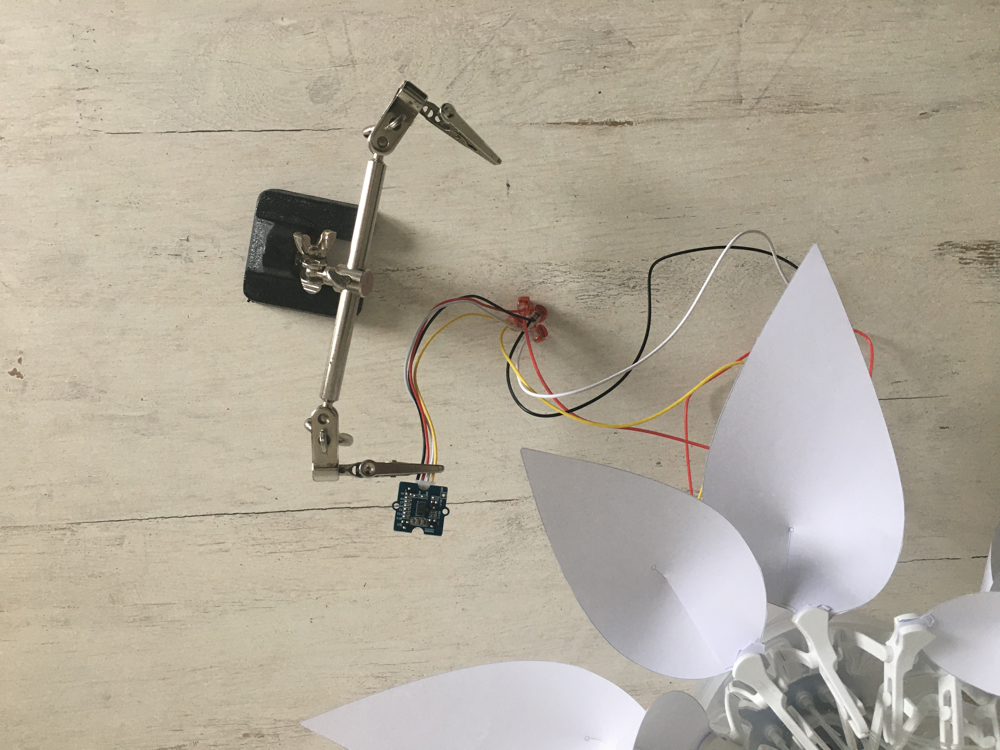

# STEP-BY-STEP 
# Carnivorous plant 
<br>

Carnivorous plants are unique in their ability to attract, capture and assimilate (in whole or in part) their prey (mostly insects). Carnivorous plant's traps are defined as 
“active” if they are mobile and fast. Indeed, when the carnivorous plant detects an insect, it immediately closes and traps the prey. After digestion, the plant reopens while
waiting for the next prey.

You will write a program to interact with the flower. Initially, the flower is open and lights in green. If you touch the touch sensor (simulating the prey) the flower fastly closes and is flashing in red. After a delay, the flower opens again and lights up in green. In addition, you will also be able to improve this scenario by using the gesture sensor. You will be able to use the 8 movements of the gesture sensor to define different behaviors of the flower. For example, the "forward" movement to trigger the closing of the flower and the flash of the LEDs. The movement "back" to reopen the flower. The movements "right" and "left" to change the color of the flower. The "up" and "down" movements to modify the intensity of the color. And "clockwise" and "anti-clockwise" movements to create a charging movement with the LEDs respectively clockwise or anti-clockwise.

## Objective
* You can toggle an LED.
* You can integrate a touch sensor.
* You can integrate a gesture sensor.
* You can control a stepper motor.
* You understand conditionals.
* You can deal with global and local variables.
* You understand logical operators.
* You understand writing and calling functions.

## Material 
* 1 Bionic Flower
* 1 touch sensor 
* 1 gesture sensor
* Jumper cables
* *CARNIVOROUS_PLANT_Code_Challenge.ino* (download on github)

<br>

# Task 1: Control the LEDs
Change the color of the LED's and create a flashing movement. The Bionic Flower is equipped with 5 LEDs. The color of each LED is given by an RGB code. The LEDs are connected
to GPIO 16.

## Wiring scheme:
LEDs	| ESP32 
------------ | -------------
LEDs | GPIO 16

## Code:
1. Open the *CARNIVOROUS_PLANT_Code_Challenge.ino* file.
2. *library*
<br> Add the library to control the LEDs. 
3. *global variables*
* Define the GPIO of the LEDs and give it the variable name "LED_PIN". 
* Create the object for the LEDs. 
* Create 2 functions to light up the LEDs in red and green. Think about adding a function to turn off the LEDs (black color). 
*RGB code website link :* https://www.w3schools.com/colors/colors_picker.asp
4. *setup()*
* Initialize the LEDs.
* Turn off the LEDs.
* Light up the LEDs in green.
* Wait 2s. 
5. *loop()*
* Make a if-structure : 
    * If the LEDs are off, turn on the red LEDs and use the boolean variable to mark that the LEDs are on.
    * Else, turn off the LEDs and use the boolean variable to mark that the LEDs are off.
 * Wait 2s.

# Task 2 : Implement the touch sensor
<br> The touch sensor sends a signal if a contact is detected. This sensor use the I2C communication, so it uses the SCL and SDA pins. The touch sensor's I2C address is 0x28.
<br> If a contact is detected the LED's are flashing red. Otherwise, the flower is green. 
<br>
## Wiring scheme:
Touch sensor | ESP32
------------ | -------------
SCL | GPIO 5
SDA | GPIO 4 
(+)  | 5 V
(-)  | GND

## Code:
1. *library*
<br> Add the library for the I2C communication and the library for the touch sensor. 
2. *global variables*
* Define the I2C communication pins.
* Define the sensor's I2C address.
* Create the object for the touch sensor.
3. *setup()*
* Start the I2C communication
* Initialize the touch sensor
* Light up the Bionic Flower in green.
4. *loop()*
 * Write a while-structure :
    * while no touch detected (no left and no right), the flower is green.
    * If your are out of the while loop, a contact has been detected, the flower is flashing. 

# Task 3: Implement the stepper motor
Use the stepper motor to open or close the Bionic Flower.
<br> In this task, initially, the flower is opened and in green color. The flower's fastly closes and is flashing in red if a contact is detected
with the touch sensor. After 3s, the flower opens again and light up in green.

## Code:
1. *library*
<br> Add the library to control the motor of the Bionic Flower. 
2. *global variables*
* Define the GPIO and variable for the motor. 
* Create the object for the motor.
*  Add the *motor_calibration()* function.
3. *setup()*
* Initialize the motor. 
* Calibrate the motor. 
* Fully open the Bionic Flower (initial position).
* Turn the flower on - lighting green (initial color).
4. *loop()*  
 * Define a low speed for the stepper motor. 
 ```
 //Low speed
   RPM=100;
   stepper.begin(RPM, MICROSTEPS);
 ```
 * Write a while-structure :
    * while no touch detected (no left and no right), the flower is green and is open.
 * If your are out of the while loop, a contact has been detected, the flower fastly closing (RPM = 450) and the LED's are flashing.  
 * After the flower is completely closed, the flower turns on red.
 * Wait 3s.
 * Turn on the flower in initial color and use the boolean variable to indicate that the LEDs are off.
 

# Task 4: Implement the gesture sensor
<br> The gesture sensor allows to detect 8 movements.If the sensor detect a movement, it sends a integer value for each movements : right (1), left(2),
up(4),down(8),forward(16),backward(32),clockwise(64) and anti-clockwise (128). This sensor use the I2C communication, so it uses the SCL and SDA pins. The gesture sensor's I2C 
address is 0x43.
<br> In this task, initially, the flower is open and lights in green. The flower's fastly closes and is flashing in red if the "forward" movement is detected
with the gesture sensor. After, if the "backward" movement is detected : the flower opens again and lights up in green.

**You will no longer use the touch sensor.**
<br>
## Wiring scheme:
gesture sensor | ESP32
------------ | -------------
SCL | GPIO 5
SDA | GPIO 4 
(+)  | 5 V
(-)  | GND

## Code:
1.Removes or comments lines of codes for the gesture sensor.
2. *library*
<br> Add the library for the gesture sensor. 
```
// gesture sensor's library
#include "paj7620.h"
```
3. *global variables*
* Define 8 global variable to associate each movement with their value.
4. *setup()*
* Initialize the gesture sensor
```
//Gesture sensor initialisation
 uint8_t error = paj7620Init();  
```
5. *loop()*
* Read the value from the gesture sensor. 
 ```
  //Read the gesture sensor value
  byte gesture;
  int error;
  error = paj7620ReadReg(ADD_GEST, 1, &gesture);
  Serial.print("Gesture :  ");
  Serial.println(gesture);
```
* Write an if-structure : 
    * If the "forward" movement is detected,the flower's fastly closes and is flashing in red.
    * If the "backward" movement is detected, the flower opens again and light up in green.
 
# Task 5: To go further
Now, you will create the final code. For this, you will add this features : 
*  Use the "right" and "left" movement to change the color (right: next color and left: previous color) and the "up" and "down" movements to change the intensity of the color
 (up: increases the intensity and down: decreases the intensity). There are 5 colors (blue,red,green,pink,yellow) and 3 degrees of intensity (low,medium,high). 
  1. *global variables*
     * Define a global variable to save the number of current colors (Blue = 0,Green = 1,Red = 2,Yellow = 3,Pink = 4) and a global variable to save the number of the current
     intensities.
     * Create for each color a function with a variable intensity. 
     * Create the *color(int color,int intensity)* function. This function allows to light the Bionic Flower with the color defined by the number of the *color* variable and with the intensity defined by the number of the *intensity* variable. For example, if *color* = 1 and *intensity* = 3, the LEDs lights in green with a high intensity : call the *green_3()* function. Use the if structure to create this function. 
  2. *setup()*
   <br>Use the *random(value)* function to light up the Bionic Flower in a random color and a random intensity at the beginning. 
  ```
  //initial color 
 color(random(nb_color),random(nb_intensity));
 ```
  3. *loop()*
     * If "right" movement is detected, increase the *current_color* variable bye one. After, if current_color is equal to the number of color, put the current color value to 0. (Without this, the flower will only light up in pink). Now, use the *color(int color,int intensity)* function to light up the flower.
     * If "left" movement is detected, decrease the *current_color* variable by one. After, if current_color is negative, put the current color value equal to the number of color -1 . (Without this, the flower will only light up in blue). Now, use the *color(int color,int intensity)* function to light up the flower.
     * If "up" movement is detected and if *current_intensity* value is superior or equal to number of intensity -1, increase the *current_intensity* variable by one. Now, use the *color(int color,int intensity)* function to light up the flower.
     * If "down" movement is detected and if *current_intensity* value is positive, decrease the *current_intensity* variable by one. Now, use the *color(int color,int intensity)* function to light up the flower.


* Use the "clocckwise" and "anti-clockwise" movement to make a load movement (clockwise: clockwise load movement and anti-clockwise: anti-clockwise load movement)
  1. *loop()*
    * If "anti_clockwise" movement is detected, turn on each LED in blue, wait 500 ms, and turn them off again. For this, select each LED with a for-structure (from led 0 to led NUM_LEDS-1)
   * If "clockwise" movement is detected, turn on each LED in blue, wait 500 ms, and turn them off again. For this, select each LED with a for-structure (from led NUM_LEDS-1 to led 0)


