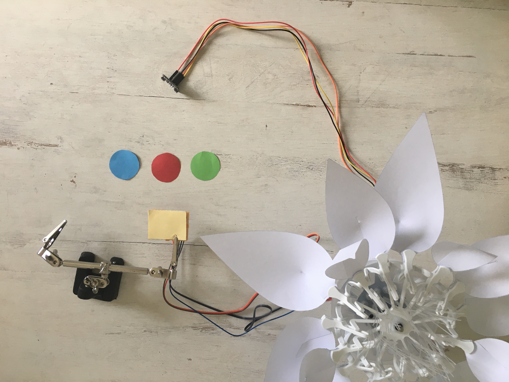

# STEP-BY-STEP 
# Diversity of the flower 
<br>

Pollination allows the transport of pollen from the male reproductive organs to the female reproductive organ, which will then allow the reproduction of the plants.
This transport takes place either inside the flowers (self-pollination) or by cross-pollination (the pollen of one flower is deposited on the stigmata of another flower). 
In the latter case, the pollination vectors may be biotic (birds, insects...) or abiotic (wind, water,..). 
Thus, cross-pollination may allow flower varieties to cross, to give rise to new species with a new color of plants for example. 
In this project, you will recreate the diversity of the flower regarding the flower's color due to the spreading of the seeds by the wind. 

You will write a program to interact with the flower. You need a red, green and blue paper. Each piece of paper represents a seed of one kind of a flower with petals. The flower
opens (50%) if a color is detected and the LEDs light like the color. When  a second color is detected, you will need to breath on the CO2 sensor to act like the wind
and the flower opens (100%) and lights up in the same color as the mixture of the two colors.

## Objective
* You can toggle an LED.
* You can integrate a color sensor.
* You can integrate a CO2 sensor.
* You can control a stepper motor.
* You understand conditionals.
* You can deal with global and local variables.
* You understand logical operators.
* You understand writing and calling functions.

## Material 
* 1 Bionic Flower
* 1 color sensor 
* 1 CO2 sensor
* Jumper cables
* *DIVERSITY_OF_THE_FLOWER_Code_Challenge.ino* (download on github)

<br>

# Task 1: Control the LEDs
**Some variables or functions (such as *RGB_Calibration ()*) are commented lines of code, these will be useful from task 2.**

Change the color of the LED's. The Bionic Flower is equipped with 5 LEDs. The color of each LED is given by an RGB code. The LEDs are connected on GPIO 16.
## Wiring scheme:
LEDs	| ESP32 
------------ | -------------
LEDs | GPIO 16

## Code:
1. Open the *DIVERSITY_OF_THE_FLOWER_Code_Challenge.ino* file.
2. *library*
<br> Add the library to control the LEDs. 
3. *global variables*
* Define the GPIO of the LEDs and give it the variable name "LED_PIN". 
* Create the object for the LEDs. 
* Create 6 functions to light up the LEDs for the blue, red, green, magenta (mix between blue and red), cyan (mix between blue and green) and yellow color (mix between red and green). Think about adding a function to turn off the LEDs (black color). 
*RGB code website link :* https://www.w3schools.com/colors/colors_picker.asp
4. *setup()*
* Initialize the LEDs.
* Turn off the LEDs.
5. *loop()*
<br> Make a color sequence : 
* Turn on the LEDs in blue.
* Wait 500 ms.
* Turn on the LEDs in red.
* Wait 500 ms.
* Turn on the LEDs in magenta.
* Wait 500 ms.
* Turn on the LEDs in green.
* Wait 500 ms.
* Turn on the LEDs in cyan.
* Wait 500 ms.
* Turn on the LEDs in yellow.
* Wait 500 ms.

# Task 2: Implement the color sensor
<br> Each color is defined by its RGB code, a color component from 0 to 255. (https://www.w3schools.com/colors/colors_picker.asp). After a calibration, the color sensor measures the value of the red, green and blue color components.
<br> The color sensor use the I2C communication, so it uses the SCL and SDA pins. The color sensor's I2C address is 0x44.
<br> In this task, the flower lights up in the color wich has been detected by the color sensor (red,blue or green). 
* The *BW_Calibration()* function allows to calibrate the maximum RGB value by measuring a white object and the minimum RGB value with the black object. These values 
will then allow you to calculate the RGB values of all colors.
* The *RGB_Calibration()* function allows the measurement of RGB components for red, green and blue. These values will then be used in the *Read_RGB()* function 
to determine if one of these colors is present underneath the sensor.
* The *Read_RGB()* function allows to read the RGB components values. It determines if the red color is underneath the sensor (Red=true if it is the case),
 if the green color is underneath the sensor (GREEN=true if it is the case) or if blue color is underneath the sensor (BLUE=true if it is the case).

<br>
## Wiring scheme:
Color sensor | ESP32
------------ | -------------
SCL | GPIO 5
SDA | GPIO 4 
(+)  | 5 V
(-)  | GND

## Code:
1. *library*
<br> Add the library for the I2C communication.
<br> Add the library for the color sensor. 
```
// color sensor's library
#include "SparkFunISL29125.h"
```
2. *global variables*
* Define the I2C communication pins.
* Uncomment the code lines for the color sensor.
* Define the sensor's I2C address. 
* Create the object for the color sensor.
```
// Color sensor
SFE_ISL29125 RGB_sensor;
```
* Uncomment the *BW_Calibration()* function, the *RGB_Calibration()* function and the *Read_RGB()* function. Take your time to read and understand the functions. 
3. *setup()*
* Start the I2C communication.
* Initialize the color sensor.
```
//Color sensor initialisation
 RGB_sensor.init();
 ```
 * Calibrate the sensor first with black and white and then with red, green and blue. 
 * Wait 3s.
4. *loop()*
* Write a while-structure :
    * while no color is detected (no red,no blue,no green), read the color sensor. 
 * If your are out of the while loop, a color has been detected, so you can light up the flower in the color which has been detected.
 * Wait 5s.
 * Turn off the LEDs. 
 * Put the boolean variable (RED,BLUE and GREEN) in false. 
 
# Task 3: Implement the stepper motor
 Use the stepper motor to open or close the Bionic Flower.
 <br> In this task, if a color is detected the flower lights up in this color and the flower partly opens (50%).

## Code:
1. *library*
<br> Add the library to control the motor of the Bionic Flower. 
2. *global variables*
* Define the GPIO and variable for the motor. 
* Create the object for the motor.
* Add the *motor_calibration()* function.
3. *setup()*
* Initialize the motor. 
* Calibrate the motor. 
4. *loop()*  
 * Write a while-structure :
    * while no color is detected (no red,no blue,no green), read the color sensor. 
 * If your are out of the while loop, a color has been detected, so you light up the flower in this color. 
 * Open the flower (50%).
 * Wait 5s.
 * Close the flower. 
 * Turn off the LEDs. 
 * Put the boolean variable (RED,BLUE and GREEN) in false. 
 
# Task 4: Implement the CO2 sensor
<br> The CO2 sensor provides an approximate measurement of the CO2 level in the air. This sensor use the I2C communication, so it uses the SCL and SDA pins.
The CO2 sensor's I2C address is 0x58.
<br> In this task, you will read the CO2 value. If a color is detected the flower lights up in this color and the flower partly opens (50%). Then, if a breath is detected (indicating the wind) the flower closes. 
<br>
## Wiring scheme:
CO2 sensor | ESP32
------------ | -------------
SCL | GPIO 5
SDA | GPIO 4 
(+)  | 5 V
(-)  | GND

## Code:
1. *library*
<br> Add the library for the CO2 sensor. 
```
// CO2 sensor's library
#include "Adafruit_SGP30.h"
```
2. *global variables*
* Define the sensor's I2C address.
* Define a global variable to save the CO2 level. 
* Define a global variable for a CO2 threshold value to detect a breath (approximately 700 ppm).
* Create the object for the CO2 sensor.
```
//CO2 sensor 
Adafruit_SGP30 sgp;
```
3. *setup()*
* Initialize the CO2 sensor
```
 // CO2 sensor initialisation
 sgp.begin();
```
4. *loop()*
 * Write a while-structure :
    * while no color is detected (no red,no blue,no green), read the color sensor. 
 * If your are out of the while loop, a color has been detected, so you light up the flower in this color. 
 * Open the flower (50%).
 *  Read the CO2 value 
```
   //Start the transmission with the CO2 sensor 
    Wire.beginTransmission(ADD_CO2);      
    //Read the CO2 value
    if (! sgp.IAQmeasure()) {return;}
    int CO2_value = sgp.eCO2;
    Serial.print("eCO2 "); Serial.println(CO2_value);
    // End the transmission with the CO2 sensor
    Wire.endTransmission();
 ```
 * Write a while-structure :
     * while no breath is detected, read the CO2 value. 
 * If you are out of the while loop, a breath has been detected, and the flower closes. 
 * Turn off the LEDs. 
 * Put the boolean variable (RED,BLUE and GREEN) in false. 

# Task 5: Scenario
Now, write the final code to recreate the scenario :
  * First, a color is detected (red,blue or green), the flower lights up in this color and partly open (50%).
  * A second color is detected (red,blue or green) and a breath is detected, the flower lights up in mixing color (magenta, cyan or yellow) depending on the 2 colors which have been detected before and the flower fully open (100%). 
  * After 5s, the flower closes and turn off the LEDs. 
 

