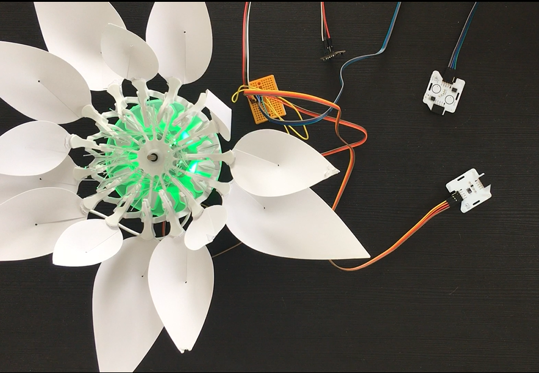
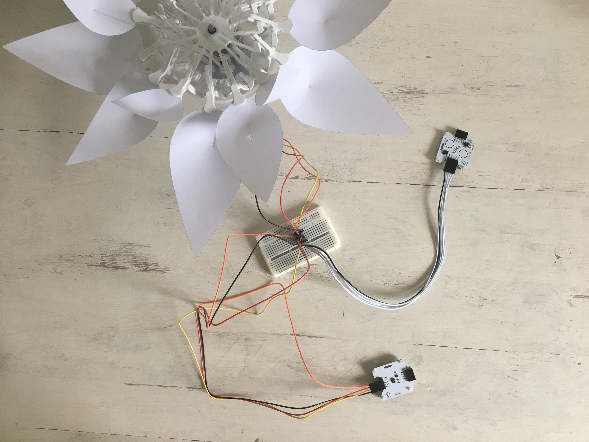

# STEP-BY-STEP 
# Photosynthesis
<br>

Photosynthesis needs light, chlorophyll, Co2 and water. This phenomena allows to create O2 out of CO2 and luminous energy.
In this project, you will recreate the effect of photosynthesis. 

You will write a program to interact with the flower. You will select the color green (which represents chlorophyll cells) with the touch sensor.
The light sensor will allow you to define if it's day or night.The flower opens if it's day and closes if not. 
In addition, you can blow on the CO2 sensor to represent the presence of C02.

## Objective
* You can toggle an LED.
* You can integrate a touch sensor.
* You can integrate a light sensor.
* You can integrate a CO2 sensor.
* You can control a stepper motor.
* You understand conditionals.
* You can deal with global and local variables.
* You understand logical operators.
* You understand writing and calling functions.

## Material 
* 1 Bionic Flower
* 1 touch sensor 
* 1 light sensor 
* 1 CO2 sensor
* Jumper cables
* *PHOTOSYNTHESIS_Code_Challenge.ino* (download on github)

<br>

# Task 1: Control the LEDs
Change the color of the LED's. The Bionic Flower is equipped of 5 LEDs. The color of each LED is given by an RGB code. The LEDs are connected on GPIO 16.

## Wiring scheme:
LEDs	| ESP32 
------------ | -------------
LEDs | GPIO 16

## Code:
1. Open the *PHOTOSYNTHESIS_Code_Challenge.ino* file.
2. *library*
<br> Add the library to control the LEDs. 
3. *global variables*
* Define the GPIO of the LEDs and give it the variable name "LED_PIN". 
* Define the number of colors
* Create the object for the LEDs. 
* Create 4 functions to light up the LEDs in blue, red, yellow and green. Think about adding a function to turn off the LEDs (black color). 
*RGB code website link :* https://www.w3schools.com/colors/colors_picker.asp
4. *setup()*
* Initialize the LEDs.
* Turn off the LEDs.
5. *loop()*
<br>Make a if-structure :
   * If *color* variable is equal to 1, turn on the LEDs in red
   * If *color* variable is equal to 2, turn on the LEDs in green 
   * If *color* variable is equal to 3, turn on the LEDs in blue
   * If *color* variable is equal to 4, turn on the LEDs in yellow and put *color* variable to 0.  
   * Wait 2 s.

# Task 2: Implement the touch sensor
<br> The touch sensor sends a signal if a contact is detected. This sensor use the I2C communication, so it uses the SCL and SDA pins. The touch sensor's I2C address is 0x28.
<br> In this task, the flower lights up in random color first. Then if a touch is detected the flower changes the color in a random order. 
<br>
## Wiring scheme:
Touch sensor | ESP32
------------ | -------------
SCL | GPIO 5
SDA | GPIO 4 
(+)  | 5 V
(-)  | GND

## Code:
1. *library*
<br> Add the library for the I2C communication and the library for the touch sensor. 
2. *global variables*
* Define the I2C communication pins.
* Define the sensor's I2C address.
* Create the object for the touch sensor.
3. *setup()*
* Start the I2C communication.
* Initialize the touch sensor.
* Use the *random(value)* function to define the first color.
```
 color = random(num_color);
```
* Light up the Bionic Flower in this random color (you can use a if-structure as in the previous task). 
4. *loop()*
* Write a while-structure :
    * while no touch detected (no left and no right), print "No touch detected" on serial monitor
    * If your are out of the while loop, a contact has been detected, so you can use the if loop to change color.
 
# Task 3: Implement the light sensor
<br> The light sensor allows to measure the ambient luminosity. This sensor use the I2C communication, so it uses the SCL and SDA pins. The light sensor's I2C address is 0x38.
<br> In this task, you will read the luminosity value and change the flower's color depending on it.   

<br>
## Wiring scheme:
Light sensor | ESP32
------------ | -------------
SCL | GPIO 5
SDA | GPIO 4 
(+)  | 5 V
(-)  | GND

## Code:
1. *library*
<br> Add the library for the light sensor. 
2. *global variables*
* Define the sensor's I2C address.
* Add the variable of the light sensor.
* Define a global variable for a luminosity threshold value (limit between day and night).
* Create the object for the light sensor.
3. *setup()*
* Start the I2C communication. 
* Initialize the light sensor.
4. *loop()
* Read the value of the light sensor and display the luminosity value on the serial monitor. 
 ```
  //Start the transmission with the light sensor 
    Wire.beginTransmission(ADD_LIGHT);
    //Read the luminsity value
    luminosity_sensor= rpr0521rs.get_psalsval(&proximity,&luminosity);
    Serial.println("Luminosity value");
    Serial.println(luminosity);
    // End the transmission with the light sensor
    Wire.endTransmission();
```
* Write a if-structure : 
     * If the luminosity exceeds the threshold value, print the message "Day" on the serial monitor.
     * Else, print "Night" on the serial monitor. 

# Task 4 : Integrate the stepper motor
Use the stepper motor to open and close the Bionic Flower.
<br> In this task you open the flower when it is day and close it when it is night.
## Code:
1. *library*
<br> Add the library to control the motor of the Bionic Flower. 
2. *global variables*
* Define the GPIO and variable for the motor. 
* Create the object for the motor.
*  Add the *motor_calibration()* function.
3. *setup()*
* Initialize the motor. 
* Calibrate the motor. 
4. *loop()*  
 * Write an if-structure : 
    * if the luminosity is high enough (day), the flower is opening. 
    * otherwise, the flower is closing. 

# Task 5: Implement the CO2 sensor
<br> The CO2 sensor provides an approximate measurement of the CO2 level in the air. This sensor use the I2C communication, so it uses the SCL and SDA pins.The CO2 sensor's I2C address is 0x58.
<br> In this task, you will read the CO2 value, and detect a breath (the CO2 level will increase).
<br>
## Wiring scheme:
CO2 sensor | ESP32
------------ | -------------
SCL | GPIO 5
SDA | GPIO 4 
(+)  | 5 V
(-)  | GND

## Code:
1. *library*
<br> Add the library for the CO2 sensor. 
```
// CO2 sensor's library
#include "Adafruit_SGP30.h"
```
2. *global variables*
* Define the sensor's I2C address.
* Define a global variable to save the CO2 level. 
* Define a global variable for a CO2 threshold value to detect a breath (approximately 700 ppm).
* Create the object for the CO2 sensor.
3. *setup()*
* Initialize the CO2 sensor
```
 // CO2 sensor initialisation
 sgp.begin();
```
4. *loop()*
* Read the CO2 value 
```
   //Start the transmission with the CO2 sensor 
    Wire.beginTransmission(ADD_CO2);      
    //Read the CO2 value
    if (! sgp.IAQmeasure()) {return;}
    int CO2_value = sgp.eCO2;
    Serial.print("eCO2 "); Serial.println(CO2_value);
    // End the transmission with the CO2 sensor
    Wire.endTransmission();
 ```
 * Write an if-structure : 
    * if a breath is detected (CO2 level is higher than the CO2 threshold), print "Breath detected" on the serial monitor.
    * otherwise, print "No breath detected" on the serial monitor.

# Task 6: Scenario
Now, create the final program to recreate the scenario :
  * While no touch is detected :
       * Read the light sensor. The flower opens if it's day and closes if it's night. 
       * Read the CO2 sensor. 
       * If it's day, the color was selected to be green and a breath has been detected, you can create a "photosynthesis behavior" like a color sequence. Then, you use the *random(value)* function to light up the flower in a new random color. 
  * If a touch is detected, you change the flower's color. 

