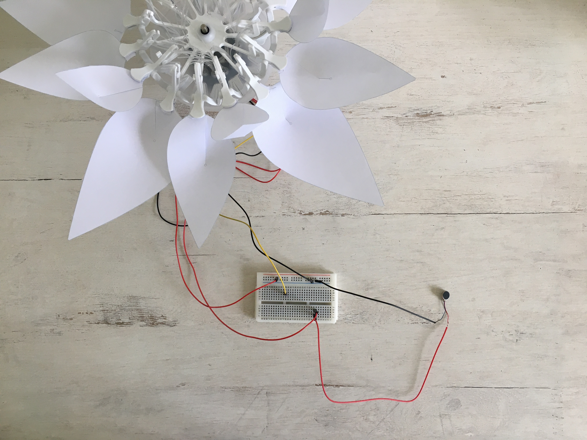
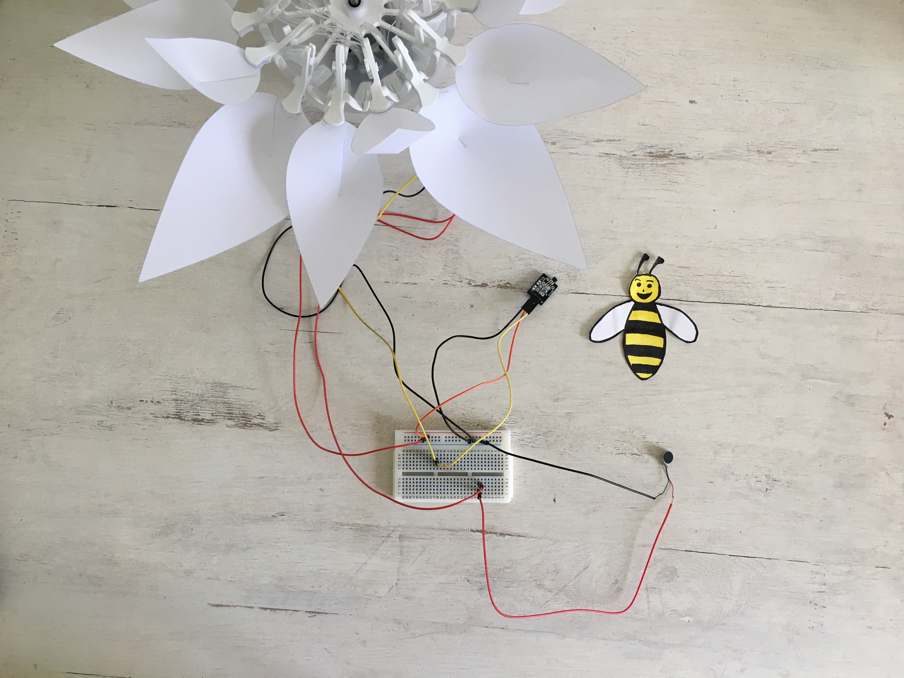

# Schritt für Schritt 
# Die Biene 
<br>

Bienen sind wichtig für das Leben und Gedeihen der Blumen. Die Hauptaufgabe der Bienen ist die Bestäubung der Blumen, welche die  Fortpflanzung der Pflanzen ermöglicht. In diesem Projekt werden wir das Zusammenspiel zwischen  Bienen und  Blumen nachstellen. Dabei reproduzieren wir das Geräusch der Bienen (Summen), wenn sie sich in der Nähe von Blumen befinden und zeigen, dass die meisten Bienen tagaktive Tiere sind.


Du wirst ein kleines Programm schreiben, um mit der Blume zu interagieren. Wenn es Tag ist (helle Umgebung), öffnet sich die Blume. Ansonsten ist es Nacht und die Blume schließt sich. Zusätzlich wirst du eine Biene zeichnen und einen Magneten darunter platzieren. Der Hall-Effekt-Sensor erkennt dann die Anwesenheit der Biene (d.h. des Magneten), wodurch der Vibrationsmotor aktiviert wird. Dies kann nur am Tag erfolgen.


## Zielsetzung
* Du kannst eine LED schalten.
* Du kannst einen Hallsensor integrieren.
* Du kannst einen Lichtsensor integrieren.
* Du kannst einen Vibrationsmotor ansteuern.
* Du kannst einen Schrittmotor ansteuern.
* Du verstehst Bedingungen.
* Du kannst mit globalen und lokalen Variablen umgehen.
* Du verstehst logische Operatoren.
* Du verstehst das Schreiben und Aufrufen von Funktionen.


## Material 
* 1 Bionic Flower
* 1 Lichtsensor
* 1 Hallsensor
* 1 Vibrationsmotor
*	Jumper Kabel
* *BEE_Code_Challenge.ino* (download on github)

<br>

# Aufgabe 1: Steuere den Vibrationsmotor an
Aktiviere den Vibrationsmotor alle 1s. Der Vibrationsmotor ist auf GPIO 22 gesteckt.
<br>
## Verdrahtungsplan:
Vibrating motor	| ESP32 
------------ | -------------
Red | GPIO 22 
Black | GND 

## Code:
1.Öffne die Datei *BEE_Code_Challenge.ino*. <br>
2. *Globale Variablen*
<br>Definier den GPIO des Vibrationsmotors und gib ihm den Variablennamen "MOTOR_PIN". <br>
3. *setup()*
* Setze den "MOTOR_PIN" als OUTPUT.
*	Schalte den Vibrationsmotor aus. Verwende die Funktion *digitalWrite(variable, Wert);* um die Leistung des Vibrationsmotors über den LOW-Wert zu steuern.
4. *loop()* (Schleife) 
<br>Steuere den MOTOR_PIN über Ein- und Ausschalten. Verwende die Funktion  *digitalWrite(variable, Wert);* um die Leistung des Vibrationsmotors über HIGH- und LOW-Werte zu steuern.Füge zwischen jedem HIGH- und LOW-Wert ein *delay();* von 1000 ms ein (Verzögerung von einer Sekunde).

# Aufgabe 2: Integriere den Hallsensor
Nun wollen wir mit dem Hallsensor arbeiten, um einen Magneten zu erkennen. Die Ergebnisse, ob ein Magnet in der Nähe ist oder nicht, werden auf dem seriellen Monitor in der Arduino IDE angezeigt. Wenn sich ein Magnet dem Hall-Sensor nähert, erkennt er eine Änderung des Magnetfeldes. Der Hall-Sensor hat 3 Pins: Masse (-), Spannungsversorgung und Signal-Pin (S). Dieser Sensor ist ein digitaler Sensor: der Wert des Hallsensors ist 0, wenn ein Magnet erkannt wird, ansonsten ist er 1.
<br>
## Verdrahtungsplan:
Hallsensor| ESP32 
------------ | -------------
S | GPIO 21
(+)| 5V
(-) | GND

## Code:
1. *Globale variablen*
* Definiere den GPIO des Hallsensors und gib ihm den Variablennamen "HALL_PIN".
* Definiere eine Integer-Variable (ganzzahlig) zum Speichern des Hallsensorwertes und gib ihr den Variablennamen "Magnet".
2. *setup()*
<br> Setzt HALL_PIN als IMPUT.
3. *loop()* (Schleife) 
* Lies die Werte aus dem Hallsensor mit digitalRead()und gib sie auf dem seriellen Monitor aus.
```
//Read the hall sensor
magnet = digitalRead( HALL_PIN);
Serial.println("Magnet");
Serial.println(magnet);    
```
* Schreiben Sie eine if-Bedingung:
    * Wenn ein Magnet erkannt wird, schalte den Vibrationsmotor ein.
    * Wenn kein Magnet erkannt wird, schalte den Vibrationsmotor aus.


# Aufgabe 3: Steuer die LEDs an
Ändere die Farbe der LED's. Die Bionic Flower besteht aus 5 eingebauten LEDs. Die Farbe jeder LED ist durch einen RGB-Code gegeben. Die LEDs sind an GPIO 16 angeschlossen.

## Verdrahtungsplan:
LEDs	| ESP32 
------------ | -------------
LEDs | GPIO 16

## Code:
1. *Bibliothek*
<br> Füg die Bibliothek zur Steuerung der LEDs hinzu.
2. *Globale Variablen*
*	Definiere den GPIO der LEDs und gib ihm den Variablennamen "LED_PIN".
*	Erstelle das Objekt für die LEDs.
*	Erstelle 2 Funktionen, um die LEDs für den Tag und für die Nacht einzuschalten. Denk daran, eine Funktion zum Ausschalten der LEDs (schwarze Farbe) hinzuzufügen.  
*Hier findest du Hilfe zu den Farben: RGB-Code Website-Link* : https://www.w3schools.com/colors/colors_picker.asp
3. *setup()*
* Initialisiere die LEDs.
* Schaltedie LEDs aus.
4. *loop()* (Schleife) 
<br>Erzeuge eine Farbabfolge :
* Schalte die LEDs in der für den Tag verwendeten Farbe ein.
*	Warte 500 ms.
*	Schalte die LEDs in der Farbe ein, die für die Nacht verwendet wird.
*	Warte 500 ms.

# Aufgabe 4: Integriere den Schrittmotor
Benutze den Schrittmotor zum Öffnen und Schließen der Bionic Flower.

## Code:
1. *Bibliothek*
<br> Füg die Bibliothek zur Steuerung des Motors der Bionic Flower hinzu. 
2. *Globale Variablen*
*	Definier den GPIO und die Variable für den Motor.
*	Erstelle das Objekt für den Motor.
*	Füge die Funktion *motor_calibration()* hinzu.
3. *setup()*
* Initialisiere den Motor.
* Kalibriere den Motor.
4. *loop()* (Schleife) 
*	Lass die LEDs in der von dir gewählten Farbe leuchten.
*	Öffne die Blume vollständig.
*	Warte 1 s.
*	Lass die LEDs in der Farbe leuchten, die du für die Nacht gewählt hast.
*	Schließe die Blume.
*	Warte 1s.

# Aufgabe 5: Integriere den Lichtsensor
<br> Der Lichtsensor ermöglicht die Messung der Umgebungshelligkeit. Dieser Sensor kommuniziert über das I2C-Protokoll, er nutzt also die Pins SCL und SDA. 
<br>
## Verdrahtungsplan:
Lichtsensor | ESP32
------------ | -------------
SCL | GPIO 5
SDA | GPIO 4 
(+)  | 5 V
(-)  | GND

## Code:
1. *Bibliothek*
<br>Füg die Bibliothek für die I2C-Kommunikation und für den Lichtsensor hinzu. 
2. *Globale Variablen*
* Definiere die Pins der I2C-Kommunikation.
* Füge die Variable für den Lichtsensor hinzu.
* Definiere die globale Variable für einen Helligkeitsschwellenwert (Grenze zwischen Tag und Nacht).
* Erstellen Sie das Objekt für den Lichtsensor.
3. *setup()*
* Starte die I2C-Kommunikation.
* Initialisiere den Lichtsensor.
4. *loop()* (Schleife) 
* Lies den Wert des Lichtsensors aus. 
 ```
 //Read the luminosity value
 luminosity_sensor= rpr0521rs.get_psalsval(&proximity,&luminosity);
 Serial.println("Luminosity value");
 Serial.println(luminosity);
```
* Schreibe eine while-Schleife :
     * wenn es hell genug ist, um als Tag erkannt zu werden, leuchten die LEDs in der Farbe, die du für den Tag gewählt hast, und die Blume öffnet sich.
     * Ansonsten leuchten die LEDs in der Farbe, die du für die Nacht gewählt hast, und die Blume schließt sich.

   
# Aufgabe 6: Das ganze Szenario
Erstelle nun den endgültigen Code, um das Szenario nachzubilden :
*	Tag : LEDs leuchten in der Tagesfarbe auf, die Blume öffnet sich. Zusätzlich wird, wenn sich ein Magnet in der Nähe des Hallsensors befindet, der Vibrationsmotor aktiviert.
* Nacht : LEDs leuchten in der Nachtfarbe und die Blume schließt sich.
 

