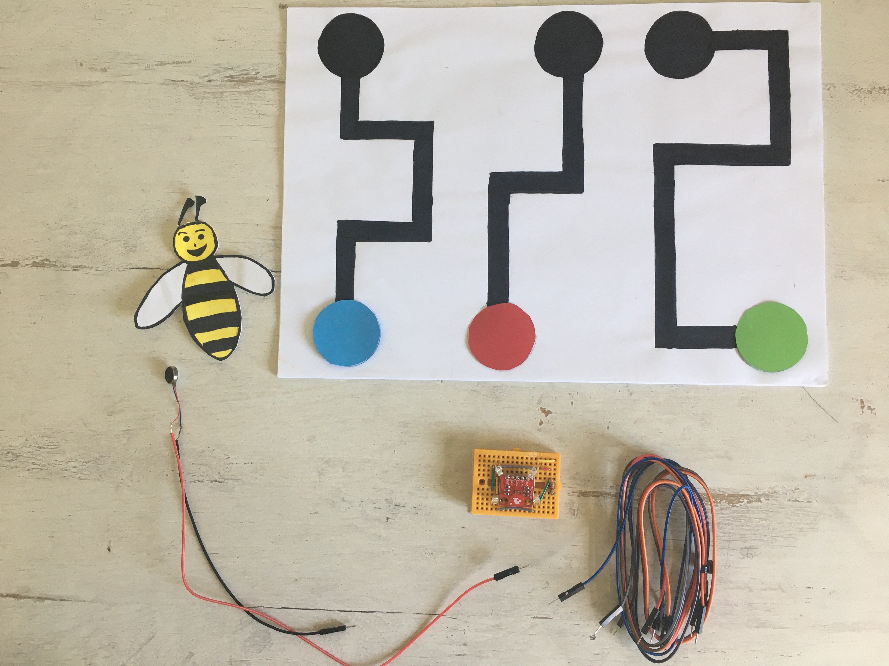

# STEP-BY-STEP 
# Bee's travel
<br>

Bees are important in the life of flowers. Indeed, the main role of bees is the pollination that allows the reproduction of plants. 
<br> In this project, you will recreate the fact that some bees are attracted to specific flowers. Thus, every year they follow the same path to pollinate these flowers.

You will write a program to interact with the flower. Each path is associated with a color (blue,red or green). You will draw a bee and put the color sensor underneath. The Bionic Flower will light up in random colors. The sensor will detect if you followed the path well and if you choose the right color. If it's the case, the flower will open. Otherwise, the vibrating motor is buzzing. 

## Objective
* You can toggle an LED.
* You can integrate a color sensor.
* You can integrate a vibrating motor.
* You can control a stepper motor.
* You understand conditionals.
* You can deal with global and local variables.
* You understand logical operators.
* You understand writing and calling functions.

## Material 
* 1 Bionic Flower
* 1 color sensor 
* 1 vibrating motor sensor
* Jumper cables
* *BEE_S_TRAVEL_Code_Challenge.ino* (download on github)

<br>

# Task 1: Control the LEDs
**Some variables or functions (such as *RGB_Calibration ()*) are commented lines of code, these will be useful for task 2.**

Change the LED's color. The Bionic Flower is equipped with 5 integrated LEDs. The color of each LED is given by an RGB code. The LEDs are connected on GPIO 16.
## Wiring scheme:
LEDs	| ESP32 
------------ | -------------
LEDs | GPIO 16

## Code:
1. Open the *BEE_S_TRAVEL_Code_Challenge.ino* file.
2. *library*
<br> Add the library to control the LEDs. 
3. *global variables*
* Define the GPIO of the LEDs and give it the variable name "LED_PIN". 
* Create the object for the LEDs. 
* Create 3 functions to light up the LEDs in blue, red and green. Think about adding a function to turn off the LEDs (black color). 
*RGB code website link :* https://www.w3schools.com/colors/colors_picker.asp
4. *setup()*
* Initialize the LEDs.
* Turn off the LEDs.
5. *loop()*
<br> Light up the flower in random colors :
* Define a random value, for this use the *random(value)* function.
```
 //The flower light in random color 
  int color = random(3);
 ```
 * Write a if-structure : 
   * If *color* variable is equal to 0, light up the flower in red.
   * If *color* variable is equal to 1, light up the flower in green.
   * If *color* variable is equal to 2, light up the flower in blue.
 * Wait 500 ms.

# Task 2: Implement the color sensor
<br> Each color is defined by its RGB code ,a color component from 0 to 255. (https://www.w3schools.com/colors/colors_picker.asp). After a calibration, the color sensor measures the value of the red, green and blue color components.
<br> The color sensor use the I2C communication, so it uses the SCL and SDA pins. The color sensor's I2C address is 0x44.
<br> In this task, the flower lights up in the color wich has been detected by the color sensor (red,blue or green). 
* The *BW_Calibration()* function allows to calibrate the maximum RGB value by measuring a white object and the minimum RGB value with the black object. These values 
will then allow you to calculate the RGB values of all colors.
* The *RGB_Calibration()* function allows the measurement of RGB components for red, green and blue. These values will then be used in the *Read_RGB()* function 
to determine if one of these colors is present underneath the sensor.
* The *Read_RGB()* function allows to read the RGB components values. It determines if the red color is underneath the sensor (Red=true if it is the case),
 if the green color is underneath the sensor (GREEN=true if it is the case) or if blue color is underneath the sensor (BLUE=true if it is the case).
<br>
## Wiring scheme:
Color sensor | ESP32
------------ | -------------
SCL | GPIO 5
SDA | GPIO 4 
(+)  | 5 V
(-)  | GND

## Code:
1. *library*
<br> Add the library for the I2C communication.
<br> Add the library for the color sensor. 
```
// color sensor's library
#include "SparkFunISL29125.h"
```
2. *global variables*
* Define the I2C communication pins.
* Uncomment the code lines for the color sensor.
* Define the sensor's I2C address. 
* Create the object for the color sensor.
```
// Color sensor
SFE_ISL29125 RGB_sensor;
```
* Uncomment the *BW_Calibration()* function, the *RGB_Calibration()* function and the *Read_RGB()* function. Take your time to read and understand the functions. 
3. *setup()*
* Start the I2C communication.
* Initialize the color sensor.
```
//Color sensor initialisation
 RGB_sensor.init();
 ```
 * Calibrate the sensor first with black and white and then with red, green and blue. 
 * Wait 3s.
4. *loop()*
* Write a while-structure :
    * while no color is detected (no red,no blue,no green), read the color sensor. 
 * If your are out of the while loop, a color has been detected, so you can light up the flower in the color which has been detected.
 * Wait 5s.
 * Turn off the LEDs. 
 * Put the boolean variable (RED,BLUE and GREEN) in false. 
 
# Task 3: Implement the stepper motor
 Use the stepper motor to open or close the Bionic Flower.
 <br> In this task, the flower lights up in a random color. If a color is detected, and this color is like the random color the flower opens. After 4s, the flower closes again. 

## Code:
1. *library*
<br> Add the library to control the motor of the Bionic Flower. 
2. *global variables*
* Define the GPIO and variable for the motor. 
* Create the object for the motor.
* Add the *motor_calibration()* function.
3. *setup()*
* Initialize the motor. 
* Calibrate the motor. 
4. *loop()*  
 * Light up the Bionic Flower in a random color.
 * Write a while-structure :
    * while no color is detected (no red,no blue,no green), read the color sensor. 
 * If your are out of the while loop, a color has been detected, define and put a boolean variable *good_color* true if the random color and the color which has been detected 
 are the same. 
 * Write a if-structure : 
   * If *good_color* is true, open the flower, wait and close the flower.
   * Else, display "Lose" on the serial monitor.   
 * Turn off the LEDs. 
 * Put the boolean variable (RED,BLUE and GREEN) in false. 
 * Wait 5s.
 
# Task 4: Implement the vibrating motor
<br> The vibrating motor vibrates when you power it. The motor is a digital object and is connected on GPIO 22.
<br> In this task, you will use the vibrating motor to indicate if the wrong color was detected.
<br>
## Wiring scheme:
Vibrating motor| ESP32
------------ | -------------
(+)  | GPIO 22 
(-)  | GND

## Code:
1. *global variables*
* Define the GPIO of the vibrating motor and give it the variable name "MOTOR_PIN". 
2. *setup()*
* Define the vibrating motor as a OUTPUT.
* Turn off the vibrating motor. 
3. *loop()*
 * Light up the Bionic Flower in a random color.
 * Write a while-structure :
    * while no color is detected (no red,no blue,no green), read the color sensor. 
 * If your are out of the while loop, a color has been detected, define and put a boolean variable *good_color* true if the random color and the color which has been detected 
 are the same. 
 * Write a if-structure : 
   * If *good_color* is true, open the flower, wait and close the flower.
   * Else, turn on the vibrating motor, wait 2s and turn off the vibrating motor.   
 * Turn off the LEDs. 
 * Put the boolean variable (RED,BLUE and GREEN) in false. 
 * Wait 5s.


# Task 5: Build the path.
<br> In this task, the flower lights up in the color wich has been detected by the color sensor (red,blue or green). 
* The *BW_Calibration()* function allows to calibrate the maximum RGB value by measuring a white object and the minimum RGB value with the black object. These values 
will then allow you to calculate the RGB values of all colors.
* The *RGB_Calibration()* function allows the measurement of RGB components for red, green and blue. These values will then be used in the *Read_RGB()* function 
to determine if one of these colors is present underneath the sensor.
* The *Read_RGB()* function allows to read the RGB components values. It determines if the red color is underneath the sensor (Red=true if it is the case),
 if the green color is underneath the sensor (GREEN=true if it is the case) or if blue color is underneath the sensor (BLUE=true if it is the case).

## Code:
1. *global variables*
* Define two boolean variables to detect the path and the end of the path. 
* Uncomment the part of the code about the path and the end of the path in the *RGB_Calibration()* function.
* Complete the *Read_RGB()* function to test the path and the end of the path. Inspire you structures for the colors red, blue and green.
2. *loop()*
* Define a boolean variable *RUN*. This value becomes true when a color has been detected until the end of the path has been detected.
* Light up the Bionic Flower in a random color.
 * Write a while-structure :
    * while no color is detected (no red,no blue,no green), read the color sensor. 
 * If your are out of the while loop, a color has been detected, define and put a boolean variable *good_color* true if the random color and the color which has been detected 
 are the same. 
 * Write a if-structure : 
   * If *good_color* is true, open the flower, wait and close the flower.
   * Else, turn on the vibrating motor, wait 2s and turn off the vibrating motor.  
 * Write a while-structure :
   * If path is detected, display "-----" on the serial monitor.
   * If the end of the path is detected, display "######" on the serial monitor and put the *RUN* variable in false.
   * Else turn on the vibrating motor,wait 500 ms and turn off the vibrating motor.   
 * Turn off the LEDs. 
 * Put the boolean variable (RED,BLUE and GREEN) in false. 
 * Wait 5s.

# Task 6: Scenario
Now, create the final code to recreate the scenario :
  * Light up the bionic Flower in random colors.
  * Detect a color, follow the path until the end. If you are not following the path correctly until the very end the vibrating motor buzzes .
  * Calculate a score to determine if you have followed the path well.
  * If you have chosen the right color and have a good score (superior to a win threshold), the flower opens. After 4s the flower closes again. 
 

