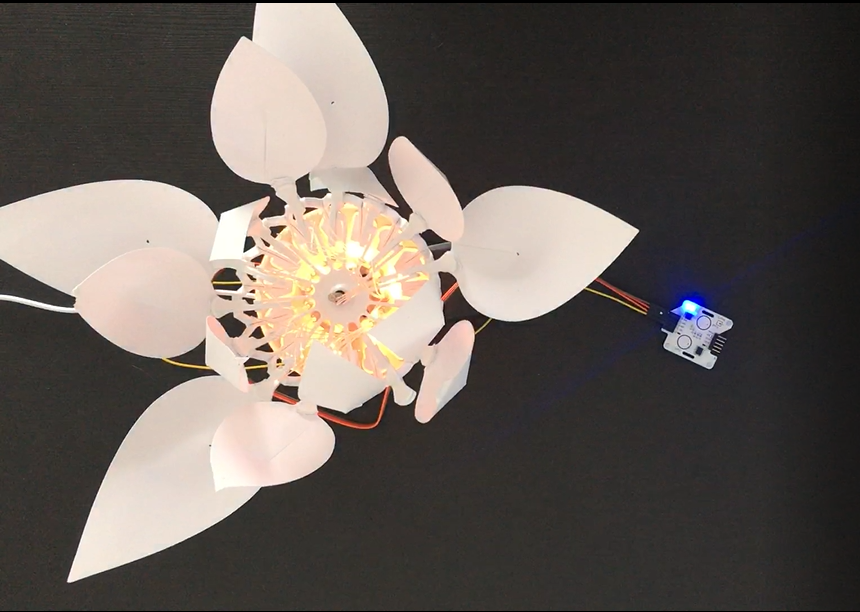

# Schritt für Schritt
# Die fleischfressende Pflanze
<br>

Fleischfressende Pflanzen sind einzigartig in ihrer Fähigkeit, ihre Beute (meist Insekten) anzulocken, zu fangen und (ganz oder teilweise) zu fressen. Die Fallen der fleischfressenden Pflanze werden als "aktiv" definiert, wenn sie mobil und schnell sind. In der Tat, wenn die fleischfressende Pflanze ein Insekt entdeckt, schließt sie sich sofort und fängt die Beute ein. Nach der Verdauung öffnet sich die Pflanze wieder und wartet auf die nächste Beute.

Zu Beginn ist die Blume geöffnet und leuchtet grün. Wenn du den Berührungssensor berührst (die Beute simulierst), schließt sich die Blume schnell und blinkt rot. Nach einer kurzen Wartezeit öffnet sich die Blume wieder und leuchtet grün. Zusätzlich kannst du dieses Szenario mit Hilfe des Gestensensors noch verbessern. Mit den 8 Bewegungen des Gestensensors kannst du verschiedene Verhaltensweisen der Blume definieren. Zum Beispiel löst du mit der Bewegung "vorwärts", das Schließen der Blume und das Blinken der LEDs aus. Die Bewegung "zurück", öffnet die Blume wieder. Die Bewegungen "rechts" und "links", ändert die Farbe der Blume. Die Bewegungen "auf" und "ab", verändert die Helligkeit der Farben. Sowie die Bewegungen "im Uhrzeigersinn" und "gegen den Uhrzeigersinn", um eine Ladebewegung mit den LEDs jeweils im oder gegen den Uhrzeigersinn zu erzeugen.

## Zielsetzung
* Du kannst eine LED schalten.
* Du kannst einen Berührungssensor integrieren.
* Du kannst einen Gestenerkennungssensor integrieren.
* Du kannst einen Schrittmotor ansteuern.
* Du verstehst Bedingungen.
* Du kannst mit globalen und lokalen Variablen umgehen.
* Du verstehst logische Operatoren.
* Du verstehst das Schreiben und Aufrufen von Funktionen.

## Material 
*	1 Bionic Flower
*	1 Berührungssensor
*	1 Gesternerkunngssensor
*	Jumper Kabel
* *CARNIVOROUS_PLANT_Code_Challenge.ino* (download on github)

<br>

# Aufgabe 1: Steuer die LEDs an
Ändere die Farbe der LED's und lass sie aufblinken Die Bionic Flower besteht aus 5 eingebauten LEDs. Die Farbe jeder LED ist durch einen RGB-Code gegeben. Die LEDs sind an GPIO 16 angeschlossen.

## Verdrahtungsplan:
LEDs	| ESP32 
------------ | -------------
LEDs | GPIO 16

## Code:
1. Öffne die Datei:  *CARNIVOROUS_PLANT_Code_Challenge.ino*
2. *Bibliothek*
<br>Füg die Bibliothek zur Steuerung der LEDs hinzu
3. *Globale Variablen*
*	Definiere den GPIO der LEDs und gib ihm den Variablennamen "LED_PIN".
*	Erstelle das Objekt für die LEDs.
*	Erstellen Sie 2 Funktionen, um die LEDs in rot und grün leuchten zu lassen. Denk daran, eine Funktion zum Ausschalten der LEDs (schwarze Farbe) hinzuzufügen. 
<br>*Hier findest du Hilfe zu den Farben: RGB-Code Website-Link :* https://www.w3schools.com/colors/colors_picker.asp
4. *setup()*
*	Initialisiere die LEDs.
*	Schalte die LEDs aus.
*	Lass die LED’s in grün leuchten
* Warte 2s
5. *loop()* (Schleife)
*	Erstellen Sie eine if-Schleife:
      *	Wenn die LEDs aus sind, schalte die roten LEDs ein und verwende die boolesche Variable, um den An-/Auszustand der LED’s zu merken.
      *	Andernfalls schalte die LEDs aus und nutze die booleschen Variablen erneut
*	Warte 2s.

# Aufgabe 2: Integriere den Berührungssensor
<br>Der Berührungssensor sendet ein Signal, wenn eine Berührung erkannt wird. Dieser Sensor kommuniziert über das I2C-Protokoll, er nutzt also die Pins SCL und SDA. Die I2C-Adresse des Farbsensors ist 0x28.
Wenn eine Berührung erkannt wird, blinken die LED's rot. Ansonsten leuchten sie grün.
<br>
## Verdrahtungsplan:
Berührungssensor | ESP32
------------ | -------------
SCL | GPIO 5
SDA | GPIO 4 
(+)  | 5 V
(-)  | GND

## Code:
1. *Bibliothek*
<br> Füg die Bibliothek für die I2C-Kommunikation und für den Berührungssensor hinzu.
2. *Globale Variablen*
*	Definiere die Pins der I2C-Kommunikation.
*	Definiere die I2C-Adresse des Sensors.
*	Erstelle das Objekt für den Berührungssensor.
3. *setup()*
*	Starte die I2c-kommunikation.
*	Initialisiere den Berührungssensor.
*	Lass die LED’s in grün leuchten.
4. *loop()* (Schleife)
*	Erstellen Sie eine while-Schleife:
	   * Solange keine Berührung erkannt wird (sowohl linkes als rechtes Pad), leuchtet die Blume grün
	   * Wenn du aus der while-Schleife raus bist und eine Berührung erkannt wurde, blinkt die Blume.
 
# Aufgabe 3: Integriere den Schrittmotor
Benutze den Schrittmotor zum Öffnen und Schließen der Bionic Flower.
<br>In dieser Aufgabe ist die Blume zunächst geöffnet und leuchtet grün. Wenn eine Berührung mit dem Berührungssensor erkannt wird, schließt sich die Blume schnell und blinkt rot. Nach 3s öffnet sich die Blume wieder und leuchtet grün.

## Code:
1. *Bibliothek*
<br> Füg die Bibliothek zur Steuerung des Motors der Bionic Flower hinzu. 
2. *Globale Variablen*
* Definier den GPIO und die Variable für den Motor.
* Erstelle das Objekt für den Motor.
*	Füge die Funktion *motor_calibration()* hinzu.
3. *setup()*
* Initialisiere den Motor.
*	Kalibriere den Motor.
*	Öffne die Bionic Flower vollständig ( Grundstellung).
*	Schalte die Blume ein - Beleuchtung grün ( Grundfarbe).
4. *loop()* (Schleife)
* Definiere eine niedrige Drehzahl für den Schrittmotor. 
 ```
 //Low speed
   RPM=100;
   stepper.begin(RPM, MICROSTEPS);
 ```
* Schreibe eine while-Schleife:
     * Solange keine Berührung erkannt wird (sowohl linkes als rechtes Pad), ist die Blume geöffnet und leuchtet grün.
*	Wenn du dich außerhalb der while-Schleife befindest, wurde ein Kontakt erkannt, die Blume schließt sich schnell (RPM = 450) und die LED's blinken.
*	Nachdem die Blume vollständig geschlossen ist, leuchtet die Blume rot.
*	Warte 3s.
*	Schalte die Blume in der Grundfarbe ein und benutze die boolesche Variable, um anzuzeigen, dass die LEDs aus sind.
 

# Aufgabe 4: Integriere den Gestenerkennungssensor
<br> Wenn der Sensor eine Bewegung erkennt, sendet er einen ganzzahligen Wert für jede Bewegung: rechts (1), links (2), oben (4), unten (8), vorwärts (16), rückwärts (32), im Uhrzeigersinn (64) und gegen den Uhrzeigersinn (128).
Dieser Sensor kommuniziert über das I2C-Protokoll, er nutzt also die Pins SCL und SDA. Die I2C-Adresse des Farbsensors ist 0x43.
<br> In dieser Aufgabe ist die Blume zunächst offen und leuchtet grün. Wenn die "Vorwärts"-Bewegung mit dem Gestensensor erkannt wird schließt sich die Blume schnell und blinkt rot. Danach, wenn die "Rückwärts"-Bewegung erkannt wird: öffnet sich die Blume wieder und leuchtet grün.
**Ab jetzt wird der Berührungssensor nicht mehr benötigt.**
<br>
## Verdrahtungsplan:
Gesternerkunngssensor | ESP32
------------ | -------------
SCL | GPIO 5
SDA | GPIO 4 
(+)  | 5 V
(-)  | GND

## Code:
1. Entferne den Kommentarbereich der Codezeilen für den Gestenerkennungssensor
2. *Bibliothek*
<br> Füg die Bibliothek zur Integration des Gestenerkennungssensors hinzu.
```
// gesture sensor's library
#include "paj7620.h"
```
3. *Globale Variablen*
* Definiere 8 globale Variablen, um jede Bewegung mit ihrem zugehörigen Wert zu verknüpfen.
4. *setup()*
* Initialisiere den Gesternerkennungssensor.
```
//Gesture sensor initialisation
 uint8_t error = paj7620Init();  
```
5. *loop()* (Schleife)
*	Lies den Wert des Gestenerkennungssensors aus.
 ```
  //Read the gesture sensor value
  byte gesture;
  int error;
  error = paj7620ReadReg(ADD_GEST, 1, &gesture);
  Serial.print("Gesture :  ");
  Serial.println(gesture);
```
*	Schreibe eine if-Schleife:
     * Wenn die "Vorwärts"-Bewegung erkannt wird, schließt sich die Blume schnell und blinkt rot.
     * Wenn die "Rückwärts"-Bewegung erkannt wird, öffnet sich die Blume wieder und leuchtet grün.
 
# Aufgabe 5: Weiterführende Aufgaben
Nun wirst du den abschließenden Code erstellen. Dazu wirst du diese Funktionen hinzufügen:

*  Mit den Bewegungen "rechts" und "links" änderst du die Farbe (rechts: nächste Farbe und links: vorherige Farbe). Mit den Bewegungen "oben" und "unten" änderst du die Intensität der Farbe (oben: erhöht die Intensität und unten: verringert die Intensität). Es gibt 5 Farben (blau, rot, grün, rosa, gelb) und 3 Intensitätsgrade (niedrig, mittel, hoch). 
  1. *Globale Variablen*
   *	Definiere eine globale Variable zum Speichern der Anzahl der aktuellen Farben (Blau = 0,Grün = 1,Rot = 2,Gelb = 3,Rosa = 4) und eine globale Variable zum Speichern der verschiedenen Intensitäten.
   *	Lege für jede Farbe eine Funktion mit einer variablen Intensität an.
   *	Erstelle die Funktion color(int color,int intensity). Diese Funktion ermöglicht es, die Bionic Flower mit der Farbe zu beleuchten, die durch die Nummer der Farbvariablen definiert ist bzw. mit der Intensität, die durch die Nummer der Intensitätsvariablen definiert ist. Wenn z.B. color = 1 und intensity = 3, leuchten die LEDs in grün mit einer hohen Intensität : ruf die Funktion green_3() auf. Verwende die if-Struktur, um diese Funktion zu erstellen.
  
   2. *setup()*
   <br>Verwende die Funktion *random(value)*, um die Bionic Flower am Anfang in einer zufälligen Farbe und einer zufälligen Intensität zu beleuchten.
   ```
  //initial color 
 color(random(nb_color),random(nb_intensity));
 ```
  3. *loop()* (Schleife)
     * Wenn die Bewegung "rechts" erkannt wird, wird die Variable current_color um eins erhöht. Danach, wenn current_color gleich der Nummer von color ist, setze den Wert von current_color auf 0. (Ohne dies leuchtet die Blume nur in rosa). Verwende nun die Funktion color(int color,int intensity), um die Blume zu beleuchten.
     * Wenn eine "linke" Bewegung erkannt wird, verringere die Variable current_color um eins. Danach, wenn current_color negativ ist, setze den aktuellen Farbwert gleich der Nummer der Farbe -1 . (Ohne diesen Wert leuchtet die Blume nur in blau). Verwende nun die Funktion color(int color,int intensity), um die Blume zu beleuchten.
     * Wenn eine "Aufwärts"-Bewegung erkannt wird und der Wert von current_intensity größer oder gleich der Anzahl von intensity -1 ist, erhöhe die Variable current_intensity um eins. Verwende nun die Funktion color(int color,int intensity), um die Blume zu beleuchten.
     * Wenn eine "Abwärtsbewegung" erkannt wird und der Wert von current_intensity positiv ist, verringer die Variable current_intensity um eins. Verwende nun die Funktion color(int color,int intensity), um die Blume zu beleuchten.

* Verwende die Bewegung "im Uhrzeigersinn" und "gegen den Uhrzeigersinn", um eine Ladebewegung durchzuführen (im Uhrzeigersinn: Ladebewegung im Uhrzeigersinn und gegen den Uhrzeigersinn: Ladebewegung gegen den Uhrzeigersinn)
  1. *loop()* (Schleife)
    * Wenn eine "anti_clockwise"-Bewegung erkannt wird, schalte jede LED in blau ein, warten 500 ms und schalte sie wieder aus. Wähle dazu jede LED mit einer for-Struktur aus (von led 0 bis led NUM_LEDS-1)
    *	Wenn eine Bewegung im "Uhrzeigersinn" erkannt wird, schalte jede LED blau ein, warte 500 ms und schalte sie wieder aus. Wähle dazu jede LED mit einer for-Schleife (von led NUM_LEDS-1 bis led 0)


