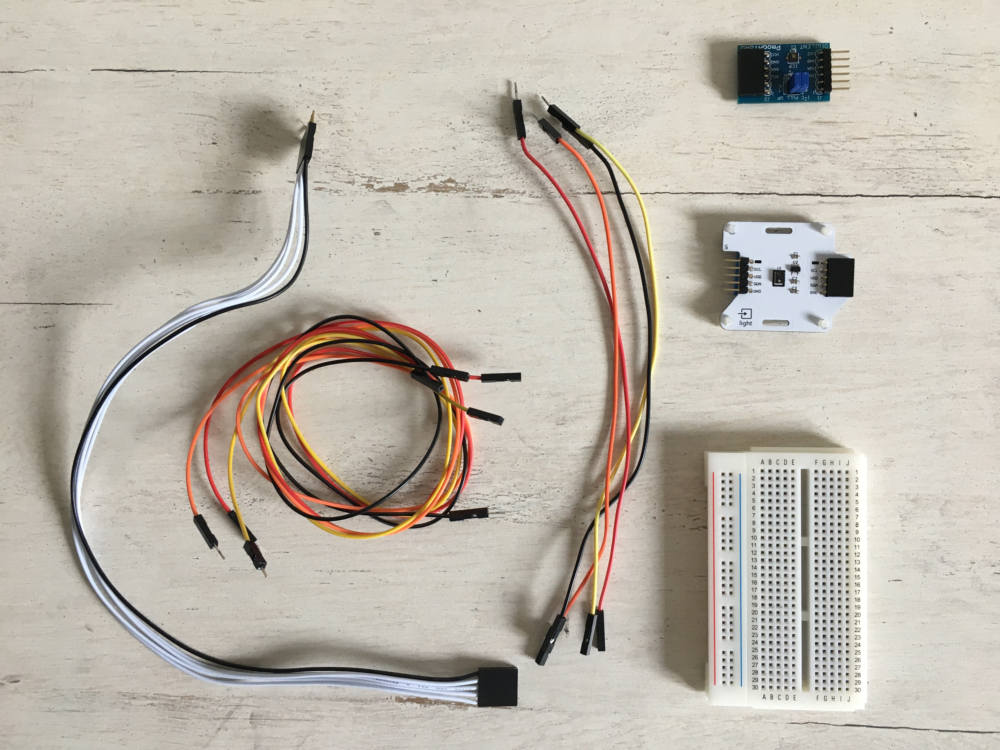
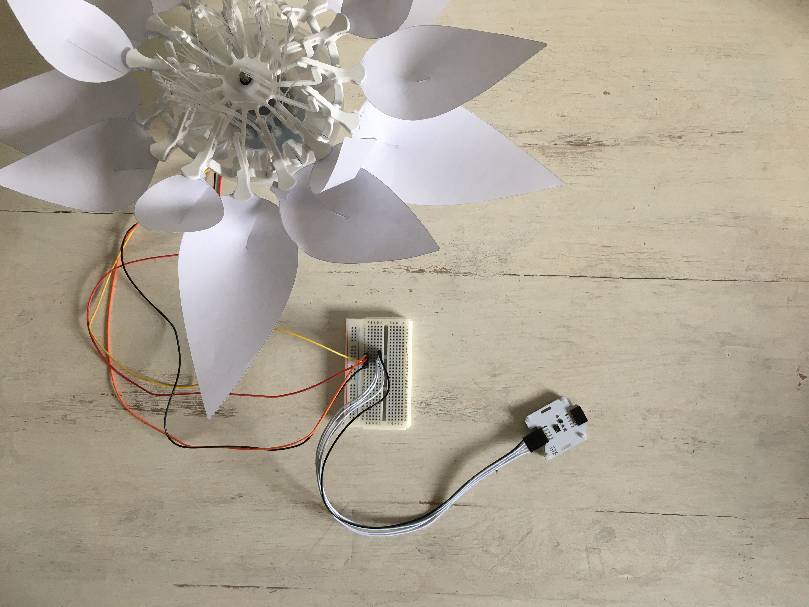

# STEP-BY-STEP 
# Day of the flower
<br>

Flowers need light and a warm environment (high temperature) to thrive. In this project you will recreate the day of a flower. This means that the flower opens in the morning and stays open all day. In addition, the degree of opening of the flower will depend on the temperature. Then the flower closes at night again.

You will write a program to interact with the flower. The flower's color depends on the time of day (morning (ambient luminosity), day (illuminate with the light of your smartphone), or night (put your hand on the sensor)). The flower needs light to open (it is open when it is day or morning and closed when it is night). And a high temperature (temperature sensor in your hands) improves the growth of the flower, so the flower opens more.

## Objective
* You can toggle an LED.
* You can integrate a light sensor.
* You can integrate a temperature sensor.
* You can control a stepper motor.
* You understand conditionals.
* You can deal with global and local variables.
* You understand logical operators.
* You understand writing and calling functions.

## Material 
* 1 Bionic Flower
* 1 light sensor 
* 1 temperature sensor
* Jumper cables
* *DAY_OF_THE_FLOWER_Code_Challenge.ino* (download on github)

<br>

# Task 1: Control the LEDs
Change the color of the LED's. The Bionic Flower is equipped of 5 LEDs. The color of each LED is given by an RGB code. The LEDs are connected on GPIO 16.

## Wiring scheme:
LEDs	| ESP32 
------------ | -------------
LEDs | GPIO 16

## Code:
1. Open the *DAY_OF_THE_FLOWER_Code_Challenge.ino* file.
2. *library*
<br> Add the library to control the LEDs. 
3. *global variables*
* Define the GPIO of the LEDs and give it the variable name "LED_PIN". 
* Create the object for the LEDs. 
* Create 3 functions to light up the LEDs for the morning, the day and for the night. Think about adding a function to turn off the LEDs (black color). 
*RGB code website link :* https://www.w3schools.com/colors/colors_picker.asp
4. *setup()*
* Initialize the LEDs.
* Turn off the LEDs.
5. *loop()*
<br>Make a color sequence : 
* Turn on the LEDs in the color used for the night
* Wait 500 ms
* Turn on the LEDs in the color used for the morning
* Wait 500 ms.
* Turn on the LEDs in the color used for the day
* Wait 500 ms.

# Task 2: Implement the light sensor
<br> The light sensor allows to measuring the ambient 
nosity. This sensor uses the I2C communication, so it uses the SCL and SDA pins. The light sensor's I2C address is 0x38.
<br> In this task, you will read the luminsoisty value and change the flower's color depending on it. 
<br>
## Wiring scheme:
Light sensor | ESP32
------------ | -------------
SCL | GPIO 5
SDA | GPIO 4 
(+)  | 5 V
(-)  | GND

## Code:
1. *library*
<br> Add the library for the I2C communication and the library for the light sensor. 
2. *global variables*
* Define the I2C communication pins.
* Define the sensor's I2C address.
* Add the variable of the light sensor.
* Define 1 global variable for a luminosity threshold value (limit between the morning and the day) and 1 global variable for a luminosity for the limit between the day and the night).
* Create the object for the light sensor.
3. *setup()*
* Start the I2C communication.
* Initialize the light sensor.
4. *loop()*
* Read the value from the light sensor. 
 ```
 //Read the luminosity value
 Wire.beginTransmission(ADRESS_LIGHT);
 luminosity_sensor= rpr0521rs.get_psalsval(&proximity,&luminosity);
 Serial.print("Luminosity =");
 Serial.println(luminosity);
 Wire.endTransmission();
```
* Write an if-structure : 
    * if it's morning, the LEDs lights in "morning color". 
    * else if it's during the day, the LEDs lights in "day color". 
    * else (it's night), the LEDs lights in "night color".
   
# Task 3: Implement the stepper motor
Use the stepper motor to open or close the Bionic Flower.

## Code:
1. *library*
<br> Add the library to control the motor of the Bionic Flower. 
2. *global variables*
* Define the GPIO and variable for the motor. 
* Create the object for the motor.
*  Add the *motor_calibration()* function.
3. *setup()*
* Initialize the motor. 
* Calibrate the motor. 
4. *loop()*  
 * Write an while-structure : 
    * while the luminosity is high enough (morning or day luminosity), the flower is open. The LED's color depend on the luminosity value. 
    * otherwise, the LEDs light up in the "night color" and the flower is closing. 

# Task 4: Implement the temperature sensor
The temperature sensor allows to measure the temperature. This sensor use the I2C communication, so it uses the SCL and SDA pins. The temperature sensor's I2C address is 0x40. 
<br> In this task, you will read the temperature and compare it to the start temperature. With this you will calculate the degree of opening of the flower.  
<br>
## Wiring scheme:
Temperature sensor | ESP32
------------ | -------------
SCL | GPIO 5
SDA | GPIO 4 
(+)  | 5 V
(-)  | GND

## Code:
1. *library*
<br> Add the library for the temperature sensor. 
```
// temperature's sensor 
#include "ClosedCube_HDC1080.h"
```
2. *global variables*
* Define the temperature sensor's I2C address.
* Define a global variable for the temperature value. 
* Define a global variable to save the start temperature (it's like a temperature reference).
* Define global variable for the degree of opening. 
* Create the object for the temperature sensor.
```
//Temperature sensor 
ClosedCube_HDC1080 hdc1080;
```
3. *setup()*
* Initialize the temperature sensor
```
//Temperature sensor initialisation
 hdc1080.begin(ADRESS_TEMP);
```
* Read the ambient temperature
```
 //Read the ambiant temperature
 Wire.beginTransmission(ADRESS_TEMP);
 start_temperature=hdc1080.readTemperature();
 Wire.endTransmission();
```
4. *loop()*
* Read the value from the light sensor. 
 ```
 //Read the temperature value
 Wire.beginTransmission(ADRESS_TEMP);
 temperature=hdc1080.readTemperature();
 Serial.print("Temperature = ");
 Serial.print(temperature);
 Serial.println(" °C");
 Wire.endTransmission();
```
* Write an if-structure : 
    * if the temperature is superior to the start temperature value +10, then the degree of the opening is the maximum so equal to 120. 
    * otherwise, the degree of opening is calculated by the next operation :
    ```
    degree_opening =((temperature-start_temperature)*10)+20;
    ```
 You can display the degree of opening to see the result.
 
# Task 5: Scenario
Now, create the final program to recreate the scenario :
  * The flower's color depends on the luminosity, there are 3 light levels : morning, day and night. 
  * The flower opens if it's morning or the day. Otherwise, the flower closes.
  * The degree of the opening depends on the temperature. If the degree of opening of the flower doesn't correspond to the respective temperature the flower then closes or opens until it reaches the corresponding degree of opening. 


