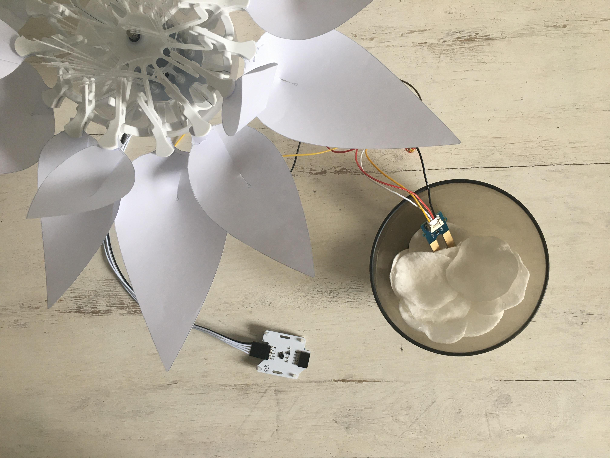

# Schritt für Schritt
# Die Nährstoffe der Blume
<br>
<br>Blumen brauchen Licht und wichtige Nährstoffe zum Wachsen. Diese Nährstoffe findet man unter anderem in der umhüllenden Erde. In diesem Projekt werden wir das Wachstum der Blume in Abhängigkeit von den Nährstoffen zeigen, welche wir durch die Menge an Wasser nachstellen, die wir der Erde (oder in diesem Experiment Baumwolle) hinzufügen.

Du wirst ein kleines Programm schreiben, um mit der Blume zu interagieren. Die Blume öffnet sich, wenn es Tag ist (Umgebungshelligkeit) und schließt sich, wenn es Nacht ist (Hand auf den Lichtsensor legen). Außerdem hängt der Öffnungsgrad der Blume von der Menge des Wassers ab, das sich in dem mit Baumwolle gefüllten Glas (das die Erde darstellt) befindet. Je mehr Wasser vorhanden ist, desto besser wächst die Blume und öffnet sich somit mehr und mehr.

## Zielsetzung
* Du kannst eine LED schalten.
* Du kannst einen Lichtsensor integrieren.
* Du kannst einen Bodenfeuchtesensor integrieren.
* Du kannst einen Schrittmotor ansteuern.
* Du verstehst Bedingungen.
* Du kannst mit globalen und lokalen Variablen umgehen.
* Du verstehst logische Operatoren.
* Du verstehst das Schreiben und Aufrufen von Funktionen.

## Material 
*	1 Bionic Flower
*	1 Lichtsensor
*	1 Bodenfeuchtesensor
*	Jumper Kabel
*	Baumwolle und ein Glas mit Wasser (du kannst es auch mit richtiger Blumenerde probieren)
* *NUTRITION_OF_THE_FLOWER_Code_Challenge.ino* (download on github)

<br>

# Aufgabe 1: Integriere den Schrittmotor
Benutze den Schrittmotor zum Öffnen und Schließen der Bionic Flower.

## Code:
1. Öffne die Datei:  *NUTRITION_OF_THE_FLOWER_Code_Challenge.ino* . <br>
2. *Bibliothek*
<br> Füg die Bibliothek zur Steuerung des Motors der Bionic Flower hinzu. 
3. *Globale Variablen*
*	Definier den GPIO und die Variable für den Motor.
*	Erstelle das Objekt für den Motor.
*	Füge die Funktion motor_calibration() hinzu.
4. *setup()*
* Initialisiere den Motor.
* Kalibriere den Motor.
5. *loop()* (Schleife)
*	Öffne die Blume vollständig.
*	Warte 1 s.
*	Schließe die Blume.

# Aufgabe 2: Integriere den Lichtsensor
<br>Der Lichtsensor ermöglicht die Messung der Umgebungshelligkeit. Dieser Sensor kommuniziert über das I2C-Protokoll, er nutzt also die Pins SCL und SDA.
<br>In dieser Aufgabe liest du den Helligkeitswert ab und öffnest die Blume, wenn es Tag ist und schließt die Blume, wenn es Nacht ist.
  
<br>
## Verdrahtungsplan:
Lichtsensor | ESP32
------------ | -------------
SCL | GPIO 22
SDA | GPIO 21
(+)  | 5 V
(-)  | GND

## Code:
1. *Bibliothek*
<br> Füg die Bibliothek für die I2C-Kommunikation und für den Lichtsensor hinzu
2. *Globale Variablen *
* Definiere die Pins der I2C-Kommunikation.
*	Füge die Variable für den Lichtsensor hinzu.
*	Definiere die globale Variable für einen Helligkeitsschwellenwert (Grenze zwischen Tag und Nacht).
*	Erstellen Sie das Objekt für den Lichtsensor.
3. *setup()*
* Starte die I2C-Kommunikation
* Initialisiere den Lichtsensor.
4. *loop()* (Schleife)
*	Lies den Wert des Lichtsensors aus.
 ```
  //Read the luminosity value
 luminosity_sensor= rpr0521rs.get_psalsval(&proximity,&luminosity);
 Serial.println("Luminosity value");
 Serial.println(luminosity);
 ```
* Schreibe eine while-Schleife :
    *	Wenn es hell genug ist, um als Tag erkannt zu werden, öffnet sich die Blume.
    * Ansonsten schließt sich die Blume.

# Aufgabe 3 : Steuer die LEDs an
Ändere die Farbe der LED's . Die Bionic Flower besteht aus 5 eingebauten LEDs. Die Farbe jeder LED ist durch einen RGB-Code gegeben. Die LEDs sind an GPIO 16 angeschlossen.
## Verdrahtungsplan:
LEDs	| ESP32 
------------ | -------------
LEDs | GPIO 16

## Code:
1. *Bibliothek*
<br> Füg die Bibliothek zur Steuerung der LEDs hinzu.
2. *Globale Variablen*
* Definiere den GPIO der LEDs und gib ihm den Variablennamen "LED_PIN".
*	Erstelle das Objekt für die LEDs.
* Erstelle eine Funktion, um die LED’s in blau zu leuchten (stellt das Wasser dar). Denk daran, eine Funktion zum Ausschalten der LEDs (schwarze Farbe) hinzuzufügen.
<br> *Hier findest du Hilfe zu den Farben: RGB-Code Website-Link :* https://www.w3schools.com/colors/colors_picker.asp
3. *setup()*
* Initialisiere die LEDs.
*	Schalte die LEDs aus.
4. *loop()* (Schleife)
<br> Führe mit den LEDs eine Ladebewegung mit einer for-Schleife durch. Für jede LED gilt :
      * Schalte die LED in blau ein
      * Warte 2s
      * Schalte die LED aus

<br> Versuche, die Wartezeiten zu verändern und beobachte die Auswirkungen auf die Geschwindigkeit der Ladebewegung.

  
# Aufgabe 4 : Integriere den Bodenfeuchtesensor
Der Bodenfeuchtesensor misst die Menge des Wassers. Dieser Sensor sendet einen Analogwert, der proportional zur Wassermenge ist. Der Sensor wird an GPIO 4 angeschlossen.
<br>In dieser Aufgabe wirst du den Feuchtewert auslesen und eine Zeitverzögerung berechnen, die die Geschwindigkeit der Lastbewegung bestimmt. Außerdem wirst du den Öffnungsgrad der Blume in Abhängigkeit von der Wassermenge berechnen und bestimmen.
<br>
## Verdrahtungsplan:
Bodenfeuchtesensor| ESP32
------------ | -------------
Signal | GPIO 4 
(+)  | 5 V
(-)  | GND

## Code:
1. *Globale Variablen*
* Definiere den GPIO des Bodenfeuchtesensors.
* Definiere eine globale Variable für den Feuchtewert.
*	Definiere eine globale Variable, um die Verzögerung (Geschwindigkeit der Ladebewegung) zu speichern.
*	Definiere eine globale Variable, um den Öffnungsgrad der Blume zu speichern.
2. *setup()*
Stelle den Sensor als INPUT ein.
3. *loop()* (Schleife)
* Lies den Wert des Feuchtesensors aus.
 ```
//Read the humidity value
  humidity_value = analogRead(HUMIDITY_PIN);
  Serial.println(humidity_value);
```
* Schreibe eine while-Schleife:
   * wenn der Feuchtigkeitswert größer als 3000 ist, ist die Blume volkommen geöffnet (also gleich 120) und die Blume leuchtet blau.
   * sonst :
        <br> * berechne den Verzögerungswert bei der nächsten Operation : 
                ```
                dl = (100-(humidity_value/30))*10;
               ```
         <br>  * Ladebewegung
         <br>  * Berechne den Öffnungsgrad mit der nächsten Operation : 
                ```
                limit_open=humidity_value*FLOWER_CLOSE_TO_OPEN/3000;
                ```
            

# Aufgabe 5: Das ganze Szenario
Erstelle nun den endgültigen Code, um das Szenario nachzubilden :
   *	Die Blume öffnet sich, wenn es Tag ist. Ansonsten (nachts) schließt sich die Blume.
   *	Der Öffnungsgrad der Blume und die Geschwindigkeit der Ladebewegung der LEDs hängen von der Bodenfeuchte ab. Je mehr Wasser vorhanden ist, desto mehr öffnet sich die Blüte und desto schneller ist die Ladebewegung der LEDs.


