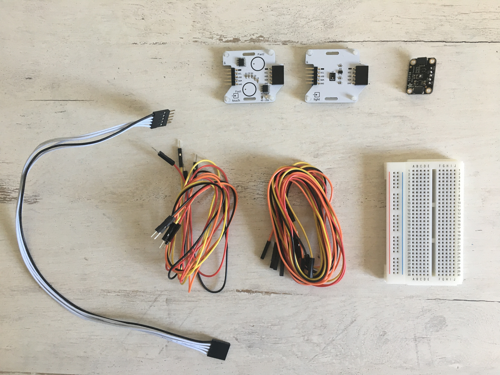
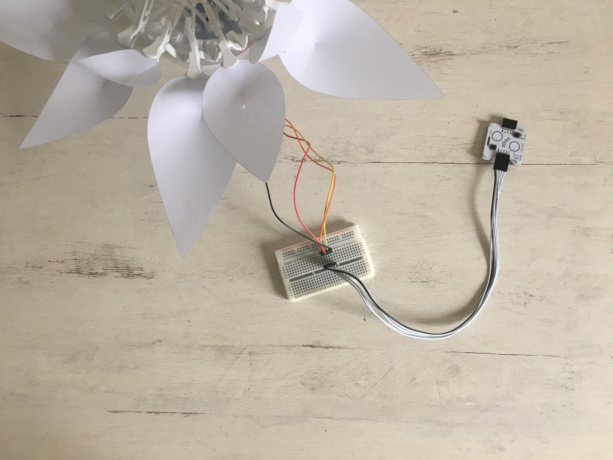
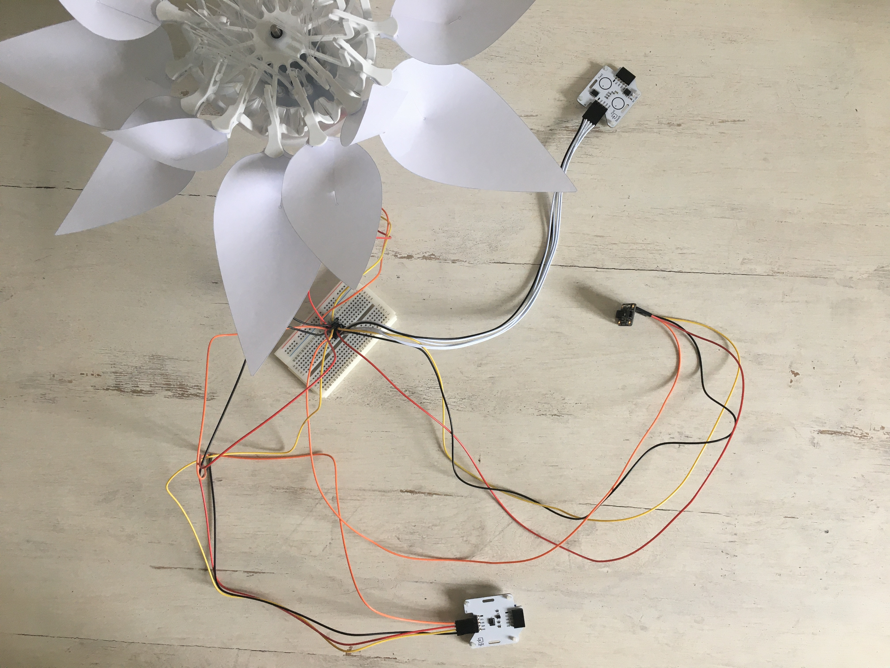

# Schritt für Schritt
# Die Photosynthese
<br>

Die Photosynthese benötigt Licht, Chlorophyll, Co2 und Wasser. Dieses Phänomen ermöglicht es, aus CO2 und Lichtenergie O2 zu erzeugen. In diesem Projekt werden Sie den Effekt der Photosynthese nachbilden.

Du wirst ein kleines Programm schreiben, um mit der Blume zu interagieren. Mit dem Berührungssensor wählst du die Farbe Grün aus (die Chlorophyllzellen darstellt). Mit dem Lichtsensor kannst du bestimmen, ob es Tag oder Nacht ist: Die Blume öffnet sich, wenn es Tag ist, und schließt sich nachts. Außerdem kannst du auf den CO2-Sensor pusten, um die C02-Präsenz darzustellen.

## Zielsetzung
* Du kannst eine LED schalten.
* Du kannst einen Lichtsensor integrieren.
* Du kannst einen Berührungssensor integrieren.
* Du kannst einen Kohlenstoffdioxid integrieren.
* Du kannst einen Schrittmotor ansteuern.
* Du verstehst Bedingungen.
* Du kannst mit globalen und lokalen Variablen umgehen.
* Du verstehst logische Operatoren.
* Du verstehst das Schreiben und Aufrufen von Funktionen


## Material 
*	1 Bionic Flower
* 1 Berührungssensor
* 1 Lichtsensor
* 1 Kohlenstoffdioxidsensor
*	Jumper Kabel
* *PHOTOSYNTHESIS_Code_Challenge.ino* (download on github)

<br>

# Aufgabe 1: Steuer die LEDs an
Ändere die Farbe der LED's. Die Bionic Flower besteht aus 5 eingebauten LEDs. Die Farbe jeder LED ist durch einen RGB-Code gegeben. Die LEDs sind an GPIO 16 angeschlossen.

## Verdrahtungsplan:
LEDs	| ESP32 
------------ | -------------
LEDs | GPIO 16

## Code:
1. 	Öffne die Datei: *PHOTOSYNTHESIS_Code_Challenge.ino*.
2. *Bibliothek*
<br> Füg die Bibliothek zur Steuerung der LEDs hinzu.
3. *Globale Variablen*
*	Definiere den GPIO der LEDs und gib ihm den Variablennamen "LED_PIN".
*	Definiere die Anzahl der Farben
*	Erstelle das Objekt für die LEDs.
*	Erstelle 4 Funktionen zum Aufleuchten der LEDs in den Farben Blau, Rot, gelb, grün. Denk daran, eine Funktion zum Ausschalten der LEDs (schwarze Farbe) hinzuzufügen. 
<br> *Hier findest du Hilfe zu den Farben: RGB-Code Website-Link :* https://www.w3schools.com/colors/colors_picker.asp
4. *setup()*
*	Initialisiere die LEDs.
*	Schalte die LEDs aus.
5. *loop()* (Schleife)
<br> Erstelle eine if-Schleife :
   * Wenn Farbvariable gleich 1 ist, schalte die LEDs in rot ein
   * Wenn Farbvariable gleich 2 ist, schalte die LEDs in grün ein
   * Wenn Farbvariable gleich 3 ist, schalte die LEDs in blau ein
   * Wenn Farbvariable gleich 4 ist, schalte die LEDs in gelb ein und setze Farbvariable auf 0.
   * Warte 2 s.


# Aufgabe 2: Integriere den Berührungssensor
<br>Der Berührungssensor sendet ein Signal, wenn eine Berührung erkannt wird. Dieser Sensor kommuniziert über das I2C-Protokoll, er nutzt also die Pins SCL und SDA. Die I2C-Adresse des Farbsensors ist 0x28.
<br>Bei dieser Aufgabe leuchtet die Blume zunächst in einer zufälligen Farbe. Wenn dann eine Berührung erkannt wird, ändert die Blume die Farbe in zufälliger Reihenfolge.
<br>
## Verdrahtungsplan:
Berührungssensor | ESP32
------------ | -------------
SCL | GPIO 5
SDA | GPIO 4 
(+)  | 5 V
(-)  | GND

## Code:
1. *Bibliothek*
<br> Füg die Bibliothek für die I2C-Kommunikation und für den Berührungssensor hinzu.
2. *Globale Variablen*
*	Definiere die Pins der I2C-Kommunikation.
*	Definiere die I2C-Adresse des Sensors
*	Erstelle das Objekt für den Berührungssensor.
3. *setup()*
*	Starte die I2c-kommunikation
*	Initialisiere den Berührungssensor.
*	Verwenden Sie die Funktion *random(Wert)*, um die erste Farbe zu bestimmen. 
```
 color = random(num_color);
```
*	Beleuchte die Bionic Flower in dieser zufälligen Farbe (Du kannst eine if-Struktur wie in der vorherigen Aufgabe verwenden).
4. *loop()* (Schleife)
*	Erstellen Sie eine while-Schleife:
  *	Solange keine Berührung erkannt wird (sowohl linkes als rechtes Pad), gib den Nachricht „No touch detected“ auf dem seriellen Monitor aus.
  * Wenn du aus der while-Schleife raus bist und eine Berührung erkannt wurde, kannst du die if.Schleife verwenden um die Farbe zu wechseln.

 
# Aufgabe 3: Integriere den Lichtsensor
<br> Der Lichtsensor ermöglicht die Messung der Umgebungshelligkeit. Dieser Sensor kommuniziert über das I2C-Protokoll, er nutzt also die Pins SCL und SDA.
<br> In dieser Aufgabe liest du den Helligkeitswert aus und änderst die Farbe der Blume in Abhängigkeit davon.
<br>
## Verdrahtungsplan:
Lichtsensor| ESP32
------------ | -------------
SCL | GPIO 5
SDA | GPIO 4 
(+)  | 5 V
(-)  | GND

## Code:
1. *Bibliothek*
<br> Füg die Bibliothek für die I2C-Kommunikation und für den Lichtsensor hinzu.
2. *Globale Variablen*
*	Definiere die Pins der I2C-Kommunikation.
*	Füge die Variable für den Lichtsensor hinzu.
*	Definiere die globale Variable für einen Helligkeitsschwellenwert (Grenze zwischen Tag und Nacht).
*	Erstellen Sie das Objekt für den Lichtsensor.
3. *setup()*
*	Starte die I2C-Kommunikation
*	Initialisiere den Lichtsensor.
4. *loop()* (Schleife)
*	Lies den Wert des Lichtsensors aus und gib ihn im Serial Monitor der Arduino Die aus
 ```
  //Start the transmission with the light sensor 
    Wire.beginTransmission(ADD_LIGHT);
    //Read the luminsity value
    luminosity_sensor= rpr0521rs.get_psalsval(&proximity,&luminosity);
    Serial.println("Luminosity value");
    Serial.println(luminosity);
    // End the transmission with the light sensor
    Wire.endTransmission();
```
* Schreibe eine while-Schleife :
  * Wenn es hell genug ist, um als Tag erkannt zu werden, gib die Nachricht „Day“ in dem Serial Monitor aus.
  * Ansonsten gib die Nachricht „Night“ aus.


# Aufgabe 4: Integriere den Schrittmotor
Benutze den Schrittmotor zum Öffnen und Schließen der Bionic Flower.
<br>In dieser Aufgabe öffnest du die Blume wenn es Tag ist, und schließt sie wenn es Nacht ist. 

## Code:
1. *Bibliothek*
<br> Füg die Bibliothek zur Steuerung des Motors der Bionic Flower hinzu.
2. *Globale Variablen*
*	Definier den GPIO und die Variable für den Motor.
*	Erstelle das Objekt für den Motor.
*	Füge die Funktion *motor_calibration()* hinzu.
3. *setup()*
* Initialisiere den Motor.
*	Kalibriere den Motor.
4. *loop()* (Schleife) 
* Schreibe ein If-Schleife:
   *	Wenn es hell genug ist, öffnet sich die Blume.
   * 	Sonst schließt sie sich.
 
# Aufgabe 5: Integriere den Kohlenstoffdioxidsensor (CO2)
<br>Der CO2-Sensor liefert eine ungefähre Messung des CO2-Gehalts in der Luft. Der Farbsensor kommuniziert über das I2C-Protokoll, er nutzt also die Pins SCL und SDA. Die I2C-Adresse des Farbsensors ist 0x58.
<br>In dieser Aufgabe liest du den CO2-Wert aus und erkennst somit einen Atemzug in die Nähe des Sensors (der CO2-Wert steigt).
<br>
## Verdrahtungsplan:
Kohlenstoffdioxidsensor | ESP32
------------ | -------------
SCL | GPIO 5
SDA | GPIO 4 
(+)  | 5 V
(-)  | GND

## Code:
1. *Bibliothek*
<br> Füg die Bibliothek zur Integration des CO2-Sensors hinzu.
```
// CO2 sensor's library
#include "Adafruit_SGP30.h"
```
2. *Globale Variablen*
* Definiere die I2C-Adresse des Sensors.
*	Definieren eine globale Variable zum Speichern des CO2-Niveaus.
*	Definiere eine globale Variable für einen CO2-Schwellenwert zur Erkennung eines Atems (ca. 700 ppm).
*	Erstelle das Objekt für den CO2-Sensor.
3. *setup()*
* Initialisiere den CO2-Sensor.
```
 // CO2 sensor initialisation
 sgp.begin();
```
4. *loop()* (Schleife)
* Liest den CO2 Wert aus.
```
   //Start the transmission with the CO2 sensor 
    Wire.beginTransmission(ADD_CO2);      
    //Read the CO2 value
    if (! sgp.IAQmeasure()) {return;}
    int CO2_value = sgp.eCO2;
    Serial.print("eCO2 "); Serial.println(CO2_value);
    // End the transmission with the CO2 sensor
    Wire.endTransmission();
 ```
* Schreibe eine if-Schleife: 
   *	wenn ein Atemzug erkannt wird (CO2-Niveau ist höher als der CO2-Schwellenwert), wird " Atemzug erkannt" auf dem seriellen Monitor ausgegeben.
   * andernfalls wird "Kein Atemzug erkannt" auf dem seriellen Monitor ausgegeben.

# Aufgabe 5: Das ganze Szenario
Erstelle nun den endgültigen Code, um das Szenario nachzubilden :
   * Wenn keine Berührung erkannt wird :
      * Lies den Lichtsensor aus. Die Blume öffnet sich, wenn es Tag ist, und schließt sich, wenn es Nacht ist.
      * Lies den CO2-Sensor aus.
      * Wenn es Tag ist und die Farbe Grün gewählt ist und ein Atemzug erkannt wird, kannst du ein "Photosyntheseverhalten" wie eine Farbsequenz erstellen. Dann verwendest du die Funktion random(value), um die Blume in einer neuen zufälligen Farbe zu beleuchten.
   * 	Wenn eine Berührung erkannt wird, ändern sich die Farbe der Blume.


