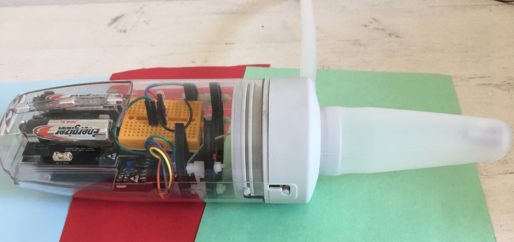
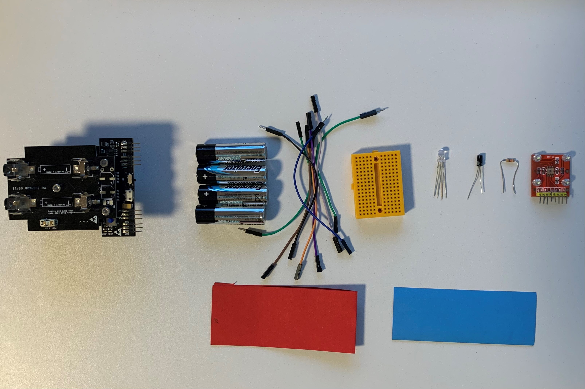
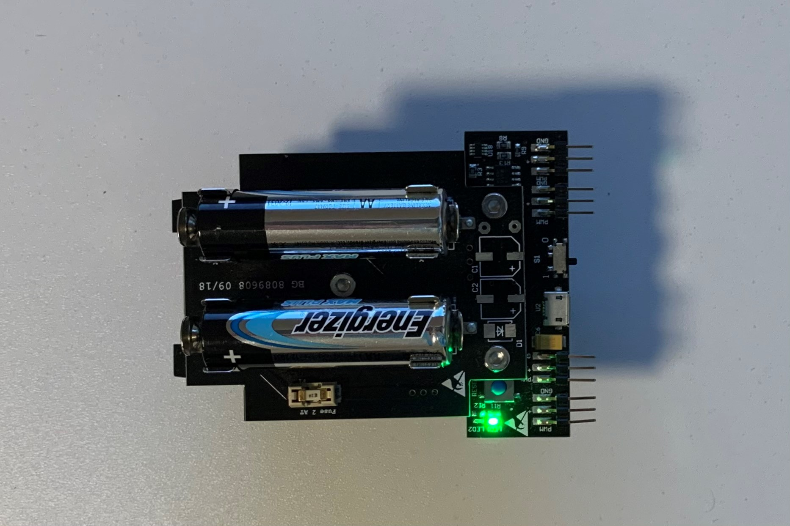
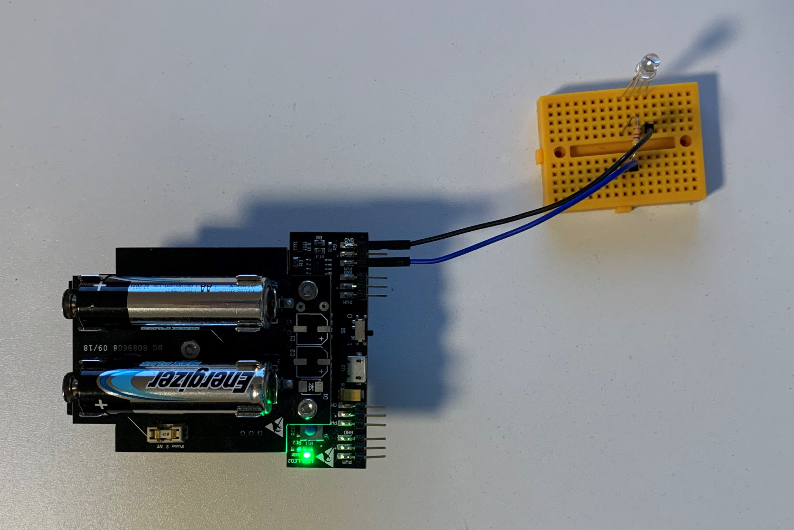
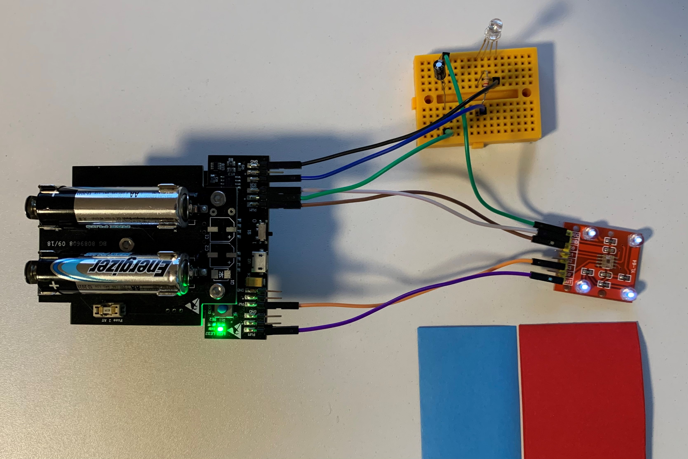

# STEP-BY-STEP
# Camouflage 

The chameleon is known for its bright colors. Indeed, the chameleon has the incredible characteristics of being able to change colors. You will be able to reproduce this characteristic with a color sensor and LEDs.

You will creat code to interact with the chameleon. If the color sensor detects red color the chameleon change its' color to red. If the color sensor detects blue color the chameleon change its' color to blue. If the color sensor detects no special color the chameleon doesn't change its' color. 

## Objective
* You can toggle a LED.
* You understand conditionals.
* You can deal with global and local variables.
* You understand logical operators.
* You understand calling functions.

## Material 
* 1 Microcontroller ESP32
* 1 Breadboard (orange)
* 12 Jumper cables
* 1 RGB LED
* 1 Color sensor (red square)
* 1 Resistors 330 Ohm
* 1 0.01 or 0.1 µF capacitor
* 1 3D printed part of: 3D_Structure_Color_sensor_and_Breadboard.stl (download on github)
* 1 3D printed part of: 3D_Structure_Light_sensor.stl (download on github)
* 1 3D printed part of: Color_Box_Top.stl (download on github)
* 1 3D printed part of: Color_Box_Bottom.stl (download on github)
* 5 Cable ties
* *CHAMELEON_Camouflage_Code_Challenge.ino* (download on github)
 

# Task 1: Control the built-in red LED (LED2)
Flash the red LED every 1000 ms. Use the built in red LED; it's defined on GPIO 13.

 

## Wiring scheme:
LED2	| ESP32 
------------ | -------------
LED2 | GPIO 13 

## Code:
1. Open the *CHAMELEON_Camouflage_Code_Challenge.ino* file. 
2. *global variables*
 Define the GPIO of the red LED and give it the variable name "LED2". 
3. *setup()*
 Setup LED2 as OUTPUT.
4. *loop()*
 Control LED2 via power on/power off. Use the function *digitalWrite(variable, value);* to control the power of the LED via HIGH and LOW values. Include a *delay();* of 1000 ms between each HIGH and LOW value.

# Task 2: Control the RGB LED 
Flash the RGB LED in blue color. Use the function *digitalWrite(variable, value);* to control the power of the LED via HIGH and LOW values. Include a *delay();* of 1000 ms between each HIGH and LOW value. If the red LED is HIGH the blue LED is LOW and the other way round.
  The picture show the design of the RGB LED:
* blue color: shortest wire 
* green color: second shortest wire
* ground: longest wire (black)
* red color: second longest wire
  
   (C) This image was created with Fritzing.
The RGB LED must be in series with a 330 Ohm resistor.

## Wiring scheme:
LED RGB| ESP32 
------------ | -------------
Blue | GPIO 16 
Black | GND

## Code:
1. *global variables*
 Define the GPIO of the RGB LED and give it the variable name "LED_RGB".
2. *setup()*
 Setup LED_RGB as OUTPUT.
3. *loop()*
 Control LED_RGB via power on/power off. Use the function *digitalWrite(variable, value);* to control the power of the LED via HIGH and LOW values. Use the *delay();* of 1000 ms between each HIGH and LOW value from task 1.

# Task 3: Implement the color sensor 
Implement the color sensor in a way to detect no color, red and blue color. Connect the capacitor in series with the power (VCC) of the  color sensor.

## Wiring scheme:
color sensor| ESP32 
------------ | -------------
VCC | VCC (+)
GND | GND
S0 | 17
S3 | 26
OUT | 25

## Code:
1. *global variables*
* Define the GPIO of the "out" pin of the sensor and give it the variable name sensorOut.
* Define the GPIO of S0.
* Define a global variable for red color frequency and one for blue color frequency. You can use the datatype *int*.
* Define your lower and upper treshold for the color sensor. You can filter data noise with this treshold. Look at the data of the color sensor and define your treshold. 
2. *setup()*
* Setup the "out" pin of the color sensor as INPUT.
* Setup S0 as OUTPUT.
* Set frequency scaling to 20% (see datasheet of the sensor). Digital write S0 as HIGH. S1 is LOW, because it's not connected to the ESP32.
* Setup S3 as OUTPUT.
3. *loop()*
* Read the red values: configure the sensor array into the mode read only red color. Set S2 LOW (not connected) and digital write S3 as LOW. Read the color values with the function *pulseIn(sensorOut, HIGH)* and store the value in a variable. The function *pulseIn()* reads the pulse on the pin and returns the length of the pulse in µs. The pulse is a rectangular signal HIGH or LOW.
* Read the blue values: configure the sensor array into the mode read only blue color. Set S2 LOW (not connected) and digital write S3 as HIGH. Read the color values with the function *pulseIn(sensorOut, HIGH)* and store the value in a variable.
* Print the measured red and blue frequency values into the serial monitor.
* Look at the generated data and do tests with red and blue colored paper; change the ground (white vs. black). What do you see when red or blue colored paper covers the sensor? If the LED light of the color sensor is too low adapt the brightness of the environment. Define a lower and an upper treshold and write the value in your global variable.
* Write conditions to change the color of the chameleon: 
* If the red frequency value is between the lower and upper value and less than the blue frequency value flash the red LED.
* If the blue frequency value is between the lower and upper value and less than the red frequency value flash the blue LED.
* If no color is detected no LED lights up.