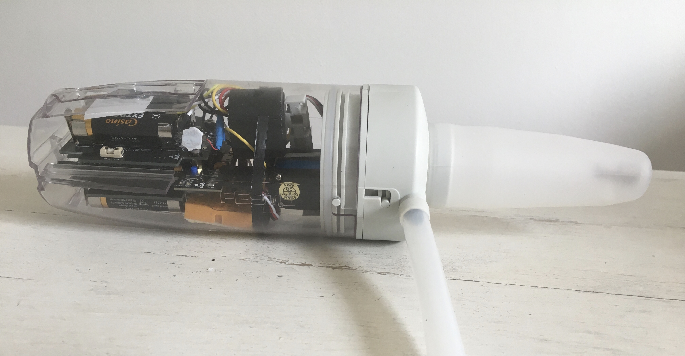
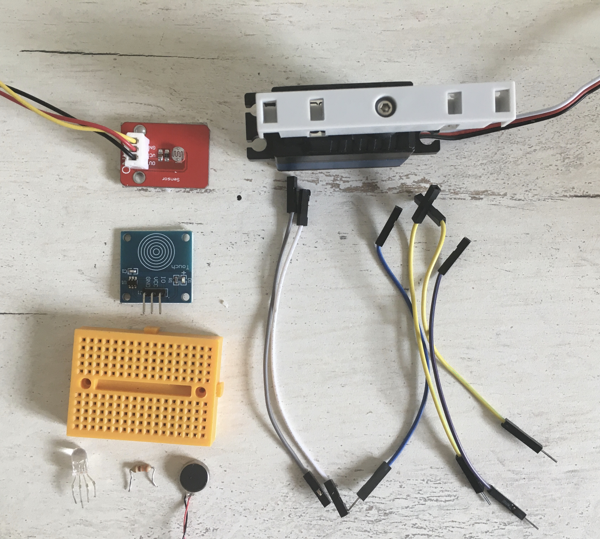
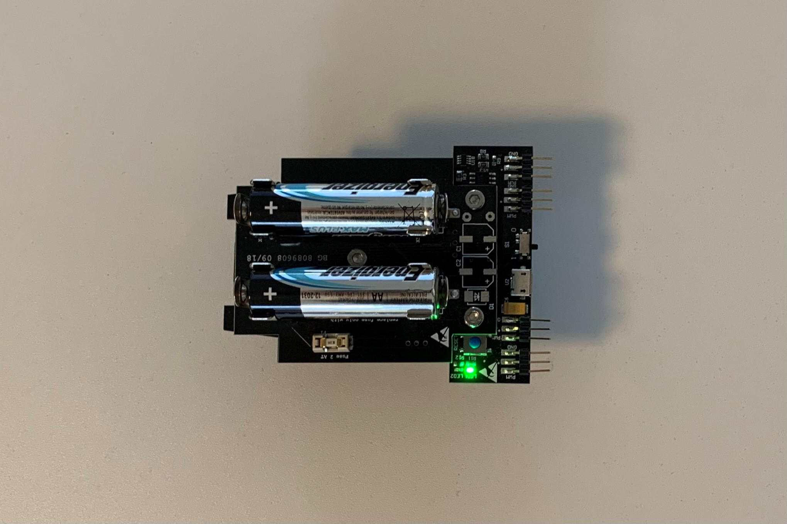
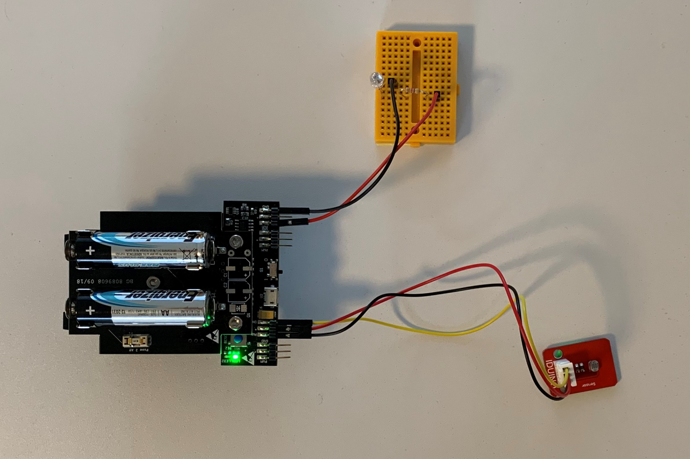
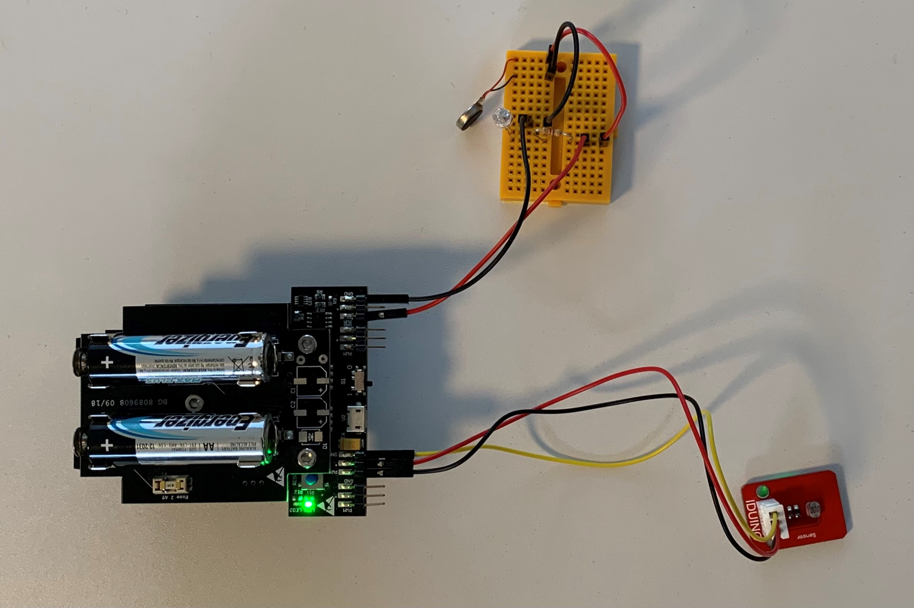
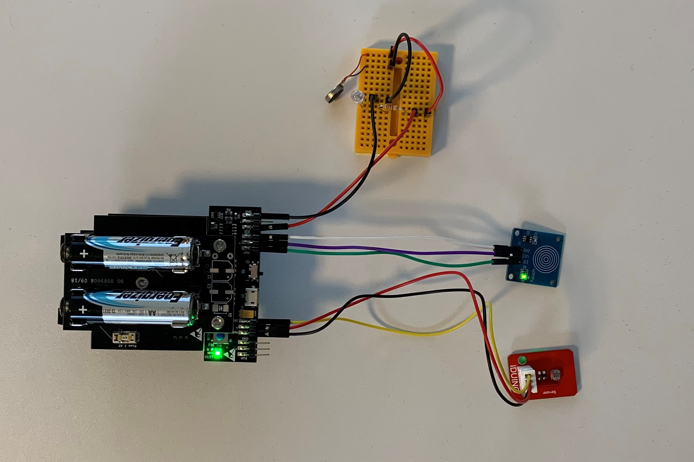
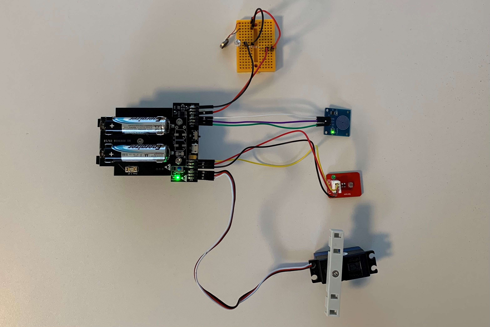

# STEP-BY-STEP
# Environment


Chameleons are sensitive animals. The color of their skin depends on their moods and the environment. The chameleons is a stressed animal, for example abrupt movements should be avoided. In this project you will recreate different behaviors. For this you will use the light sensor to determine the time of day. Using a touch sensor you will simulate the presence of a predator.

You will creat code to interact with the chameleon. If it's night (dark environment) the chaemelon is snorring noice and blue light. If it's  day (bright environment) the chameleon respond to touches. A touch implies danger and the chameleon get flashed in red color and all movements get stopped. No touch means the chameleon is comfortable and it moves  it's tongue.

## Objective
* You can toggle and change the intensity of an LED.
* You can integrate a touch sensor.
* You can integrate a light sensor.
* You can control a servomotor.
* You understand conditionals.
* You can deal with global and local variables.
* You understand logical operators.
* You understand writing and calling functions.

## Material
* 1 Microcontroller ESP32
* 1 Breadboard (orange)
* 12 Jumper cables
* 1 RGB LED
* 1 resistor 330 Ohm
* 1 Touch sensor (blue)
* 1 Light sensor (red)
* 1 Vibrating motor (black)
* 1 Servomotor (waterproof)
* 1 3D printed part of: 3D_Structure_Light_sensor.stl (download on github)
* 1 3D printed part of: Light_Box_Top.stl (download on github)
* 1 3D printed part of: Light_Box_Bottom.stl (download on github)
* 2 Cable ties
* *CHAMELEON_Environment_Code_Challenge.ino* (download on github)


# Task 1: Control the built-in red LED (LED2)
Flash the red LED every 500 ms. Use the built in red LED; it's defined on GPIO 13.



## Wiring scheme:
LED2	| ESP32 
------------ | -------------
LED2 | GPIO 13 

## Code:
1. Open the *CHAMELEON_Environment_Code_Challenge.ino* file.<br>
2. *global variables*
<br>Define the GPIO of the red LED and give it the variable name "LED2". 
3. *setup()*
<br>Setup LED2 as OUTPUT.
4. *loop()*
<br>Control LED2 via power on/power off. Use the function *digitalWrite(variable, value);* to control the power of the LED via HIGH and LOW values. Include a *delay();* of 500 ms between each HIGH and LOW value.

# Task 2: Control the RGB LED 
Make the RGB LED fade in blue color. Use the function *ledcWrite(channel,cycle);*.This function do a pulse wide modulation (PWM) an need therefore three inputs: a channel, a frequency and a resolution. Please read the documentation of *ledcWrite()* for more information.
<br> The picture show the design of the RGB LED:
* blue color: shortest wire 
* green color: second shortest wire
* ground: longest wire (black)
* red color: second longest wire
  
<br> <br>(C) This image was created with Fritzing.
The RGB LED must be in series with a 330 Ohm resistor.


## Wiring scheme:
LED RGB| ESP32 
------------ | -------------
Blue | GPIO 16 
Black | GND

The picture shows the assembly of the breadboard (grey), LED RGB (clear), 330 Ohm resistor, and ESP32 (brown) with cables.
 <br>(C) This image was created with Fritzing.

## Code:
1. *global variables*
<br>Define the GPIO of the RGB LED and give it the variable name "LED_RGB". Also, define the channel, frequency and resolution of the PWM as an int and give them a number:
* channel = 12
* frequency = 5000
* resolution = 8
<br>Define two global variable for the maximun and minimum brightness value of the RGB LED.
* brightness_high = 255
* brightness_low = 0
<br>Define two global variable for implementing the fading cycle later
* current_value = 0
* stepSize = 8
2. *setup()*
* Setup LED_RGB as OUTPUT.
* Attach the channel to the GPIO of LED_RGB to be controlled with *ledcAttach(LED_RGB, channel);*
* Define the PWM functionalities of the channel with *ledcSetup(channel,frequency, resolution);*
3. *loop()*
<br>Light the LED with different intensity via a PWM signal with *ledcWrite(Channel_LED,i)*. The variable i can be between 0 and 255. Level zero turns off the 
LED and the level 255 is the highest level of brightness.
* light up the LED with *ledcWrite(Channel_LED,i)*. i is represented by the global variable "current_value" you defined previously. 
* implent a delay of 100 ms to see the effect
* increase the variable i with a defined stepSize (your global variable) to reach the value 255 in 8 *void loop()* repeats.
* write an if-structure to invert the stepSize, if the current_value reached 0 or 255. Use the logical OR to link both conditions. 

# Task 3: Implement the light sensor
<br> Implement the light sensor and find your treshold value. If the meassured value is equal or higher than your treshold print "day" to the serial monitor. If the meassured value is lower than your treshold print "night" to the serial monitor.
The light sensor has 3 pins: ground (GND), power supply (VCC) and data pin connection (OUT). 



## Wiring scheme:
light sensor	| ESP32 
------------ | -------------
OUT | GPIO 26 
VCC | VCC (+)
GND | GND

## Code:
1. *global variables*
<br>Define the GPIO of the light sensor and indicate a global variable for your treshold value.
2. *setup()*
<br> Setup the light sensor as INPUT.
3. *loop()*
* Read the values from the light sensor with *analogRead();* and store the value in a local variable.
* Print the value in the serial monitor.
* Use a flashlight and your finger to demonstrate extreme light sensor values: bright and dark. Find out a realistic treshold value to distinguish "day mode" and "night mode". Write this treshold value in your global variable you defined in *global variables* previously. 
* Write an if-structre:
	* If the meassured light sensor value is equal or higher then your treshold print "day" to the serial monitor and flash the red LED. Use the code of task 1.
	* If the meassured light sensor value is lower then your treshold print "night" to the serial monitor and fade the RGB LED. Use the code of task 2.

# Task 4: Implement the vibration motor
<br> Implement the vibrating motor by connecting the RGB LED and the vibrating motor in series. This both components have the same connections GPIO.



## Wiring scheme:
LED RGB and vibrating motor| ESP32 / Bredboard 
------------ | -------------
Red | GPIO 16 
Black | GND

## Code:
1. *global variables*
<br> The vibrating motor has the same GPIO as the RGB LED and with it the same global variables.
2. *setup()*
<br> The vibrating motor has the same setup as the RGB LED.
3. *loop()*
<br> The vibrating motor use the same code as the RGB LED.

# Task 5: Implement the touch sensor
<br> Make the touch sensor only work if it's "day". If a touch is detected flash the red LED and write "danger" into the serial monitor. If no touch is detected trigger no action.
The touch sensor has 3 pins: ground (GND), power supply (VCC) and data pin connection (IO). 



## Wiring scheme:
touch sensor| ESP32
------------ | -------------
IO | GPIO 17
VCC | VCC
GND  | GND

## Code:
1. *global variables*
<br>Define the GPIO of the touch sensor.
2. *setup()*
<br> Setup the touch sensor as INPUT.
3. *loop()*
* Read the values from the touch sensor with *digitalRead();* and store the value in a local variable. Use *digitalRead()* because the touch sensor sends a digital signal.
* Print the value in the serial monitor.
* Write an if-structure:
	* If a touch is detected (boolean HIGH), print "danger" to the serial monitor.
	* If no touch is detected (boolean LOW), print "no touch detected" to the serial monitor.

# Task 6: Implement the servo motor
<br> Implement the servo motor to move the chameleons' tongue. Move the chameleon's tongue only if it's day and no touch is detected.
<br> The servo motor has 3 pins: ground (black), power supply (red) and data pin connection (white). 



## Wiring scheme:
servo motor | ESP32
------------ | -------------
White | GPIO 25
Red | VCC
Black  | GND

## Code:
1. *global variables*
<br>Define the GPIO of the servo motor and give it the variable name "servomotor". Also, define the channel, frequency and resolution of the PWM as an int and give them a number:
* channel = 0
* frequency = 50
* resolution = 16
<br>Define two global variable for the minimum and maximum angle of motor movement.
* servomotor_Angle_Min = 80
* servomotor_Angle_Max = 120
<br>Define a function that converts the motor angle to motor steps to control the stepper motor. A function encapsulates a logic and behaviour, in this case to move the servomotor by the input value.
* void command_servomotor(float servomotor_Angle): declarate the function as *void* and give the angle to the function. *Void* indicates that no information as output is expected.
* convert 0-180 degrees to 0-65536. Use *uint32_t* as datatype to store the value.
* call the function *ledcWrite(channel,i)* to move the servo motor. Use the variable for the servo motor channel. i is represented by the variable of your converting calculation. 

```
void command_servomotor(float servomotor_Angle)
{
  //convert 0-180 degrees to 0-65536
  uint32_t conv = (((servomotor_Angle / 180.0) * 2000) / 20000.0 * 65536.0) + 1634;
  ledcWrite(servomotor_Channel, conv);
}
```

2. *setup()*
* Setup servomotor as OUTPUT.
* Attach the channel to the GPIO of the servomotor to be controlled with *ledcAttach(servomotor, channel);*
* Define the PWM functionalities of the channel with *ledcSetup(channel,frequency, resolution);*
3. *loop()*
<br>If it's day and no touch is detected, move the servo motor by calling the function you defined previously *command_servomotor(angle)*.
* move the servomotor to it's maximum angle value. Use the global variable you defined previously.
* wait 1000 ms
* move the servomotor to it's minimum angle value. Use the global variable you defined previously.
* wait 1000 ms

If you want to make the light sensor better in performance print the black box and assemble it like in the picture shown: 
<br>
