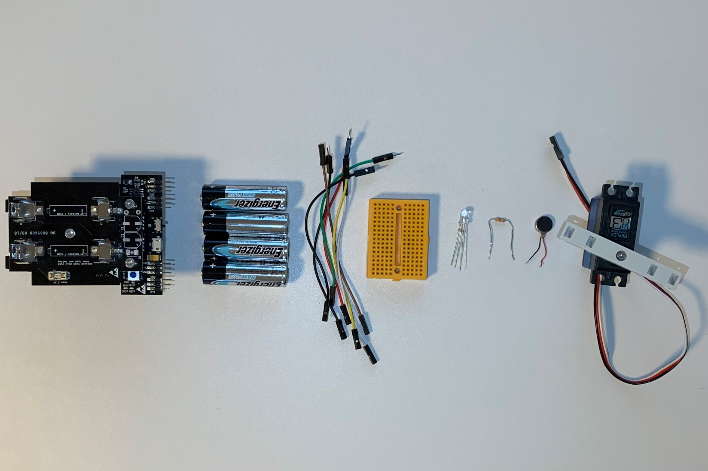
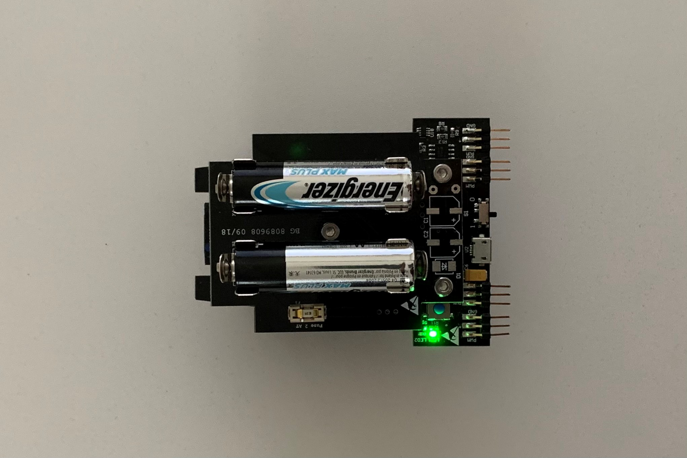
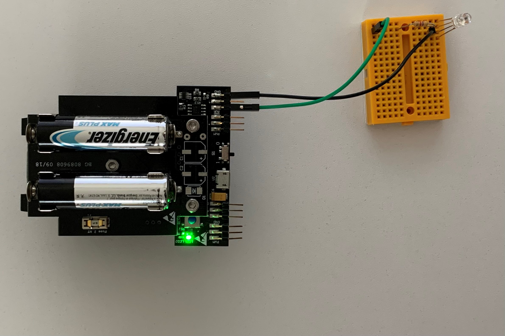
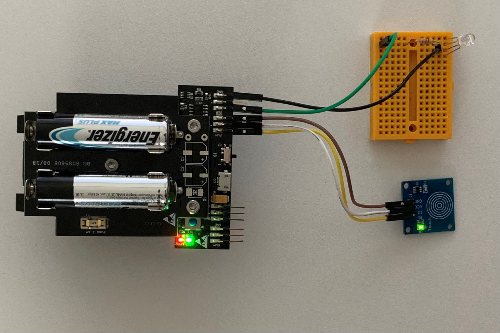
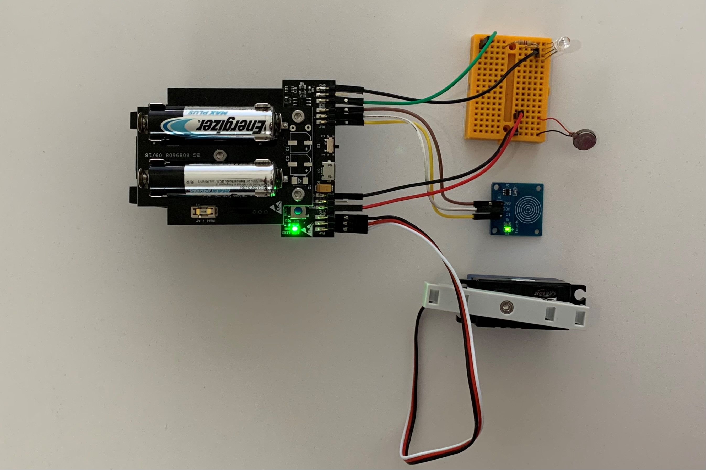

# STEP-BY-STEP 
# Food


In this project, you’re going to feed the chameleon. But be careful, food is very important for the cameleon to be healthy. You’re going to tell the cameleon you want to give food by using the touch sensor. If the chameleon likes food, you win. Otherwise, the chameleon rejects the food and you lose. The food is represented by soft balls.

You will creat code to interact with the chameleon. The chameleon decides randomly if it likes the food you feed. If the chameleon likes the food, it changes the color to green and moves the tongue. In this case you win. If the chameleon doesn't like the offered food, it changes the color to red and it shakes in disgust by the vibration motor. In this case you lose.  

## Objective
* You can toggle an LED.
* You can integrate a vibration motor.
* You can control a servomotor.
* You can write if structure.
* You understand conditionals.
* You can deal with global and local variables.
* You understand logical operators.
* You understand writing and calling functions.

## Material 
* 1 Microcontroller ESP32
* 1 Breadboard (orange)
* 9 Jumper cables
* 1 RGB LED
* 1 Resistor 330 Ohm
* 1 Vibrating motor (black)
* 1 Touch sensor (blue)
* 1 Servomotor (Waterproof)
* 3 Soft balls: diameter about 2,5 cm; color: blue, red, green
* *CHAMELEON_Food_Code_Challenge.ino* (download on github)
 

# Task 1: Control the built-in red LED (LED2)
Flash the red LED every 1000 ms. Use the built in red LED; it's defined on GPIO 13.

 

## Wiring scheme:
LED2	| ESP32 
------------ | -------------
LED2 | GPIO 13 

## Code:
1. Open the *CHAMELEON_Food_Code_Challenge.ino* file.<br>
2. *global variables*
<br>Define the GPIO of the red LED and give it the variable name "LED2". 
3. *setup()*
<br>Setup LED2 as OUTPUT.
4. *loop()*
<br>Control LED2 via power on/power off. Use the function *digitalWrite(variable, value);* to control the power of the LED via HIGH and LOW values. Include a *delay();* of 1000 ms between each HIGH and LOW value.

# Task 2: Control the RGB LED 
Flash the RGB LED in green color. Use the function *digitalWrite(variable, value);* to control the power of the LED via HIGH and LOW values. Include a *delay();* of 1000 ms between each HIGH and LOW value. If the red LED is HIGH the green LED is LOW and the other way round.
<br> The picture show the design of the RGB LED:
* blue color: shortest wire 
* green color: second shortest wire
* ground: longest wire (black)
* red color: second longest wire
  
<br> <br>(C) This image was created with Fritzing.
<br>The RGB LED must be in series with a 330 Ohm resistor.
 <br>(C) This image was created with Fritzing.



## Wiring scheme:
LED RGB| ESP32 
------------ | -------------
Blue | GPIO 16 
Black | GND

## Code:
1. *global variables*
<br> Define the GPIO of the RGB LED and give it the variable name "LED_RGB_Green".
2. *setup()*
<br> Setup LED_RGB_Green as OUTPUT.
3. *loop()*
<br> Control LED_RGB_Green via power on/power off. Use the function *digitalWrite(variable, value);* to control the power of the LED via HIGH and LOW values. Use the *delay();* of 1000 ms between each HIGH and LOW value from task 1. If the red LED lights up the green LED is off and the other way round.

# Task 3: Implement the touch sensor
<br> Make the touch sensor work. If a touch is detected generate a random value between 0 and 1. If no touch is detected set LED2 and the green LED LOW.
The touch sensor has 3 pins: ground (GND), power supply (VCC) and data pin connection (IO). 


## Wiring scheme:
touch sensor| ESP32
------------ | -------------
IO | GPIO 17
VCC | VCC
GND  | GND

## Code:
1. *global variables*
<br> Define the GPIO of the touch sensor.
2. *setup()*
<br> Setup the touch sensor as INPUT.
3. *loop()*
* Read the values from the touch sensor with *digitalRead();* and store the value in a local variable. Use *digitalRead()* because the touch sensor sends a digital signal.
* Print the value in the serial monitor.
* Write an if-structure:
	* If a touch is detected (boolean HIGH), generate a random number between 0 and 1. Store the random value in a variable and print it in the serial monitor. Flash the red and green LED alternating. Use the code of Task 1 and 2.
	* If no touch is detected (boolean LOW), print "no touch detected" to the serial monitor. Set LED2 and the green LED LOW.

# Task 4: Write a condition for the random valuee
<br> If the random value is equal to 1, the player wins. In this case print "win" into the serial monitor, light up the green LED and power off the red LED. 



## Code:
1. *global variables*
<br> There is no global variable to initialize.
2. *setup()*
<br> There is nothing to setup.
3. *loop()*
* Write an if structure:
	* If the random value is equal to 1, print "win" into the serial monitor. Light up the green LED, power off the red LED and do a delay of 1000 ms. Use parts of the code from Task 1 and 2.
	* If the random value is not equal to 1, print "lose" into the serial monitor. Light up the red LED, power off the green LED and do a delay of 1000 ms.	Use parts of the code from Task 1 and 2.

# Task 5: Implement the vibration motor
<br> Make the vibrating motor only work when the random value is not equal to 1.


## Wiring scheme:
vibrating monitor| ESP32 
------------ | -------------
Red | GPIO 26
Black | GND

## Code:
1. *global variables*
<br> Define the GPIO of the vibrating monitor.
2. *setup()*
<br> Setup the vibrating motor as OUTPUT.
3. *loop()*
<br> Set the vibrating motor HIGH only if the random value is not equal to 1. In any other case set the vibrating motor LOW. Therefore use the function *digitalWrite(variable, status)*.

# Task 6: Implement the servo motor
<br> Implement the servo motor to move the chameleons' tongue. Move the chameleon's tongue only if the random value is euqal to 1.
<br> The servo motor has 3 pins: ground (black), power supply (red) and data pin connection (white). 



## Wiring scheme:
servo motor | ESP32
------------ | -------------
White | GPIO 25
Red | VCC
Black  | GND

## Code:
1. *global variables*
<br> Define the GPIO of the servo motor and give it the variable name "servomotor". Also, define the channel, frequency and resolution of the PWM as an int and give them a number:
* channel = 0
* frequency = 50
* resolution = 16
<br> Define two global variable for the minimum and maximum angle of motor movement.
* servomotor_Angle_Min = 80
* servomotor_Angle_Max = 120
<br> Define a function that converts the motor angle to motor steps to control the stepper motor. A function encapsulates a logic and behaviour, in this case to move the servomotor by the input value.
* void command_servomotor(float servomotor_Angle): declarate the function as *void* and give the angle to the function. *Void* indicates that no information as output is expected.
* convert 0-180 degrees to 0-65536. Use *uint32_t* as datatype to store the value.
* call the function *ledcWrite(channel,i)* to move the servo motor. Use the variable for the servo motor channel. i is represented by the variable of your converting calculation. 

```
void command_servomotor(float servomotor_Angle)
{
  //convert 0-180 degrees to 0-65536
  uint32_t conv = (((servomotor_Angle / 180.0) * 2000) / 20000.0 * 65536.0) + 1634;
  ledcWrite(servomotor_Channel, conv);
}
```

2. *setup()*
* Setup servomotor as OUTPUT.
* Attach the channel to the GPIO of the servomotor to be controlled with *ledcAttach(servomotor, channel);*
* Define the PWM functionalities of the channel with *ledcSetup(channel,frequency, resolution);*
3. *loop()*
<br> If the random value is equal to 1, move the servo motor by calling the function you defined previously *command_servomotor(angle)*.
* move the servomotor to it's maximum angle value. Use the global variable you defined previously.
* wait 1000 ms
* move the servomotor to it's minimum angle value. Use the global variable you defined previously.
* wait 1000 ms