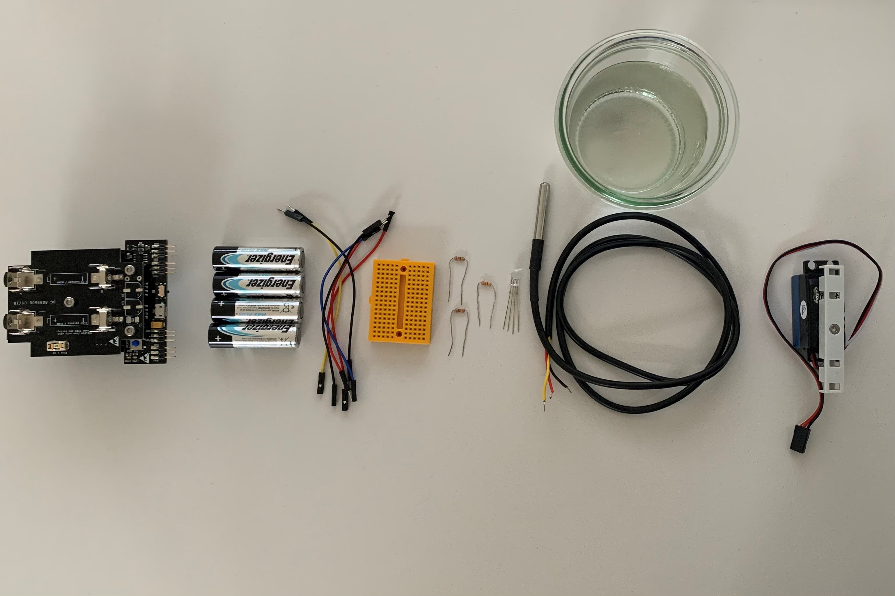
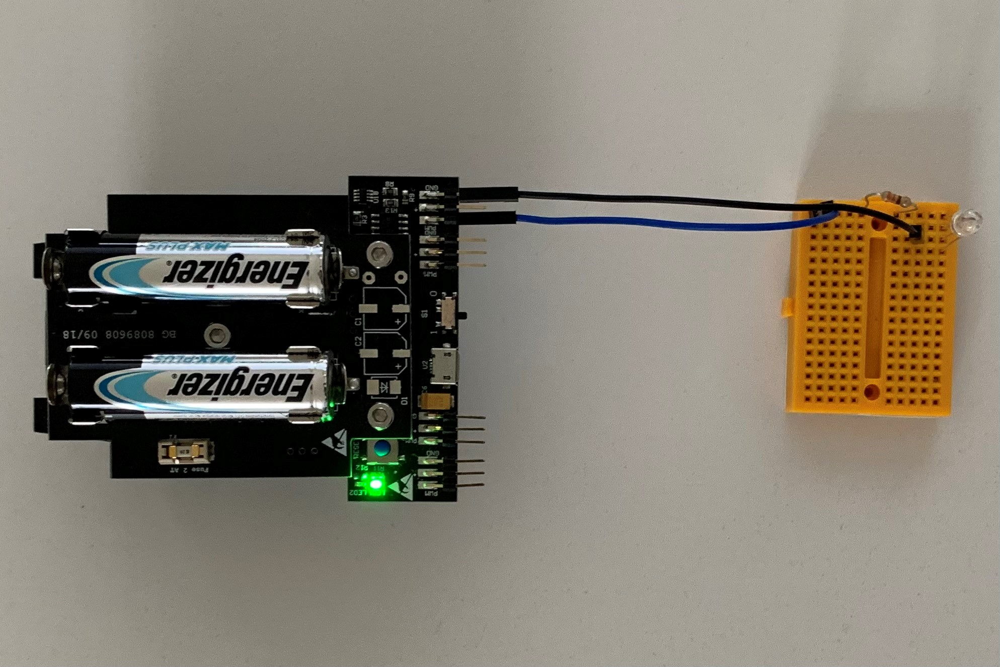
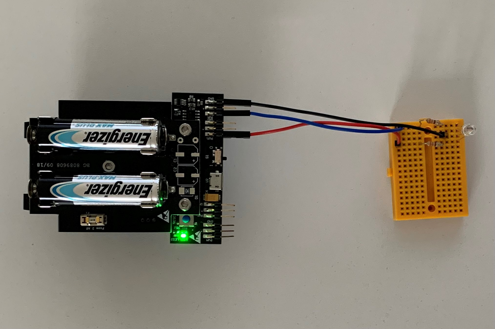
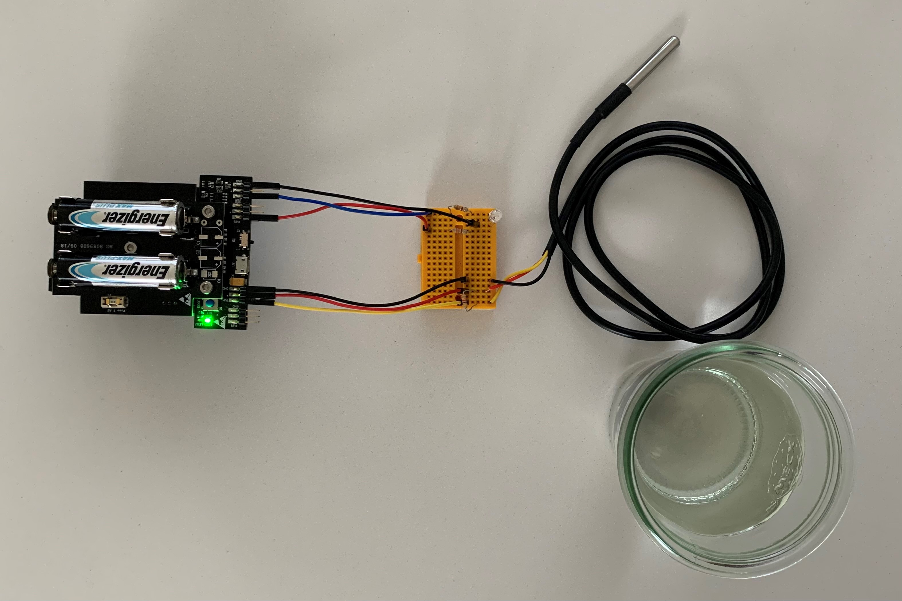

 <br>
# STEP-BY-STEP
# Temperature


## Objective
The elephant's trunk is very much used by the animal. For example, the elephant uses its trunk to bring water to its mouth. For this scenario, you're going to use a temperature sensor. If it's hot, the LED is red. Then you must bring water to the elephant to make him drink. Thus, the temperature sensor will be immersed in water. If the temperature will decrease the LED turns blue and the elephant drinks: the clamps open and close.

You will creat code to interact with the elephant. If it's warm the elephant lights up in red color. Otherwise the elephant lights up in blue color and moves its' clamps on top of the trunk.

## Material 
* 1 Microcontroller ESP32
* 1 Breadboard (orange)
* 6 Jumper cables
* 1 Temperature sensor  
* 1 LED RGB 
* 1 Servomotor
* 1 Glas with hot water (red)
* 1 Glas with cold water (blue)
* 8 3D printed part of: Plate.stl (download on github)
* *ELEPHANT_Temperature_Code_Challenge.ino* (download on github)



# Task 1: Control the RGB LED in blue color
Flash the RGB LED in blue color. Use the function *digitalWrite(variable, value);* to control the power of the LED via HIGH and LOW values. Include a *delay();* of 100 ms between each HIGH and LOW value.
<br> The picture show the design of the RGB LED:
* blue color: shortest wire 
* green color: second shortest wire
* ground: longest wire (black)
* red color: second longest wire
  
<br> <br>(C) This image was created with Fritzing.
<br>The RGB LED must be in series with a 330 Ohm resistor.



## Wiring scheme:
LED RGB| ESP32 
------------ | -------------
Blue | GPIO 16 
Black | GND

## Code:
1. Open the *ELEPHANT_Temperature_Code_Challenge.ino* file.<br>
2. *global variables*
<br> Define the GPIO of the RGB LED in blue color and give it the variable name "LED_RGB_Blue".
3. *setup()*
<br> Setup LED_RGB_Blue as OUTPUT.
4. *loop()*
<br> Control LED_RGB_Blue via power on/power off. Use the function *digitalWrite(variable, value);* to control the power of the LED via HIGH and LOW values. Use the *delay();* of 100 ms between each HIGH and LOW value.

# Task 2: Control the RGB LED in red color
Flash the RGB LED in red color. Use the function *digitalWrite(variable, value);* to control the power of the LED via HIGH and LOW values. Include a *delay();* of 100 ms between each HIGH and LOW value. If the red LED is HIGH the blue LED is LOW and the other way round.
<br>The RGB LED must be in series with a 330 Ohm resistor.



## Wiring scheme:
LED RGB| ESP32 
------------ | -------------
Blue | GPIO 17 
Black | GND

## Code:
1. *global variables*
<br> Define the GPIO of the RGB LED in red color and give it the variable name "LED_RGB_Red".
2. *setup()*
<br> Setup LED_RGB_Red as OUTPUT.
3. *loop()*
<br> Control LED_RGB_Red via power on/power off. Use the function *digitalWrite(variable, value);* to control the power of the LED via HIGH and LOW values. Use the *delay();* of 100 ms between each HIGH and LOW value from task 1. If the red LED lights up the blue LED is off and the other way round.

# Task 3: Implement the temperature sensor
Make the temperature sensor work to display the measured values in the serial monitor. If the measured temperature value is equal or higher than the temperature treshold light up the red LED; otherwise light up the blue LED.

 

## Wiring scheme:
LED2	| ESP32 
------------ | -------------
LED2 | GPIO 26 

## Code:
1. *global variables*
* Define the GPIO of the temperature sensor and give it the variable name "temperaturesensor".
* Include the library of the temperature sensor:
	* #include <OneWire.h>
	* #include <DallasTemperature.h>
* Define the temperaturesensor
	* OneWire oneWire(temperaturesensor);
	* DallasTemperature sensors(&oneWire);
* Define a variable for your temperature treshold to distinguish warm and cold. For example, you can set the value to 22.
2. *setup()*
* Setup temperature sensor as INPUT.
* Start the temperature sensor by calling *sensors.begin();*
3. *loop()*
* Read and Display the temperature values. Call the function *sensors.requestTemperatures();* and *sensors.getTempCByIndex(0);*. Store your measured temperature value in a variable and print it to the serial monitor.
* Make a sanity check of the measured values: take a cold glas of water and your hand to verify the measured values. If the measured values are realistic, go to the next step.
* Write an if structure:
	* If the temperature sensor value is equal of higher then the temperature treshold print "warm" in the serial monitor. Power off the blue LED and power on the red LED. Use the code of task 1 and 2.
	* If the temperature sensor value is lower then the temperature treshold print "cold" in the serial monitor. Power on the blue LED and power off the red LED. Use the code of task 1 and 2.

# Task 4: Implement the servo motor
<br> Implement the servo motor to move the clamps if it's cold. Otherwise stop the trunk movement.
<br> The servo motor has 3 pins: ground (black), power supply (red) and data pin connection (white). 


## Wiring scheme:
servo motor | ESP32
------------ | -------------
White | GPIO 25
Red | VCC
Black  | GND

## Code:
1. *global variables*
<br>Define the GPIO of the servo motor and give it the variable name "servomotor". Also, define the channel, frequency and resolution of the PWM as an int and give them a number:
* channel = 0
* frequency = 50
* resolution = 16
<br>Define two global variable for the minimum and maximum angle of motor movement.
* servomotor_Angle_Min = 80
* servomotor_Angle_Max = 120
<br>Define a function that converts the motor angle to motor steps to control the stepper motor. A function encapsulates a logic and behaviour, in this case to move the servomotor by the input value.
* void command_servomotor(float servomotor_Angle): declarate the function as *void* and give the angle to the function. *Void* indicates that no information as output is expected.
* convert 0-180 degrees to 0-65536. Use *uint32_t* as datatype to store the value.
* call the function *ledcWrite(channel,i)* to move the servo motor. Use the variable for the servo motor channel. i is represented by the variable of your converting calculation. 

```
void command_servomotor(float servomotor_Angle)
{
  //convert 0-180 degrees to 0-65536
  uint32_t conv = (((servomotor_Angle / 180.0) * 2000) / 20000.0 * 65536.0) + 1634;
  ledcWrite(servomotor_Channel, conv);
}
```

2. *setup()*
* Setup servomotor as OUTPUT.
* Attach the channel to the GPIO of the servomotor to be controlled with *ledcAttach(servomotor, channel);*
* Define the PWM functionalities of the channel with *ledcSetup(channel,frequency, resolution);*
3. *loop()*
* If it's "warm" the clamps doesn't move. Otherwise move the clamps.
* Move the servo motor by calling the function you defined previously *command_servomotor(angle)*.
	* move the servomotor to it's maximum angle value. Use the global variable you defined previously.
	* wait 1000 ms
	* move the servomotor to it's minimum angle value. Use the global variable you defined previously.
	* wait 1000 ms