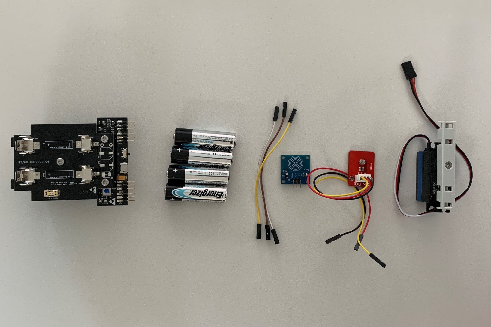
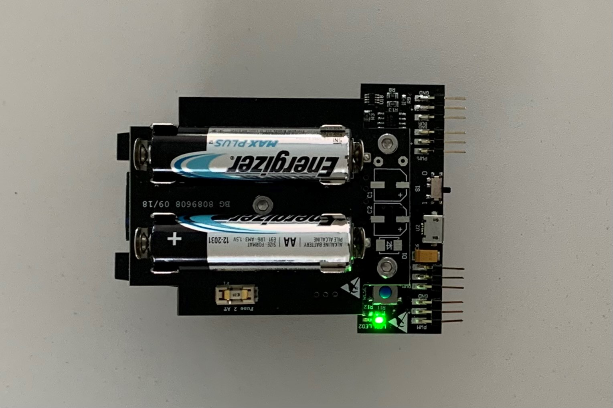
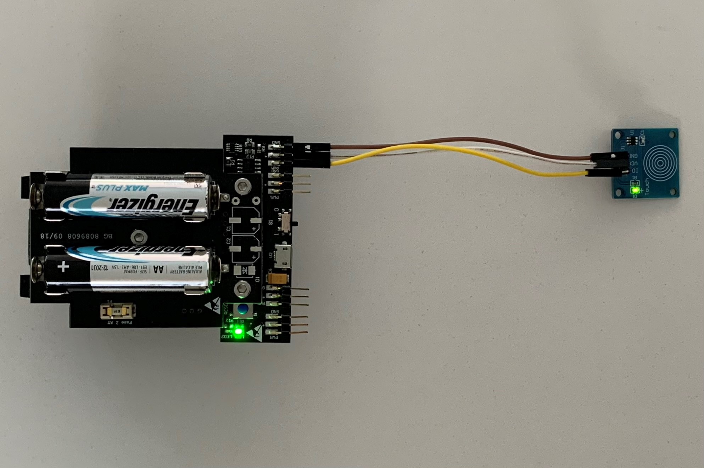
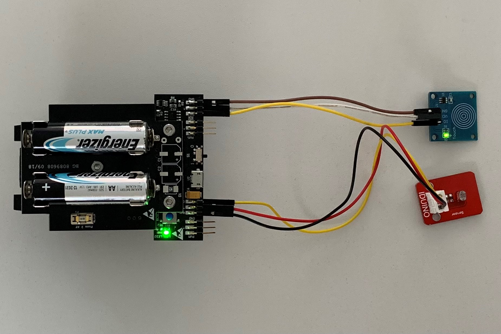
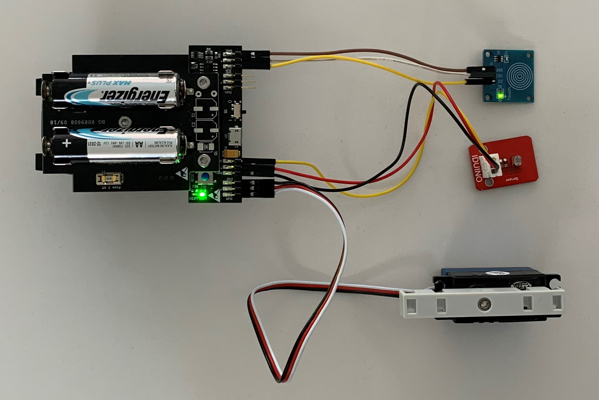

# STEP-BY-STEP
# Adaptability of the trunk 
<br>

The trunk of elephants is used to breathe, to drink, catch fruit, communicate, etc.. The movements of the trunk are numerous. In this project you will use a light sensor and a touch sensor to create several behaviors. You create behaviors like sleep or day mode with trunk movement or warning signal.  

You will creat code to interact with the elephant. If It's day and no touch is detected the elephant feels comfortable and moves its trunk. If it's day and a touch is detected the elephant is on alert with a flashing red LED. If it's night the elephant is asleep and reacts to no stimuli.  

## Objective
* You can toggle an LED.
* You can integrate a touch sensor.
* You can integrate a light sensor.
* You can control a servomotor.
* You understand conditionals.
* You can deal with global and local variables.
* You understand logical operators.
* You understand writing and calling functions.

## Material 
* 1 Microcontroller ESP32
* 9 Jumper cables
* 1 Touch sensor (blue sqaure)
* 1 Light sensor (red)
* 1 Servomotor
* 2 Cable ties
* 1 3D printed part of: 3D_Structure_Light_sensor.stl (download on github)
* 1 3D printed part of: Light_Box_Top.stl (download on github)
* 1 3D printed part of: Light_Box_Bottom.stl (download on github)
* *ELEPHANT_Adaptability-of-the-trunk_Code_Challenge.ino* (download on github)
<br>

# Task 1: Control the built-in red LED (LED2)
Flash the red LED every 100 ms. Use the built in red LED; it's defined on GPIO 13.



## Wiring scheme:
LED2	| ESP32 
------------ | -------------
LED2 | GPIO 13 

## Code:
1. Open the *ELEPHANT_Adaptability-of-the-trunk_Challenge.ino* file.<br>
2. *global variables*
<br>Define the GPIO of the red LED and give it the variable name "LED2". 
3. *setup()*
<br>Setup LED2 as OUTPUT.
4. *loop()*
<br>Control LED2 via power on/power off. Use the function *digitalWrite(variable, value);* to control the power of the LED via HIGH and LOW values. Include a *delay();* of 500 ms between each HIGH and LOW value.


# Task 2: Implement the touch sensor
<br> Make the touch sensor only work if it's "day". If a touch is detected flash the red LED. If no touch is detected trigger no action.
The touch sensor has 3 pins: ground (GND), power supply (VCC) and data pin connection (IO). 



## Wiring scheme:
touch sensor| ESP32
------------ | -------------
IO | GPIO 16
VCC | VCC
GND  | GND

## Code:
1. *global variables*
<br>Define the GPIO of the touch sensor.
2. *setup()*
<br> Setup the touch sensor as INPUT.
3. *loop()*
* Read the values from the touch sensor with *digitalRead();* and store the value in a local variable. Use *digitalRead()* because the touch sensor sends a digital signal.
* Print the value in the serial monitor.
* Write an if-structure:
	* If a touch is detected (boolean HIGH), trigger no action.
	* If no touch is detected (boolean LOW), print "no touch detected" to the serial monitor.

# Task 3: Implement the light sensor
<br> Implement the light sensor and find your treshold value. If the meassured value is equal or higher than your treshold print "day" to the serial monitor. If the meassured value is lower than your treshold print "night" to the serial monitor.
The light sensor has 3 pins: ground (GND), power supply (VCC) and data pin connection (OUT). 



## Wiring scheme:
light sensor	| ESP32 
------------ | -------------
OUT | GPIO 26 
VCC | VCC (+)
GND | GND

## Code:
1. *global variables*
<br>Define the GPIO of the light sensor and indicate a global variable for your treshold value.
2. *setup()*
<br> Setup the light sensor as INPUT.
3. *loop()*
* Read the values from the light sensor with *analogRead();* and store the value in a local variable.
* Print the value in the serial monitor.
* Use a flashlight and your finger to demonstrate extreme light sensor values: bright and dark. Find out a realistic treshold value to distinguish "day mode" and "night mode". Write this treshold value in your global variable you defined in *global variables* previously. 
* Write an if-structre:
	* If the meassured light sensor value is equal or higher then your treshold print "day" to the serial monitor and start the condition of the touch sensor value. Use the code of task 2.
	* If the meassured light sensor value is lower then your treshold print "night" into the serial monitor.
* Power off the LED after the conditions have been run through. Use parts of the code from task 1.

# Task 4: Implement the servo motor
<br> Implement the servo motor to move the elephants' trunk. Move the elephant's trunk only if it's day and no touch is detected.
<br> The servo motor has 3 pins: ground (black), power supply (red) and data pin connection (white). 



## Wiring scheme:
servo motor | ESP32
------------ | -------------
White | GPIO 25
Red | VCC
Black  | GND

## Code:
1. *global variables*
<br>Define the GPIO of the servo motor and give it the variable name "servomotor". Also, define the channel, frequency and resolution of the PWM as an int and give them a number:
* channel = 0
* frequency = 50
* resolution = 16
<br>Define two global variable for the minimum and maximum angle of motor movement.
* servomotor_Angle_Min = 80
* servomotor_Angle_Max = 120
<br>Define a function that converts the motor angle to motor steps to control the stepper motor. A function encapsulates a logic and behaviour, in this case to move the servomotor by the input value.
* void command_servomotor(float servomotor_Angle): declarate the function as *void* and give the angle to the function. *Void* indicates that no information as output is expected.
* convert 0-180 degrees to 0-65536. Use *uint32_t* as datatype to store the value.
* call the function *ledcWrite(channel,i)* to move the servo motor. Use the variable for the servo motor channel. i is represented by the variable of your converting calculation. 

```
void command_servomotor(float servomotor_Angle)
{
  //convert 0-180 degrees to 0-65536
  uint32_t conv = (((servomotor_Angle / 180.0) * 2000) / 20000.0 * 65536.0) + 1634;
  ledcWrite(servomotor_Channel, conv);
}
```

2. *setup()*
* Setup servomotor as OUTPUT.
* Attach the channel to the GPIO of the servomotor to be controlled with *ledcAttach(servomotor, channel);*
* Define the PWM functionalities of the channel with *ledcSetup(channel,frequency, resolution);*
3. *loop()*
<br>If it's day and no touch is detected, move the servo motor by calling the function you defined previously *command_servomotor(angle)*.
* move the servomotor to it's maximum angle value. Use the global variable you defined previously.
* wait 1000 ms
* move the servomotor to it's minimum angle value. Use the global variable you defined previously.
* wait 1000 ms

If you want to make the light sensor better in performance print the black box and assemble it like in the picture shown: 
<br>