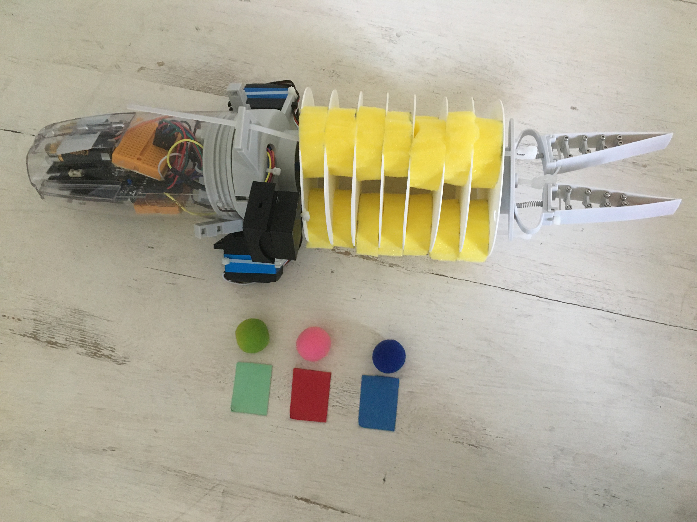
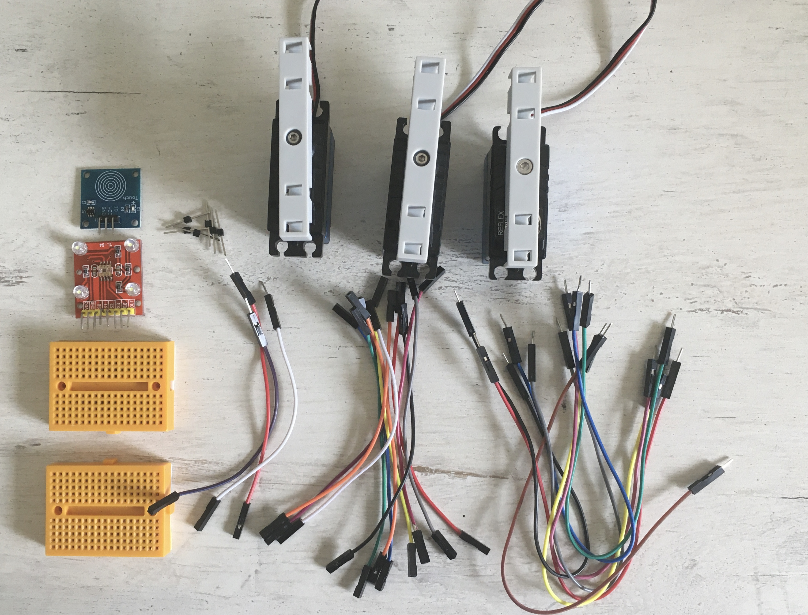
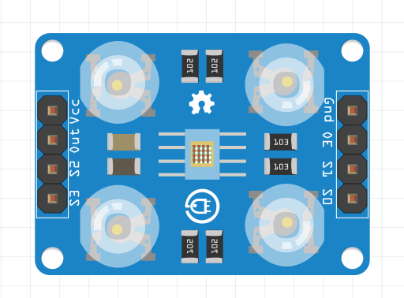

# STEP-BY-STEP
# Colored fruit


In this project, you’re going to feed the elephant. The elephant uses its trunk to catch and bring the fruits to its mouth. But it doesn't like all fruits. So in turn you will give the elephant's trunk objects each associated with a color. By using a color sensor, you will be able to determine if it is the winning color. If it is the elephant will be happy and move its trunk. Otherwise, it will reject your fruit.

## Objective
* You can control an LED with signals.
* You can write if structure.
* You can write while-loop.
* You learn how to use a touch sensor.
* You learn how to use a color sensor.
* You learn how to control a servomotor.
* You learn to deal with global and local variables.

## Material 
* 1 Microcontroller ESP32
* 2 Breadboards (orange)
* 24 Jumper cables
* 1 Touch sensor (blue)
* 1 Color sensor (red)
* 6 Connectors
* 3 Servomotors
* 3 Soft balls: diameter about 2,5 cm; color: blue, red, green
* 3 Rectangular paper: about 2 x 1 cm; color: blue, red, green
* 4 Cable ties
* 1 3D printed part of: 3D_Structure_Extra.stl (download on github)
* 1 3D printed part of: Color_Box_Top.stl (download on github)
* 1 3D printed part of: Color_Box_Bottom.stl (download on github)
* *ELEPHANT_Colored-fruit_Code_Challenge.ino* (download on github)


*Throughout the tutorial, do not hesitate to refer to the documentation.*

# Task 1: Using LED
Use the built-in LED and create a function to display the number of player who has to play. To do this, control the power supply of the LED. The ESP32 only send information to the LED. 

## Code:
1. Open the *ELEPHANT_Colored-fruit_Code_Challenge.ino*  file.
<br> *Don't hesitate to consult the documentation to better understand the functions used.*
2.*globales variables*
<br>Complete with the GPIO's number used by the Built-in LED.
3. *Function*
<br>The *player_display* function allows to indicate the number of the player who is to play. Indeed, the LED lights up as many times as the player’s number. 
<br>Complete the code to create this function.
4.*setup()*
<br>First, indicate the GPIO mode. Then you may notice instructions regarding the serial link. Do not hesitate to open the serial monitor.
5. *loop()*
<br>Please,complete to call the *player_display* function to display the number of the player. 
 
# Task 2: Touch sensor 
Use the touch sensor and write code to display the next number of player only if the sensor has been touched.
<br>The touch sensor has 3 pins: ground (GND), power supply (VCC) and data pin connection (I/O). It sends a high level when a touch is detected. The vibrating motor will be connected to the OUT pin of the sensor. The motor will vibrate each time a contact is detected.
<br> <br>(C) This image was created with Fritzing.
 
## Wiring scheme: 
The picture shows the assembly of the touch sensor (blue) and ESP32 (brown) with cables.
<br> <br>(C) This image was created with Fritzing.

Touch sensor| ESP32
------------ | -------------
I/O | GPIO 16
VCC | VCC
GND  | GND

## Code: 
1. *global variables* 
<br>Please indicate the number of the new GPIO used for touch sensor.
2. *setup()* 
<br>Please indicate the mode of touch sensor.
<br>*ESP32 receives information from the touch sensor.*
3. *loop()*
<br>Please read the sensor's value.

```
//Reading Touch Value
State_Touch = digitalRead(PIN_TOUCH);
```

<br>Using a while-do structure, write the code to allow to display the next number of player if a contact has detected.

# Task 3: Color sensor 
Use a color sensor to determine the object's color. It sends a value (proportional to the frequency) according to the color. The color sensor has 8 pins: ground (GND), supply power (VCC), configuration pins (S0,S1,S2,S3) and a data pin (OUT).
<br> <br>(C) This image was created with Fritzing.

## Wiring scheme: 
The picture shows the assembly of the touch sensor (blue), the color sensor (blue) and ESP32 (brown) with cables.
<br> <br>(C) This image was created with Fritzing.

Touch sensor| ESP32
------------ | -------------
I/O | GPIO 16
VCC | VCC
GND  | GND

Color sensor | Breadboard
------------- | ------------- 
VCC | VCC
GND | GND 
S0| VCC 
S1 | VCC 
S2 |VCC 
S3 | GND
E0| GND 
OUT| GPIO 25

## Code: 
1. *global variables* 
<br>Please indicate the number of the new GPIO used for color sensor.
2. *setup()* 
<br>Please indicate the mode of color sensor.
<br>*ESP32 receives information from the color sensor.*
2. *loop()* 
<br>Please read the color sensor's value.

```
//Reading the color
int Current_Frequency = pulseIn(PIN_COLOR, HIGH);
Serial.println("Color Frequency");
Serial.println(Current_Frequency);
delay(500);
```

You can change the value of the global variables *Blue*, *Green* and *Red* according to the values you get when the sensor has to detect the color.

# Task 4: Game's structure
<br>Complete the game's structure to include the winning color.

## Code:
1. *global variables* 
<br>Please create a *Winner* variable that stores the winning color.

```
//Winner that is the winning color (randomly defined)
int Winner;
```

2. *loop()* 
<br>First, define a randomly winning color.

```
int rd = random(Number_player);
Winner = table_color[rd];
Serial.println("Winner");
Serial.println(Winner);
```

<br>After reading of the color value: If it is the winning color please turn the LED on and set the *Continue* variable false: the game is over. If it is not the winning color, please dislay "Lose" on the serial monitor.
<br>*Don't hesitate to consult the documentation to better understand how to use the conditions structure.*
<br>After the end of the game you will be able to have the possibility of replaying thanks to the *Restart* variable.

```
//Ready to restart ? 
delay(10000);
State_Touch = digitalRead(PIN_TOUCH);
Serial.println("RESTART");
Serial.println(State_Touch);
if (State_Touch==HIGH)
{
 //The game restart
 Restart=true;
 Continue=true;
}
```

# Task 5: Servo motor
Control the servomotor in a way to show "happy" movement and a "disgust" movement.

## Wiring scheme : 
The picture shows the assembly of the touch sensor (blue), the color sensor (blue), 3 servomtors and ESP32 (brown) with cables.
<br> <br>(C) This image was created with Fritzing.

Touch sensor| ESP32
------------ | -------------
I/O | GPIO 16
VCC | VCC
GND  | GND

Color sensor | Breadboard
------------- | ------------- 
VCC | VCC
GND | GND 
S0| VCC 
S1 | VCC 
S2 |VCC 
S3 | GND
E0| GND 
OUT| GPIO 25

Servomotor clamps | ESP32
------------ | -------------
white | GPIO 26
red | VCC
black | GND

Servomotor trunk | Breadboard
------------ | -------------
white | GPIO 17
red | VCC
black | GND

## Code:
1. *global variables* 
<br>Please indicate the numbers of the new GPIO used for the trunk's servomotor and clamps's servomotor.
2.*Function*
<br>The *disgust_movement()* function allows to move the trunk to recreate a disgust movement: The trunk goes to one side, drop the object and returns to the initiale position.
<br>The *winner_movement()* function allows to moves the trunk to recreate a excitement movement for the winning color: The trunk goes to one side, and goes to other side severals times.
<br>Please create functions by using *servo.write()* and delays. 
<br>*Pay attention to the names used for each servomotor.*
2. *setup()* 
<br>Please create a connection between the servomotors and the ESP32.

```
//match between servo motor and the number pin specified 
servo_trunk.attach(PIN_SERVO_TRUNK);
servo_clamps.attach(PIN_SERVO_CLAMPS);
```

3. *loop()* 
<br>Complete your code so that when the player is ready to play (the player has pressed the touch sensor), the clamps close to take the object. 
<br>Then, after reading the value of the color, if it is the winning color, the trunk moves with the *winner_movement()* function. Otherwise, it moves with the *disgust_movement()* function.

<br>For assembly, you can use the following part to create a support for colored objects. Please fix the part with cable ties to the trunk. You'll find the STL-file of the part on github.
<br>
<br>
<br> <br>Congratulations, you've coded the **Colored fruit** scenario successfully!
