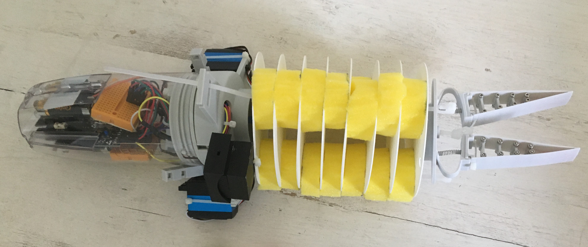
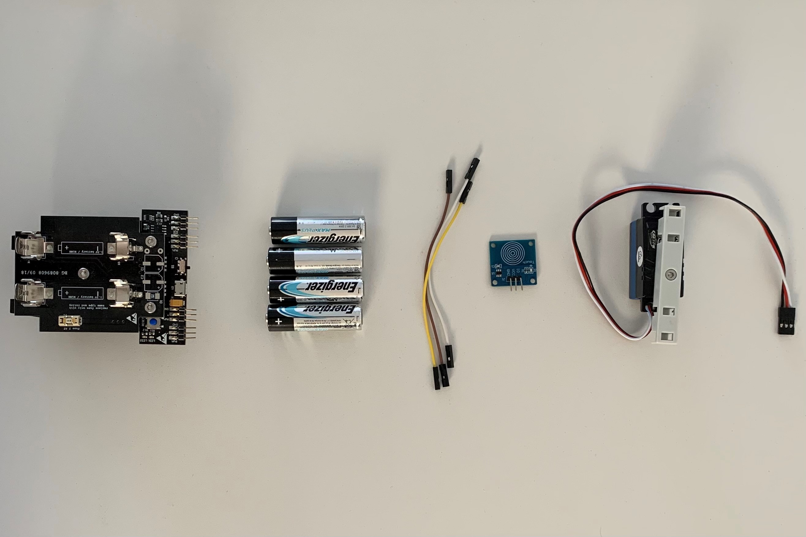
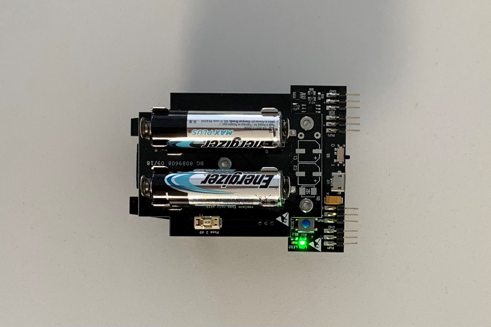
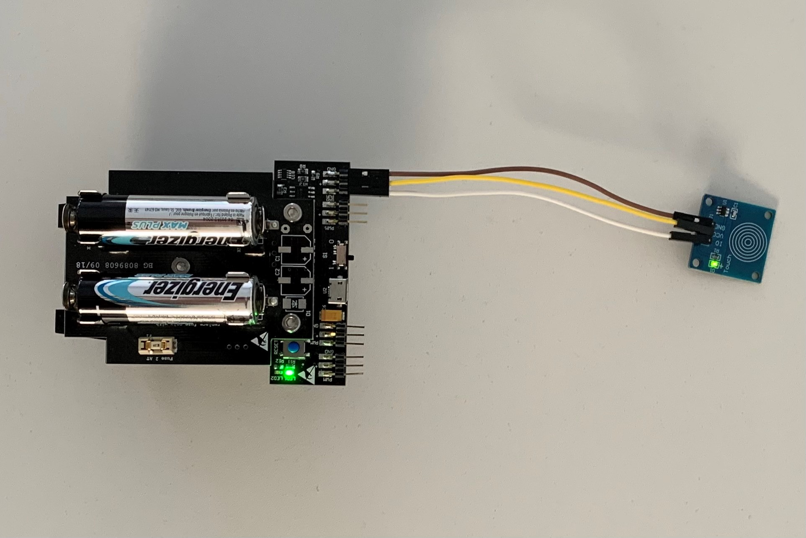
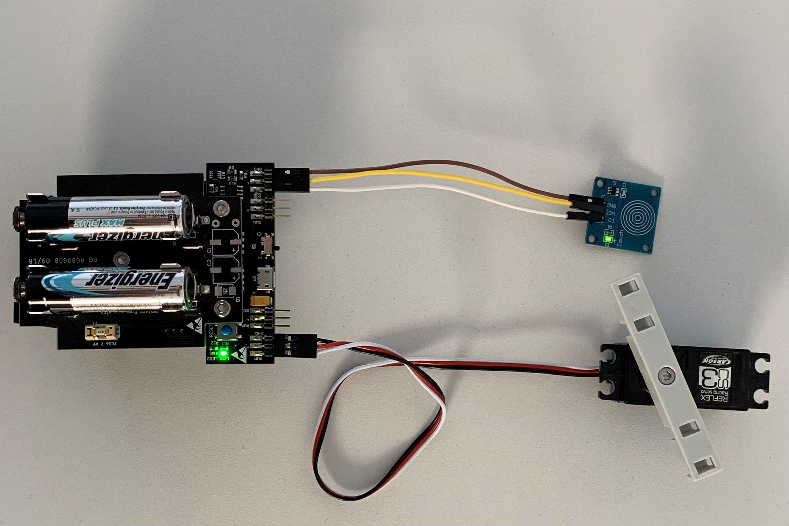

# STEP-BY-STEP
# Fruit


In this project, you’re going to feed the elephant. The elephant uses its trunk to catch and bring the fruits to its mouth. But it doesn't like all fruits. So in turn you will give the elephant's trunk objects. The elephants decides randomly if it likes to food (you win) or not (you lose).

You will creat code to interact with the elephant. If a touch is detected the game starts and a random value gets generated. If the random value is equal to 1 you win and the elephant likes the food. In this case it moves the trunk. Otherwise the red LED lights up.  

## Objective
* You can toggle an LED.
* You can integrate a touch sensor.
* You can control a servomotor.
* You understand conditionals.
* You can deal with global and local variables.
* You understand logical operators.
* You understand writing and calling functions.

## Material 
* 1 Microcontroller ESP32
* 3 Jumper cables
* 1 Touch sensor (blue)
* 1 Servomotors
* 3 Soft balls: diameter about 2,5 cm; color: blue, red, green
* *ELEPHANT_Colored-fruit_Code_Challenge.ino* (download on github)



# Task 1: Control the built-in red LED (LED2)
Flash the red LED every 500 ms. Use the built in red LED; it's defined on GPIO 13.



## Wiring scheme:
LED2	| ESP32 
------------ | -------------
LED2 | GPIO 13 

## Code:
1. Open the *ELEPHANT_Colored-fruit_Code_Challenge.ino* file.<br>
2. *global variables*
<br>Define the GPIO of the red LED and give it the variable name "LED2". 
3. *setup()*
<br>Setup LED2 as OUTPUT.
4. *loop()*
<br>Control LED2 via power on/power off. Use the function *digitalWrite(variable, value);* to control the power of the LED via HIGH and LOW values. Include a *delay();* of 500 ms between each HIGH and LOW value.

# Task 2: Implement the touch sensor
<br> Make the touch sensor work. If a touch is detected flash the red LED and write "touch detected" into the serial monitor. If no touch is detected trigger no action.
The touch sensor has 3 pins: ground (GND), power supply (VCC) and data pin connection (IO). 


## Wiring scheme:
touch sensor| ESP32
------------ | -------------
IO | GPIO 16
VCC | VCC
GND  | GND

## Code:
1. *global variables*
<br>Define the GPIO of the touch sensor.
2. *setup()*
<br> Setup the touch sensor as INPUT.
3. *loop()*
* Read the values from the touch sensor with *digitalRead();* and store the value in a local variable. Use *digitalRead()* because the touch sensor sends a digital signal.
* Print the value in the serial monitor.
* Write an if-structure:
	* If a touch is detected (boolean HIGH), print "touch detected" to the serial monitor and flash the LED. Use the code of task 1.
	* If no touch is detected (boolean LOW), print "no touch detected" to the serial monitor and implement a delay of 1000 ms.

# Task 3: Generate a random valuee
<br> If the random value is equal to 1, the player wins. In this case print "win" into the serial monitor, otherwise print "lose" into the serial monitor and flash the LED. 



## Code:
1. *global variables*
<br> There is no global variable to initialize.
2. *setup()*
<br> There is nothing to setup.
3. *loop()*
* Generate a random value with the function *random(value)* and store it in a local variable.
* Print the random value into the serial monitor.
* Write an if structure:
	* If the random value is equal to 1, print "win" into the serial monitor.
	* If the random value is not equal to 1, print "lose" into the serial monitor. Use the code of task 1 and flash the red LED.
	
# Task 4: Implement the servo motor
<br> Implement the servo motor to move the elephants' trunk. Move the elephants' trunk only if the random value is equal to 1.
<br> The servo motor has 3 pins: ground (black), power supply (red) and data pin connection (white). 



## Wiring scheme:
servo motor | ESP32
------------ | -------------
White | GPIO 25
Red | VCC
Black  | GND

## Code:
1. *global variables*
<br>Define the GPIO of the servo motor and give it the variable name "servomotor". Also, define the channel, frequency and resolution of the PWM as an int and give them a number:
* channel = 0
* frequency = 50
* resolution = 16
<br>Define two global variable for the minimum and maximum angle of motor movement.
* servomotor_Angle_Min = 80
* servomotor_Angle_Max = 120
<br>Define a function that converts the motor angle to motor steps to control the stepper motor. A function encapsulates a logic and behaviour, in this case to move the servomotor by the input value.
* void command_servomotor(float servomotor_Angle): declarate the function as *void* and give the angle to the function. *Void* indicates that no information as output is expected.
* convert 0-180 degrees to 0-65536. Use *uint32_t* as datatype to store the value.
* call the function *ledcWrite(channel,i)* to move the servo motor. Use the variable for the servo motor channel. i is represented by the variable of your converting calculation. 

```
void command_servomotor(float servomotor_Angle)
{
  //convert 0-180 degrees to 0-65536
  uint32_t conv = (((servomotor_Angle / 180.0) * 2000) / 20000.0 * 65536.0) + 1634;
  ledcWrite(servomotor_Channel, conv);
}
```

2. *setup()*
* Setup servomotor as OUTPUT.
* Attach the channel to the GPIO of the servomotor to be controlled with *ledcAttach(servomotor, channel);*
* Define the PWM functionalities of the channel with *ledcSetup(channel,frequency, resolution);*
3. *loop()*
<br>If a touch is detected and the random value is equal to 1, move the servo motor by calling the function you defined previously *command_servomotor(angle)*.
* move the servomotor to it's maximum angle value. Use the global variable you defined previously.
* wait 1000 ms
* move the servomotor to it's minimum angle value. Use the global variable you defined previously.
* wait 1000 ms