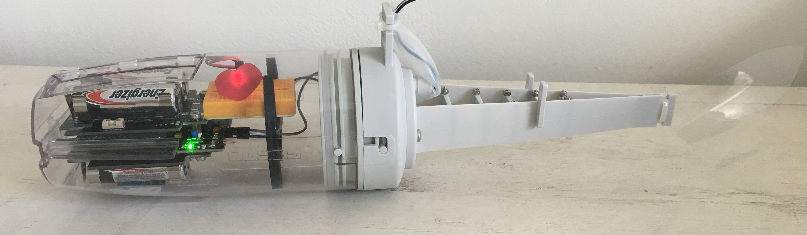
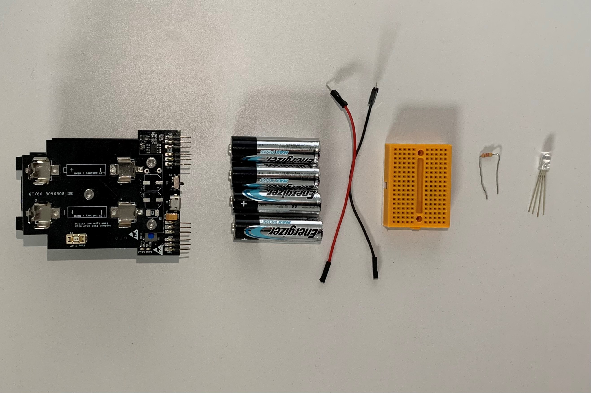
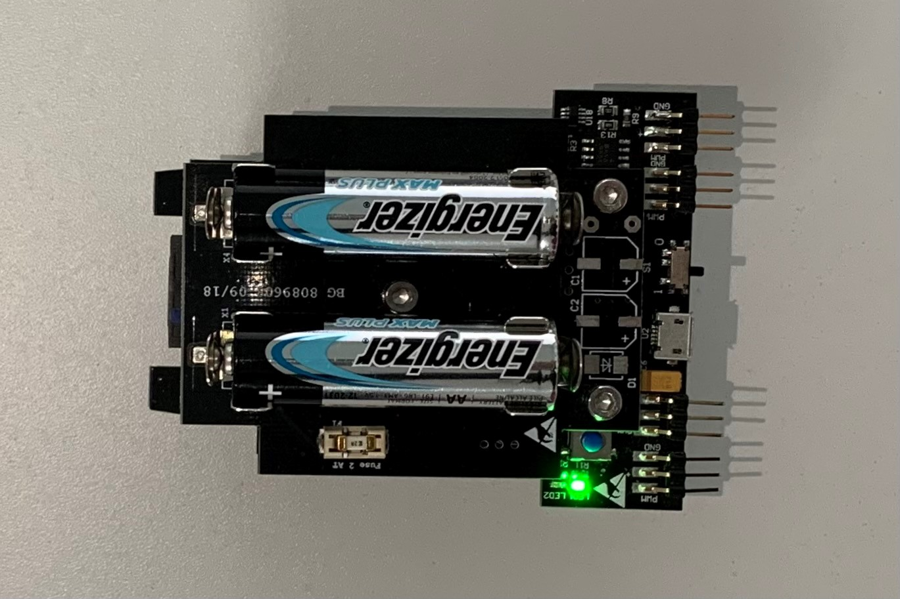
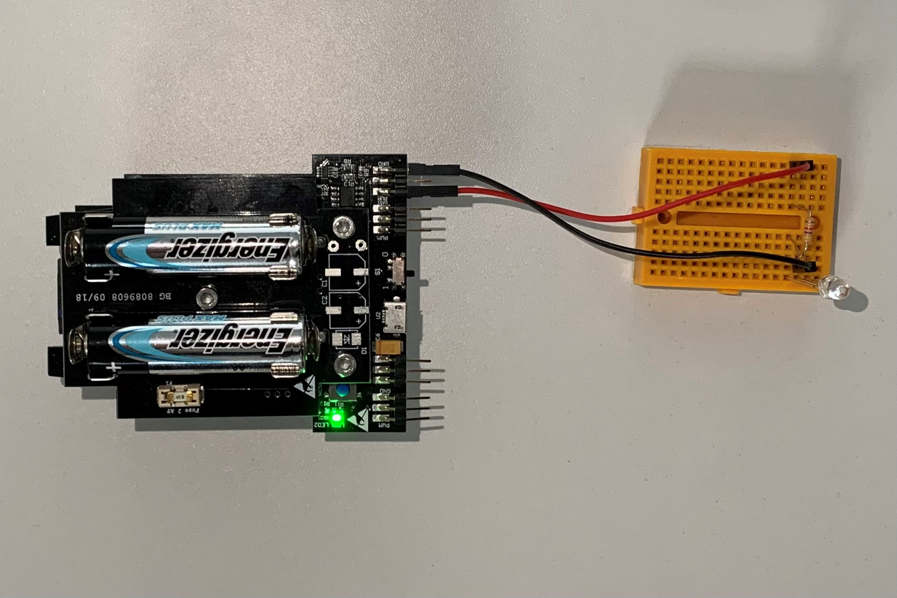

# STEP-BY-STEP
# A little heart

In this project you'll extend the bionic fish by adding a heart. For this you will add an pulsating red LED "heart" to the fish.

You will creat code to interact with the fish. If the heart reate is between 30 and 200 bpm you can change the heart rate of the fish. Otherwise the heart rate will not be changed.

## Objectives
* You can toggle an LED.
* You understand conditionals.
* You can deal with global and local variables.
* You understand logical operators.

## Material 
* 1 Microcontroller ESP32
* 1 Breadboard
* 2 Jumper cables
* 1 LED red 
* 1 Resistor 330 Ohm
* 2 Little paper hearts and some tape
* 1 3D printed part of: 3D_Structure_Light_sensor.stl (download on github)
* *A_little_heart_Start.ino* (download on github)

  

# Task 1: Initialze the resting heart rate
Initialize a global variable "bpm" with the value 60. Print the value into the serial monitor.

## Code:
1. Open the *FISH_A-little-heart_Code_Challenge.ino* file. 
2. *global variables*
 Define a global variable "bpm" with the value 60. 
3. *setup()*
 There is nothing to setup.
4. *loop()*
 Print the global variable "bpm" into the serial monitor.

# Task 2: Control the RGB LED 
Flash the LED every 100 ms.
  The picture show the design of the RGB LED:
* blue color: shortest wire 
* green color: second shortest wire
* ground: longest wire (black)
* red color: second longest wire
  
   (C) This image was created with Fritzing.
The RGB LED must be in series with a 330 Ohm resistor.

## Wiring scheme:
LED RGB| ESP32 
------------ | -------------
Blue | GPIO 16 
Black | GND

## Code:
1. *global variables*
 Define the GPIO of the RGB LED and give it the variable name "LED_RGB_Red".
2. *setup()*
* Setup LED_RGB as OUTPUT.
3. *loop()*
 Control RGB_LED_Red via power on/power off. Use the function *digitalWrite(variable, value);* to control the power of the LED via HIGH and LOW values. Include a *delay();* of 100 ms between each HIGH and LOW value.

# Task 3: Calculate the interval time
Calculate the interval time between the LED status HIGH and LOW: convert bpm into milisceonds and subtract the time of "power on" of the LED.

## Code:
1. *global variables*
  There is no global variable to define.
2. *setup()*
  There is nothing to setup.
3. *loop()*
* Calculate the interval time and store it in the data type *unsigned long*. Convert beat per minutes (bpm) into beat per milisecond. Subtract the time of *power on* of the LED. Look into the code of task 2.
* Write the calculated interval time in the "delay();" after you powered off the LED.
* Print the interval time into the serial monitor for a sanity check.

# Task 4: Read an incoming byte from the serial monitor
Look for an input in the serial monitor and write the value into a local variable.

## Code:
1. *global variables*
  There is no global variable to define.
2. *setup()*
  There is nothing to setup.
3. *loop()*
* Write a conditional looking for input in the serail monitor.
* Initialize a local variable *bpm_read*.
* Read the incoming byte withthe function *Serial.parseInt();* and store the value in your local variable.
* Clear the buffer with *Serial.flush*
* Make sure you have the right settings in the serial monitor: "no line ending"

# Task 5: Check the incoming bpm value
If the incoming bpm value is between a minimum and maximum value than set the bpm variable to a new value. Otherwise write a notification into the serial monitor.

## Code:
1. *global variables*
  Define a minimum and maximum bpm value:
* bpm_min = 30
* bpm_max = 200
2. *setup()*
  There is nothing to setup.
3. *loop()*
* Write an if structure: 
	* If the read in variable is between the permitted min and max bpm value set the variable bpm to the read in variable.
    * If the read in variable is not between the permitted min and max bpm values print a notification into the serial monitor.