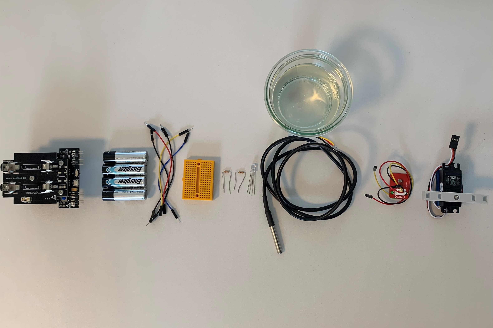
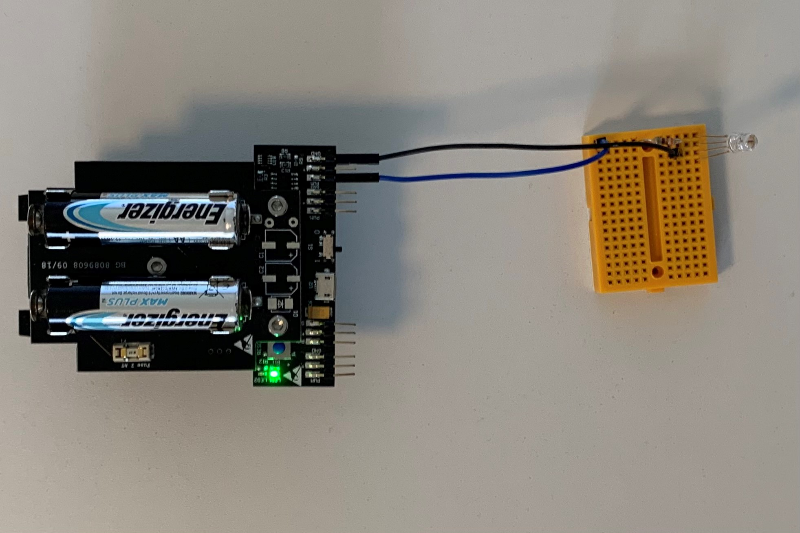
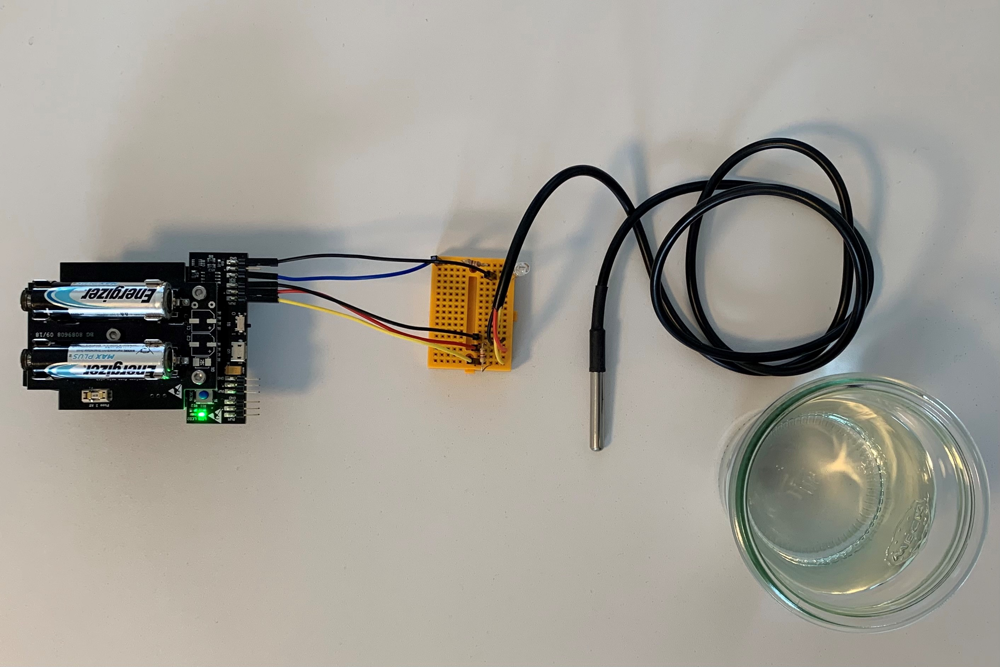
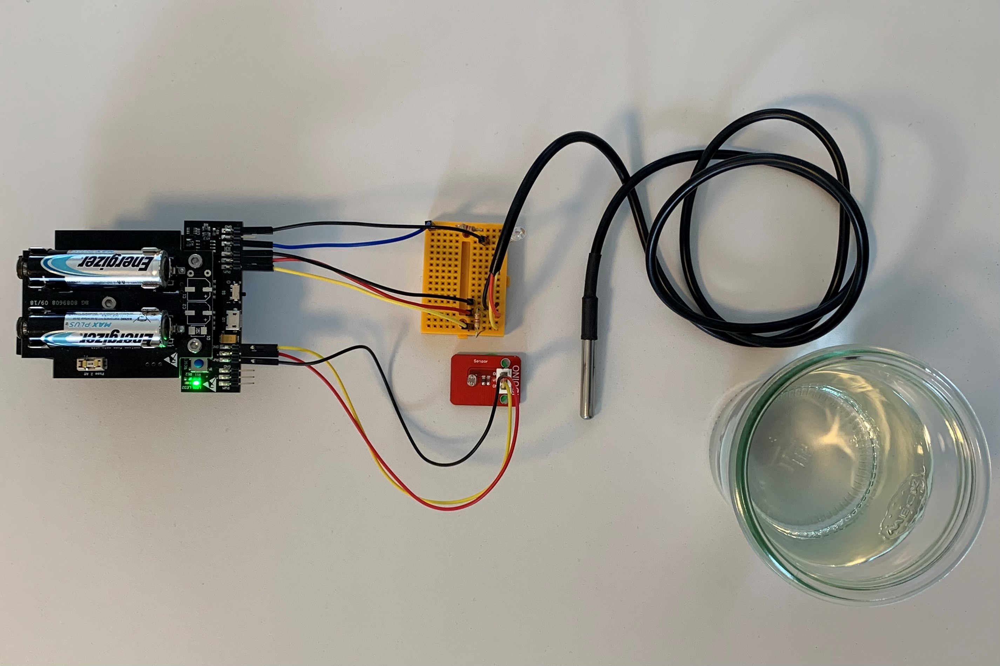
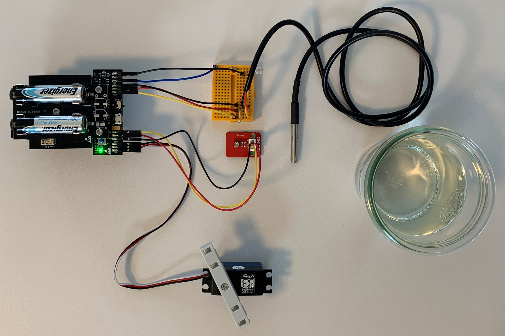
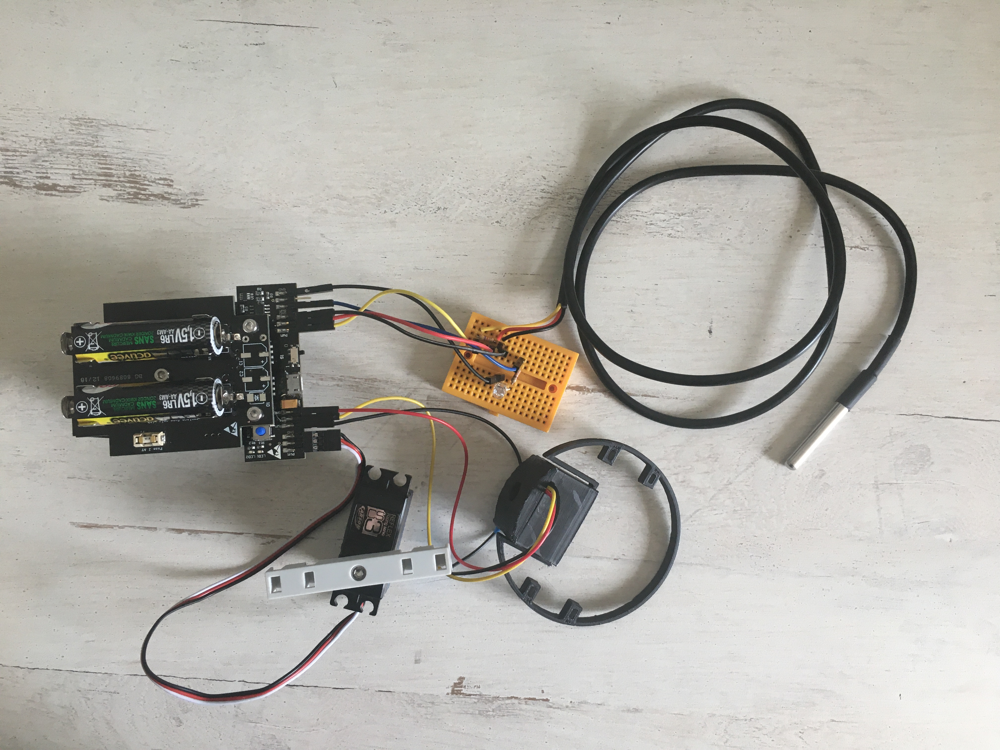

# STEP-BY-STEP 
# Cycle of the day 


In this project you will recreate the cycle of the day of the fish. With the fish, we don't talk about sleep, but rather about periods of inactivity when their 
reactivity is reduced. To rest, some species of fish swim more slowly. For this scenario, a light sensor will indicate whether it is day or night. During the day,the fish swims 
fast and during the night, the fish swims slowly. Moreover, unlike humans, fish are unable to manage their inside temperature. The temperature of the aquatic environment in 
which he swims will therefore directly influence his metabolism. Thus, use a temperature sensor to determine if the water is cold or hot , LEDs (blue and red) will light up accordingly.

You will creat code to interact with the fish. If it's day (bright environment) the fish moves its' caudal fin fast. Otherwise the fish moves its' caudal fin slowly. If it's warm enough the the fish lights up in red color. Otherwise the fish lights up in blue color.  

## Objective
* You can toggle an LED.
* You can integrate a temperature sensor.
* You can integrate a light sensor.
* You can control a servomotor.
* You understand conditionals.
* You can deal with global and local variables.
* You understand logical operators.
* You understand writing and calling functions.

## Material 
* 1 Microcontroller ESP32
* 1 Breadboard
* 5 Jumper cables
* 1 RGB LED
* 1 Resistor 330 Ohm
* 1 Resistor 4.7 kOhm
* 1 Light sensor
* 1 Temperature sensor
* 1 servo motor (Waterproof)
* 1 Glas with hot water (red)
* 1 Glas with cold water (blue)
* 1 3D printed part of: 3D_Structure_Light_sensor (download on github)
* 1 3D printed part of: Light_Box_Bottom.stl (download on github)
* 1 3D printed part of: Light_Box_Top.stl (download on github)
* 2 Cable ties
* *FISH_Cycle-of-the-day_Code_Challenge.ino* (download on github)



# Task 1: Control the built-in red LED (LED2)
Flash the red LED every 500 ms. Use the built in red LED; it's defined on GPIO 13.

 

## Wiring scheme:
LED2	| ESP32 
------------ | -------------
LED2 | GPIO 13 

## Code:
1. Open the *FISH_Cycle-of-the-day_Code_Challenge.ino* file.<br>
2. *global variables*
<br>Define the GPIO of the red LED and give it the variable name "LED2". 
3. *setup()*
<br>Setup LED2 as OUTPUT.
4. *loop()*
<br>Control LED2 via power on/power off. Use the function *digitalWrite(variable, value);* to control the power of the LED via HIGH and LOW values. Include a *delay();* of 500 ms between each HIGH and LOW value.

# Task 2: Control the RGB LED 
Flash the RGB LED in blue color. Use the function *digitalWrite(variable, value);* to control the power of the LED via HIGH and LOW values. Include a *delay();* of 500 ms between each HIGH and LOW value. If the red LED is HIGH the blue LED is LOW and the other way round.
<br> The picture show the design of the RGB LED:
* blue color: shortest wire 
* green color: second shortest wire
* ground: longest wire (black)
* red color: second longest wire
  
<br> <br>(C) This image was created with Fritzing.
<br>The RGB LED must be in series with a 330 Ohm resistor.



## Wiring scheme:
LED RGB| ESP32 
------------ | -------------
Blue | GPIO 16 
Black | GND

## Code:
1. *global variables*
<br> Define the GPIO of the RGB LED and give it the variable name "LED_RGB_Blue".
2. *setup()*
<br> Setup LED_RGB_Blue as OUTPUT.
3. *loop()*
<br> Control LED_RGB_Blue via power on/power off. Use the function *digitalWrite(variable, value);* to control the power of the LED via HIGH and LOW values. Use the *delay();* of 500 ms between each HIGH and LOW value from task 1. If the red LED lights up the blue LED is off and the other way round.

# Task 3: Implement the temperature sensor
Make the temperature sensor work to display the measured values in the serial monitor. If the measured temperature value is equal or higher than the temperature treshold light up the red LED; otherwise light up the blue LED.

 

## Wiring scheme:
LED2	| ESP32 
------------ | -------------
LED2 | GPIO 17 

## Code:
1. *global variables*
* Define the GPIO of the temperature sensor and give it the variable name "temperaturesensor".
* Include the library of the temperature sensor:
	* #include <OneWire.h>
	* #include <DallasTemperature.h>
* Define the temperaturesensor
	* OneWire oneWire(temperaturesensor);
	* DallasTemperature sensors(&oneWire);
* Define a variable for your temperature treshold to distinguish warm and cold. For example, you can set the value to 22.
2. *setup()*
* Setup temperature sensor as INPUT.
* Start the temperature sensor by calling *sensors.begin();*
3. *loop()*
* Read and Display the temperature values. Call the function *sensors.requestTemperatures();* and *sensors.getTempCByIndex(0);*. Store your measured temperature value in a variable and print it to the serial monitor.
* Make a sanity check of the measured values: take a cold glas of water and your hand to verify the measured values. If the measured values are realistic, go to the next step.
* Write an if structure:
	* If the temperature sensor value is equal of higher then the temperature treshold print "warm" in the serial monitor. Power on the red LED and power off the blue LED. Use the code of task 1 and 2.
	* If the temperature sensor value is lower then the temperature treshold print "cold" in the serial monitor. Power off the red LED and power on the blue LED. Use the code of task 1 and 2.

# Task 4: Implement the light sensor
<br> Implement the light sensor and find your treshold value. If the meassured value is equal or higher than your treshold print "day" to the serial monitor. If the meassured value is lower than your treshold print "night" to the serial monitor.
The light sensor has 3 pins: ground (GND), power supply (VCC) and data pin connection (OUT). 



## Wiring scheme:
light sensor	| ESP32 
------------ | -------------
OUT | GPIO 26 
VCC | VCC (+)
GND | GND

## Code:
1. *global variables*
<br>Define the GPIO of the light sensor and indicate a global variable for your treshold value.
2. *setup()*
<br> Setup the light sensor as INPUT.
3. *loop()*
* Read the values from the light sensor with *analogRead();* and store the value in a local variable.
* Print the value in the serial monitor.
* Use a flashlight and your finger to demonstrate extreme light sensor values: bright and dark. Find out a realistic treshold value to distinguish "day mode" and "night mode". Write this treshold value in your global variable you defined in *global variables* previously. 
* Write an if-structre:
	* If the meassured light sensor value is equal or higher then your treshold print "day" to the serial monitor.
	* If the meassured light sensor value is lower then your treshold print "night" to the serial monitor.

# Task 5: Implement the servo motor
<br> Implement the servo motor to move the caudal fin. Move the caudal fin fast if it's day. Otherwise move the caudal fin slow.
<br> The servo motor has 3 pins: ground (black), power supply (red) and data pin connection (white). 



## Wiring scheme:
servo motor | ESP32
------------ | -------------
White | GPIO 25
Red | VCC
Black  | GND

## Code:
1. *global variables*
<br>Define the GPIO of the servo motor and give it the variable name "servomotor". Also, define the channel, frequency and resolution of the PWM as an int and give them a number:
* channel = 0
* frequency = 50
* resolution = 16
<br>Define two global variable for the minimum and maximum angle of motor movement.
* servomotor_Angle_Min = 80
* servomotor_Angle_Max = 120
<br>Define a function that converts the motor angle to motor steps to control the stepper motor. A function encapsulates a logic and behaviour, in this case to move the servomotor by the input value.
* void command_servomotor(float servomotor_Angle): declarate the function as *void* and give the angle to the function. *Void* indicates that no information as output is expected.
* convert 0-180 degrees to 0-65536. Use *uint32_t* as datatype to store the value.
* call the function *ledcWrite(channel,i)* to move the servo motor. Use the variable for the servo motor channel. i is represented by the variable of your converting calculation. 

```
void command_servomotor(float servomotor_Angle)
{
  //convert 0-180 degrees to 0-65536
  uint32_t conv = (((servomotor_Angle / 180.0) * 2000) / 20000.0 * 65536.0) + 1634;
  ledcWrite(servomotor_Channel, conv);
}
```
* Define a global variable *servo_time* for the servomotor speed. Use the data type *unsigned long* and set the value to 1000 by default.

2. *setup()*
* Setup servomotor as OUTPUT.
* Attach the channel to the GPIO of the servomotor to be controlled with *ledcAttach(servomotor, channel);*
* Define the PWM functionalities of the channel with *ledcSetup(channel,frequency, resolution);*
3. *loop()*
* If it's day set the global variable *servo_time* to 1000. Otherwise set the variable *servo_time* to 2000.
* Move the servo motor by calling the function you defined previously *command_servomotor(angle)*.
	* move the servomotor to it's maximum angle value. Use the global variable you defined previously.
	* make a delay of the previously defined *servo_time* value.
	* move the servomotor to it's minimum angle value. Use the global variable you defined previously.
	* make a delay of the previously defined *servo_time* value.

If you want to make the light sensor better in performance print the black box and assemble it.
