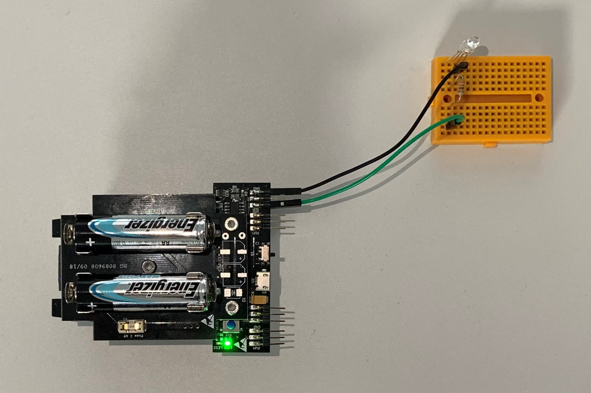
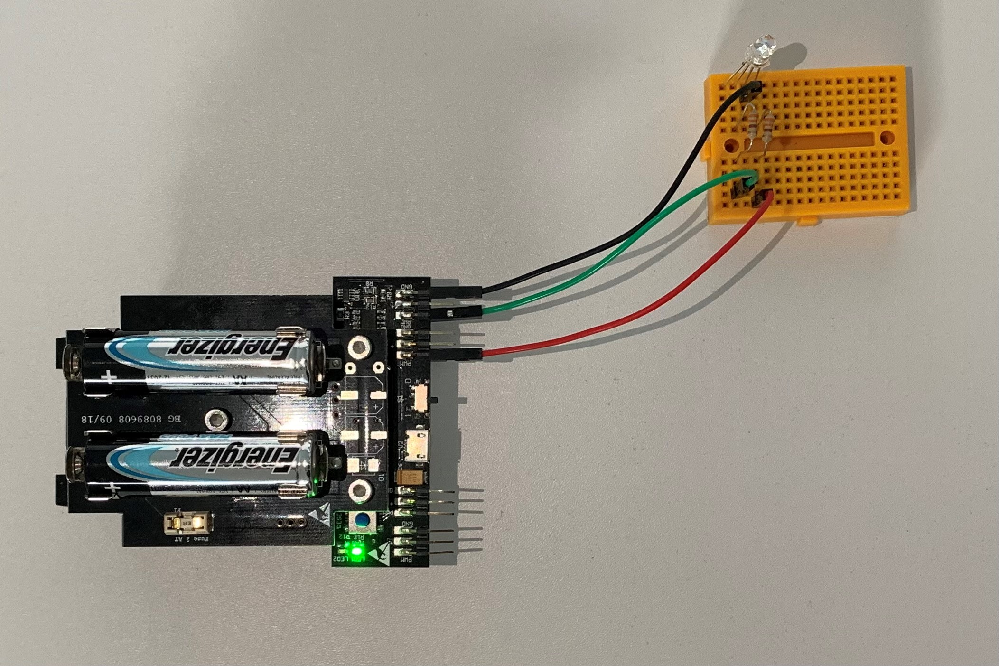
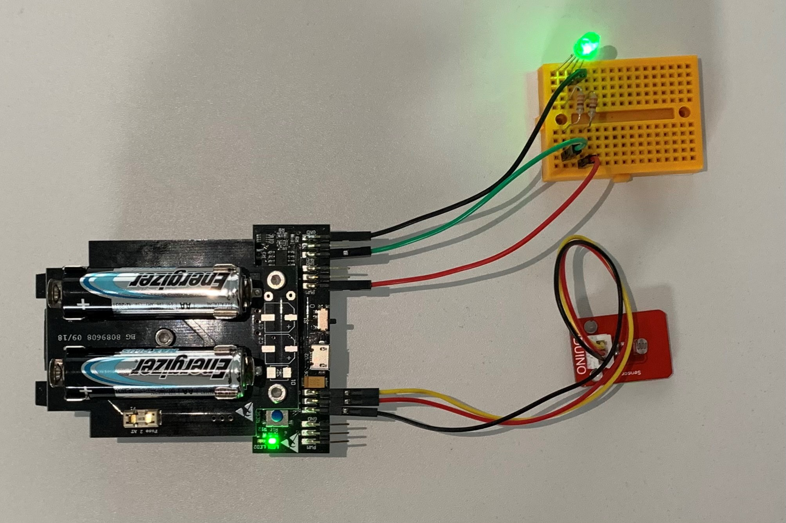
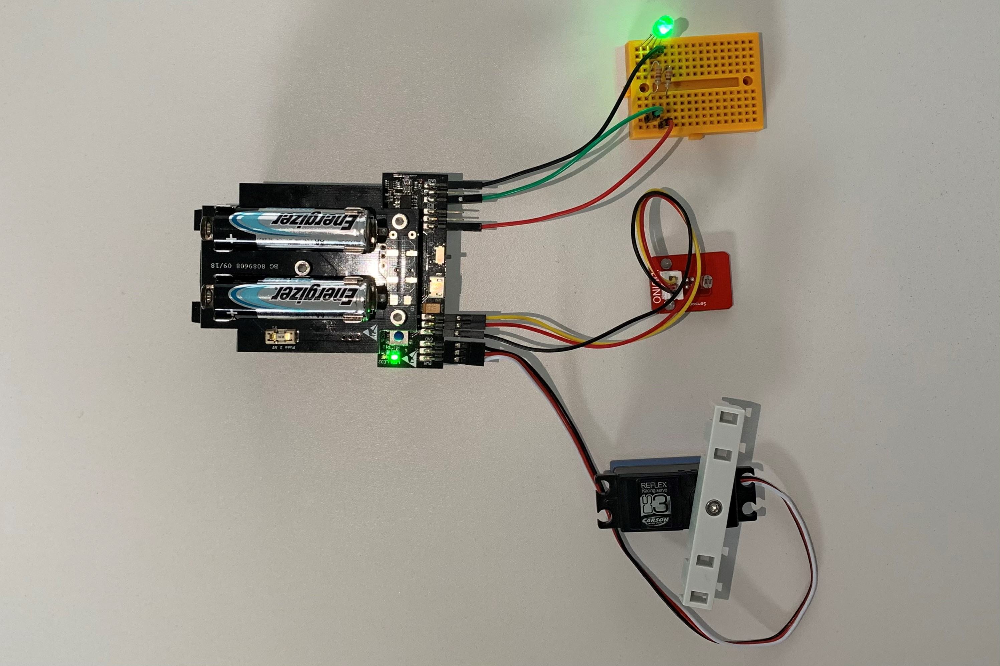

# STEP-BY-STEP 
# Swimming competition 


In this project you will play with the bionic fish in a swimming competition. What is the goal? Make your fish move randomly if its bright enough. If you manage to light up the fish best, your changes of winning increase. Only then can the fish move faster.

You will creat code to interact with the fish. If it's bright enough the game starts. A random function decides the status "win" or "lose". In case of "win", the green LED lights up and the fish starts swimming. In case of "lose", the red LED lights up.

## Objective
* You can toggle an LED.
* You can integrate a light sensor.
* You can control a servomotor.
* You understand conditionals.
* You can deal with global and local variables.
* You understand logical operators.
* You understand writing and calling functions.

## Material 
* 1 Microcontroller ESP32
* 1 Light sensor
* 1 RGB LED
* 1 Servo motor (Waterproof)
* 3 Jumper cable
* *FISH_Swimming-competition_Code_Challenge.ino* (download on github)


# Task 1: Control the RGB LED 
Flash the RGB LED in green color. Use the function *digitalWrite(variable, value);* to control the power of the LED via HIGH and LOW values. Include a *delay();* of 1000 ms between each HIGH and LOW value. If the red LED is HIGH the green LED is LOW and the other way round.
<br> The picture show the design of the RGB LED:
* blue color: shortest wire 
* green color: second shortest wire
* ground: longest wire (black)
* red color: second longest wire
  
<br> <br>(C) This image was created with Fritzing.
<br>The RGB LED must be in series with a 330 Ohm resistor.



## Wiring scheme:
LED RGB| ESP32 
------------ | -------------
Blue | GPIO 16 
Black | GND

## Code:
1. *global variables*
<br> Define the GPIO of the RGB LED and give it the variable name "LED_RGB_Green".
2. *setup()*
<br> Setup LED_RGB_Green as OUTPUT.
3. *loop()*
<br> Control LED_RGB_Green via power on/power off. Use the function *digitalWrite(variable, value);* to control the power of the LED via HIGH and LOW values. Use the *delay();* of 1000 ms between each HIGH and LOW value.

# Task 2: Control the RGB LED 
Flash the RGB LED in red color. Use the function *digitalWrite(variable, value);* to control the power of the LED via HIGH and LOW values. Include a *delay();* of 1000 ms between each HIGH and LOW value. If the red LED is HIGH the red LED is LOW and the other way round.



## Wiring scheme:
LED RGB| ESP32 
------------ | -------------
Blue | GPIO 17 
Black | GND

## Code:
1. *global variables*
<br> Define the GPIO of the RGB LED and give it the variable name "LED_RGB_Red".
2. *setup()*
<br> Setup LED_RGB_Red as OUTPUT.
3. *loop()*
<br> Control LED_RGB_Red via power on/power off. Use the function *digitalWrite(variable, value);* to control the power of the LED via HIGH and LOW values. Use the *delay();* of 1000 ms between each HIGH and LOW. If the red LED lights up the green LED is off and the other way round. Use the code of task 1.

# Task 3: Generate a random valuee
<br> If the random value is equal to 1, the player wins. In this case print "win" into the serial monitor and flash the green LED, otherwise print "lose" into the serial monitor and flash the red LED. 



## Code:
1. *global variables*
<br> There is no global variable to initialize.
2. *setup()*
<br> There is nothing to setup.
3. *loop()*
* Generate a random value with the function *random(value)* and store it in a local variable.
* Print the random value into the serial monitor.
* Write an if structure:
	* If the random value is equal to 1, print "win" into the serial monitor. Power on the green LED and power off the red LED. Use the code of task 1 and 2.
	* If the random value is not equal to 1, print "lose" into the serial monitor. Power off the green LED and power on the red LED. Use the code of task 1 and 2.
	
# Task 4: Implement the light sensor
<br> Implement the light sensor and find your treshold value. If the meassured value is equal or higher than your treshold print "game starts" to the serial monitor. If the meassured value is lower than your treshold power off the green and red LED.
The light sensor has 3 pins: ground (GND), power supply (VCC) and data pin connection (OUT). 


## Wiring scheme:
light sensor	| ESP32 
------------ | -------------
OUT | GPIO 26 
VCC | VCC (+)
GND | GND

## Code:
1. *global variables*
<br>Define the GPIO of the light sensor and indicate a global variable for your treshold value.
2. *setup()*
<br> Setup the light sensor as INPUT.
3. *loop()*
* Read the values from the light sensor with *analogRead();* and store the value in a local variable.
* Print the value in the serial monitor.
* Use a flashlight and your finger to demonstrate extreme light sensor values: bright and dark. Find out a realistic treshold value to distinguish "game starts" and "game over". Write this treshold value in your global variable you defined in *global variables* previously. 
* Write an if-structre:
	* If the meassured light sensor value is equal or higher then your treshold print "game starts" to the serial monitor and start the logic of the random value generation.
	* If the meassured light sensor value is lower then your treshold power off the green and red LED and do a delay of 1000 ms.

# Task 5: Implement the servo motor
<br> Implement the servo motor to move the finray of the fish. Move the finray only if the player "wins"
<br> The servo motor has 3 pins: ground (black), power supply (red) and data pin connection (white). 



## Wiring scheme:
servo motor | ESP32
------------ | -------------
White | GPIO 25
Red | VCC
Black  | GND

## Code:
1. *global variables*
<br>Define the GPIO of the servo motor and give it the variable name "servomotor". Also, define the channel, frequency and resolution of the PWM as an int and give them a number:
* channel = 0
* frequency = 50
* resolution = 16
<br>Define two global variable for the minimum and maximum angle of motor movement.
* servomotor_Angle_Min = 80
* servomotor_Angle_Max = 120
<br>Define a function that converts the motor angle to motor steps to control the stepper motor. A function encapsulates a logic and behaviour, in this case to move the servomotor by the input value.
* void command_servomotor(float servomotor_Angle): declarate the function as *void* and give the angle to the function. *Void* indicates that no information as output is expected.
* convert 0-180 degrees to 0-65536. Use *uint32_t* as datatype to store the value.
* call the function *ledcWrite(channel,i)* to move the servo motor. Use the variable for the servo motor channel. i is represented by the variable of your converting calculation. 

```
void command_servomotor(float servomotor_Angle)
{
  //convert 0-180 degrees to 0-65536
  uint32_t conv = (((servomotor_Angle / 180.0) * 2000) / 20000.0 * 65536.0) + 1634;
  ledcWrite(servomotor_Channel, conv);
}
```

2. *setup()*
* Setup servomotor as OUTPUT.
* Attach the channel to the GPIO of the servomotor to be controlled with *ledcAttach(servomotor, channel);*
* Define the PWM functionalities of the channel with *ledcSetup(channel,frequency, resolution);*
3. *loop()*
<br>If the random value is equal to 1, move the servo motor by calling the function you defined previously *command_servomotor(angle)*.
* move the servomotor to it's maximum angle value. Use the global variable you defined previously.
* wait 1000 ms
* move the servomotor to it's minimum angle value. Use the global variable you defined previously.
* wait 1000 ms

If you want to make the light sensor better in performance print the black box and assemble it.
If you want to speed up your fish, test different motor angle.