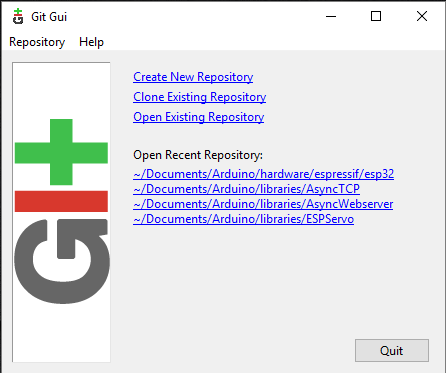
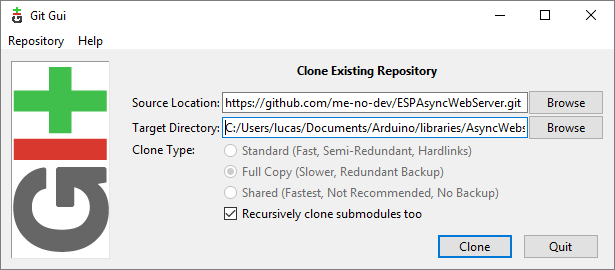
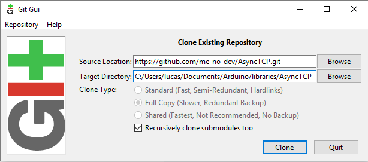
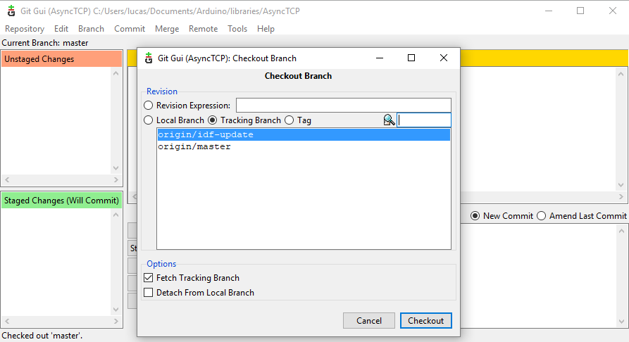
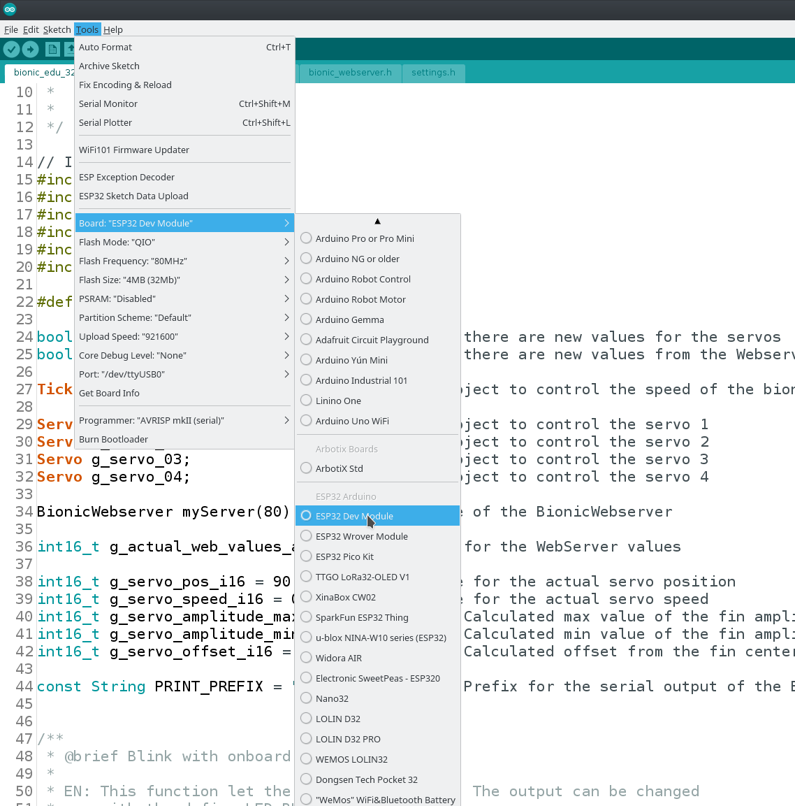
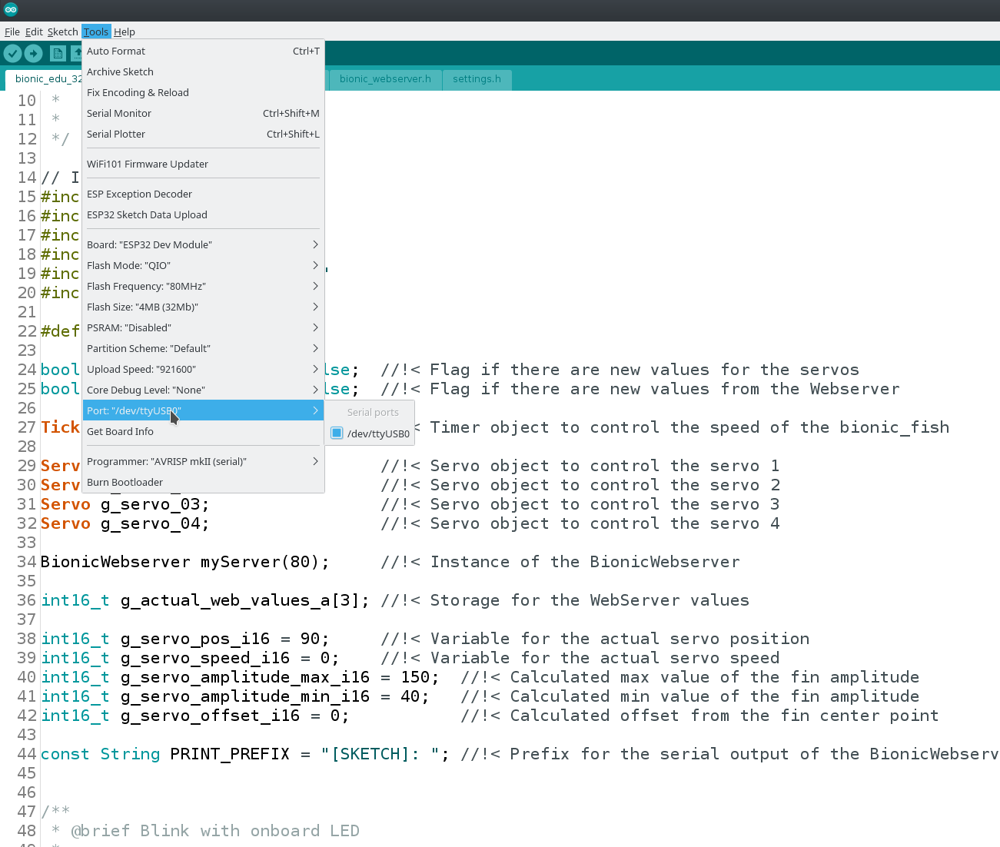
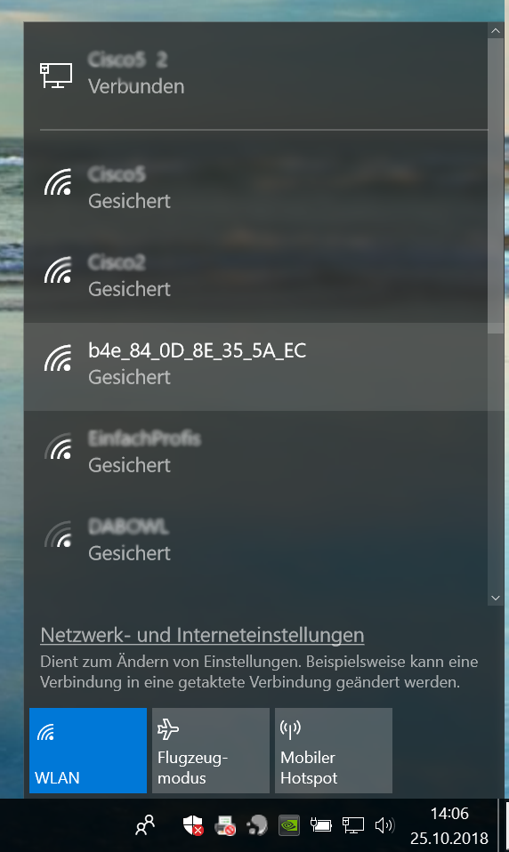
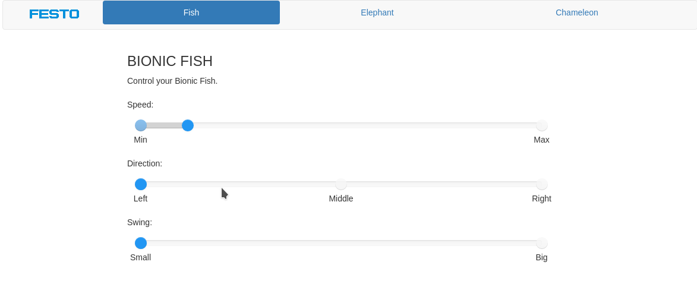

# Installation Guide Bionic-Kit

## Ubuntu

This guide is tested on Ubuntu 16.04, but should also work on newer versions.

### Arduino IDE

For the usage of the Bionic-Kit the Arduino IDE is needed. 

1. In case, you have not already installed it, download the latest version from [here](https://www.arduino.cc/en/Main/Software).

2. Extract the archive to a location of your choice, for example in your /home folder. 

3. By using the terminal, navigate to the extracted folder and change the execution rights of the file install.sh with: 

        sudo chmod +x install.sh

4. Now execute the install.sh file in the terminal

        ./install.sh


If no error occured, the installation of the Arduino IDE is done. Start the IDE once to make sure that everything is working properly and the IDE has generated all necessary folders for further installations. 

To start the Arduino IDE, run the Arduino entry in the Start-Menu or run the binary inside the extracted Arduino folder with:

	./arduino
	 

If successfully opened, you can close the IDE again.
In case there is an error, visit the [Arduino Troubleshooting Page] (https://forum.arduino.cc/index.php#c2)

### Additional Packages
To compile the source code of the Bionic-Kit, additional libraries are needed. 

#### Espressif ESP32

**The Bionic-Kit is based on the ESP32 SoC from Espressif, therefore the Arduino Core for the SoC is mandatory. To install all needed files  follow the instructions on the official Espressif Arduino GIT [here](https://github.com/espressif/arduino-esp32/blob/master/docs/arduino-ide/debian_ubuntu.md).**

There is also an install guide on the official git repository called "Instructions for Boards Manager". While testing the realease version 1.0, it was noted that it did not contain all necessary libraries and therefore we suggeest to use the above steps.


If you are interested in more stuff regarding the ESP32 for Arduino explore the [official GIT repository](https://github.com/espressif/arduino-esp32) .


#### Asynchron web server for ESP32
1. For the purpose of displaying the control website of the Bionic-Kit a special web server for the ESP32 is needed. Therefore run:

		cd ~/Arduino/libraries
	
2. Then clone the repository of the web server to the present directory:

		git clone https://github.com/me-no-dev/ESPAsyncWebServer.git AsyncWebserver


3. The web server needs an additional package. Therefore stay in the libraries folder and clone the AsyncTCP repository as well:

		git clone https://github.com/me-no-dev/AsyncTCP.git AsyncTCP
	
4. A special branch of the AsyncTCP has to be used, because of the current development status of the AsyncWebServer. For this, enter the directory and checkout the idf-update branch with:

		cd AsyncTCP
	
		git checkout idf-update

This extra step is necessary for the Asyncwebserver Version dated 26.09.2018. In future releases this step might not be necessary.

#### ESP32 Servo Library

The last library which is needed to get the Bionic-Kit running is the ESP32Servo library.

1. For this go back to the libraries folder and clone the following repository:

		cd ~/Arduino/libraries

		git clone https://github.com/jkb-git/ESP32Servo.git ESP32Servo


#### 4. Sketch Data Upload Plugin
To load the website to the internal file system of the ESP32 Chip a special upload tool is needed. 

1. For this purpose go to https://github.com/me-no-dev/arduino-esp32fs-plugin/releases/ and download the ZIP file of the sketch data upload plugin. 
2. Then navigate to the Arduino folder and create a folder named "tools"  if it doesn't exist yet.

		cd ~/Arduino
	
		mkdir tools
	
3. Unpack the previous downloaded ZIP archive into tools directory (the path will look like <home_dir>/Arduino/tools/ESP32FS/tool/esp32fs.jar). 
4. Then restart the Arduino IDE if its open. 

## Windows 10

This installation guide is tested on Windows 10. 

### Arduino IDE

For the usage of the Bionic-Kit the Arduino IDE is needed. If you have not already installed it download the latest version from [here](https://www.arduino.cc/en/Main/Software)


### Additional Packages
To compile the source code of the Bionic-Kit, additional libraries are needed. 

#### Espressif ESP32
**The Bionic-Kit is based on the ESP32 SoC from Espressif, therefore the Arduino Core for the SoC is mandatory. To install all needed files follow the instructions on the official Espressif Arduino GIT [here](https://github.com/espressif/arduino-esp32/blob/master/docs/arduino-ide/windows.md).**

There is also an install guide on the official git repository called "Instructions for Boards Manager". While testing the realease version 1.0 (July 2019), it was noted that it did not contain all necessary libraries and therefore we suggeest to use the above steps.

If you are interested in more stuff regarding the ESP32 for Arduino explore the [official GIT repository](https://github.com/espressif/arduino-esp32) .

#### Asynchron Web server for ESP32
For the purpose of displaying the control website of the Bionic-Kit a special web server for the ESP32 is needed. 

1. Therefore run the ```GIT gui``` for Windows from your Start-Menu to clone the relevant library.

	

2. On the appearing Git Gui select ```Clone Existing Repository``` 

	

	- Select source and destination
		- Sketchbook Directory: Usually ```C:/Users/[YOUR_USER_NAME]/Documents/Arduino``` and is listed underneath the "Sketchbook location" in Arduino preferences.
		- Source Location: ```https://github.com/me-no-dev/ESPAsyncWebServer.git```
		- Target Directory: ```[ARDUINO_SKETCHBOOK_DIR]/libraries/AsyncWebServer```
		- Click ```Clone``` to start cloning the repository


3. The AsyncWebserver needs an additional AsyncTCP package. This has to be cloned as well:

	

	- Select source and destination
		- Sketchbook Directory: Usually ```C:/Users/[YOUR_USER_NAME]/Documents/Arduino``` and is listed underneath the "Sketchbook location" in Arduino preferences.
		- Source Location: ```https://github.com/me-no-dev/AsyncTCP.git```
		- Target Directory: ```[ARDUINO_SKETCHBOOK_DIR]/libraries/AsyncTCP```
		- Click ```Clone``` to start cloning the repository


4. Because of the current development status of the AsyncWebServer a special branch of the AsyncTCP has to be used. For this, the  ```idf-update``` branch has to be checked out. When the previous cloning process is finished, click on ```Branch``` in the appearing window and select ```Checkout...```

	

5. In the ```Checkout Branch``` Window choose the bullet point ```Tracking Branch``` and then select ```origin/idf-update```. At last click button ```Checkout``` .
	
	
#### ESP32 Servo Library
The last library which is needed to get the Bionic-Kit running is the ESP32Servo library. For this open the ```Git Gui``` again and clone the ESP32Servo library to the ```Arduino/libraries``` folder as well. 


- Settings for cloning:
	- Sketchbook Directory: Usually ```C:/Users/[YOUR_USER_NAME]/Documents/Arduino``` and is listed underneath the "Sketchbook location" in Arduino preferences.
	- Source Location: ```https://github.com/jkb-git/ESP32Servo.git```
	- Target Directory: ```[ARDUINO_SKETCHBOOK_DIR]/libraries/ESP32Servo```
	- Click ```Clone``` to start cloning the repository


#### 4. Sketch Data Upload Plugin
To load the website to the internal file system of the ESP32 Chip a special upload tool is needed. 
1. Go to https://github.com/me-no-dev/arduino-esp32fs-plugin/releases/ and download the ZIP file of the sketch data upload plugin. 
2. Navigate to the Arduino folder and create a folder named ```tools```  if it doesn't exist yet.
3. Unpack the previous downloaded ZIP archive into tools directory (the path will look like <home_dir>/Arduino/tools/ESP32FS/tool/esp32fs.jar). 
4. Restart the Arduino IDE 

# Compiling the Source Code for the Bionic-Kit
1. Download or clone the Bionic-Kit source code from XXXXXX 
2. Save it to a location of your choice. 
3. Open the *.ino file with the Arduino IDE
4. Connect the Bionic-Kit PCB to the PC with an Micro-USB to USB cable
5. In the Arduino IDE select ```Tools -> Board: -> ESP32 Dev Module```


	


6. Make sure that the right port is selected. For this select ```Tools -> Port```. If you use Windows the Port is named ```COM X```, if you use Ubuntu your serial port is called ```/dev/ttyUSBX```

	

7. Click on the ```upload``` button (Arrow) on the top left corner of the Arduino IDE to compile the code and upload it to the Bionic-Kit. This may take a while. 
8. The last step is to upload the files for the Bionic-Kit control website. For this click on ```Tools -> ESP32 Sketch Data Upload```
9. Now reset the ESP32 by pressing down the reset button on the PCB

# Connection test  

1. Connect the Bionic-Kit to the PC with a USB cable
2. Open the ```Serial Monitor``` of the Arduino IDE (magnifying glass symbol in the top right corner)
3. Now reset the ESP32 by pressing down the reset button on the PCB. The output should look like that: 
	
	

4. Open your wifi settings menu of your PC and search for the shown ```ẀifiSSID``` for example "b4e_84_0D_8E_35_5A_EC"

	

5. Connect to the found wifi network with password ```education```
6. Once connected, open your web browser and type the address ```www.b4e.de``` or ```192.168.4.1```

	

7. If the batteries are attached on the Bionic-Kit and the switch is turned on, you should now be able to control the servos with the sliders.
